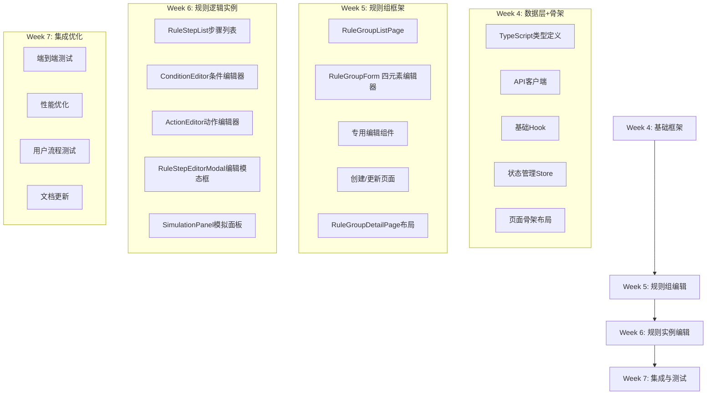

# Phase 2-A: 前端规则管理UI实施清单

> **周期**: 第4-7周（共4周）
> **目标**: 实现规则编排系统的核心前端组件

---

## 一、组件实施优先级（按依赖关系）



---

## 二、详细组件规格

### 2.1 TypeScript类型定义

**文件**: `src/types/rule.ts`

```typescript
// 核心类型定义
export interface RuleGroup {
  id: string;
  name: string;
  description?: string;
  ruleType: 'constraint' | 'inference' | 'alert' | 'decision';
  priority: number;
  
  // ① 作用对象
  appliesTo: string[];  // 实体类型列表
  
  // ② 适用场景
  applicableCategories?: Record<string, string[]>;  // {dimension: [values]}
  
  // ③ 输入输出要素
  inputs: IOElement[];
  outputs: IOElement[];
  
  // 前置条件
  preconditions: Precondition[];
  
  // UI/可视化
  color?: string;
  icon?: string;
  enabled: boolean;
}

export interface RuleStep {
  id: string;  // 如 "R001"
  ruleGroupId: string;
  name: string;
  order: number;
  
  // ④ 分析逻辑
  when: ConditionClause;
  then: ActionClause;
  else?: ActionClause;
  
  // 算子
  operator?: OperatorType;
  operatorParams?: Record<string, any>;
  
  // 元信息
  description?: string;
  tags: string[];
  enabled: boolean;
}

export type OperatorType = 
  | 'BINNING' 
  | 'SCORECARD' 
  | 'WEIGHTED_SUM' 
  | 'DECISION_TABLE' 
  | 'LLM_JUDGE'
  | 'SET_FLAG'
  | 'REJECT'
  | 'COMPUTE'
  | 'ALERT';

export interface IOElement {
  name: string;
  type: 'metric' | 'attribute' | 'rule_output' | 'variable';
  ref?: string;
  valueType: 'boolean' | 'integer' | 'decimal' | 'Money' | 'string' | 'flag';
}

// Condition/Action相关
export interface ConditionClause {
  type: 'expression' | 'all_of' | 'any_of';
  expression?: string;
  allOf?: string[];
  anyOf?: string[];
}

export interface ActionClause {
  type: 'set_flag' | 'reject' | 'compute' | 'alert' | 'none';
  target?: string;
  value?: any;
  reason?: string;
  alertLevel?: 'LOW' | 'MEDIUM' | 'HIGH';
  alertMessage?: string;
}
```

### 2.2 API客户端

**文件**: `src/api/ruleGroups.ts`, `src/api/ruleSteps.ts`, `src/api/operators.ts`

```typescript
// ruleGroups.ts API签名
export const ruleGroupsApi = {
  // 列表
  list: async (params?: ListRuleGroupsParams) => Promise<RuleGroup[]>,
  
  // CRUD
  getById: async (id: string) => Promise<RuleGroup>,
  create: async (ruleGroup: Partial<RuleGroup>) => Promise<RuleGroup>,
  update: async (id: string, updates: Partial<RuleGroup>) => Promise<RuleGroup>,
  delete: async (id: string) => Promise<void>,
  
  // 模拟
  simulate: async (
    ruleGroupId: string,
    entityData: Record<string, any>,
    stepFilter?: string[]
  ) => Promise<SimulationResult>,
  
  // YAML
  exportYaml: async (ruleGroupId: string) => Promise<string>,
  importYaml: async (yamlContent: string) => Promise<RuleGroup>,
};

// operators.ts API签名
export const operatorsApi = {
  list: async () => Promise<OperatorListResponse>,
  getSchema: async (operatorName: string) => Promise<OperatorSchema>,
  validateParams: async (operatorName: string, params: any) => Promise<ValidationResult>,
};
```

### 2.3 自定义Hook

**文件**: `src/hooks/useRuleGroups.ts`, `src/hooks/useRuleSteps.ts`, `src/hooks/useOperators.ts`

```typescript
// useRuleGroups.ts - 负责规则组数据管理
export const useRuleGroups = () => {
  const [loading, setLoading] = useState(false);
  const [ruleGroups, setRuleGroups] = useState<RuleGroup[]>([]);
  
  const fetchGroups = useCallback(async (params?: ListRuleGroupsParams) => {
    setLoading(true);
    try {
      const data = await ruleGroupsApi.list(params);
      setRuleGroups(data);
    } finally {
      setLoading(false);
    }
  }, []);
  
  const createGroup = useCallback(async (group: Partial<RuleGroup>) => {
    const created = await ruleGroupsApi.create(group);
    setRuleGroups(prev => [...prev, created]);
    return created;
  }, []);
  
  // ... 其他操作
  
  return {
    loading,
    ruleGroups,
    fetchGroups,
    createGroup,
    updateGroup,
    deleteGroup,
    exportYaml,
    importYaml,
  };
};

// useRuleSteps.ts - 负责规则实例管理
export const useRuleSteps = (ruleGroupId: string | undefined) => {
  const [steps, setSteps] = useState<RuleStep[]>([]);
  const [loading, setLoading] = useState(false);
  
  const fetchSteps = useCallback(async () => {
    if (!ruleGroupId) return;
    setLoading(true);
    try {
      const data = await ruleStepsApi.list(ruleGroupId);
      setSteps(data);
    } finally {
      setLoading(false);
    }
  }, [ruleGroupId]);
  
  // ... 其他操作
  
  return { steps, loading, fetchSteps, addStep, updateStep, deleteStep };
};

// useOperators.ts - 算子参数管理
export const useOperators = () => {
  const [operators, setOperators] = useState<Record<string, OperatorSchema>>({});
  
  const fetchOperators = useCallback(async () => {
    const data = await operatorsApi.list();
    setOperators(data);
  }, []);
  
  const validateParams = useCallback(async (
    operatorName: string, 
    params: any
  ) => {
    return await operatorsApi.validateParams(operatorName, params);
  }, []);
  
  return { operators, fetchOperators, validateParams };
};
```

### 2.4 状态管理Store（Zustand）

**文件**: `src/stores/ruleStore.ts`

```typescript
interface RuleStore {
  // === 数据状态 ===
  currentRuleGroup: RuleGroup | null;
  ruleSteps: RuleStep[];
  loading: boolean;
  error: string | null;
  
  // === 操作 ===
  actions: {
    loadRuleGroup: (id: string) => Promise<void>;
    loadRuleSteps: (ruleGroupId: string) => Promise<void>;
    addRuleStep: (step: Partial<RuleStep>) => Promise<void>;
    updateRuleStep: (step: RuleStep) => Promise<void>;
    deleteRuleStep: (stepId: string) => Promise<void>;
    reorderRuleSteps: (stepIds: string[]) => Promise<void>;
    simulateStep: (stepId: string, testData: any) => Promise<any>;
    exportYaml: () => Promise<string>;
  };
  
  // === UI状态 ===
  ui: {
    editingStepId: string | null;
    setEditingStepId: (id: string | null) => void;
    
    simulationResult: any | null;
    setSimulationResult: (result: any) => void;
    
    yamlPreview: string;
    setYamlPreview: (yaml: string) => void;
  };
}

// 创建store
export const useRuleStore = create<RuleStore>((set, get) => ({
  currentRuleGroup: null,
  ruleSteps: [],
  loading: false,
  error: null,
  
  actions: {
    loadRuleGroup: async (id) => {
      set({ loading: true, error: null });
      try {
        const ruleGroup = await ruleGroupsApi.getById(id);
        set({ currentRuleGroup: ruleGroup, loading: false });
      } catch (error) {
        set({ error: error.message, loading: false });
      }
    },
    // ... 其他actions实现
  },
  
  ui: {
    editingStepId: null,
    setEditingStepId: (id) => set((state) => ({
      ui: { ...state.ui, editingStepId: id }
    })),
    
    simulationResult: null,
    setSimulationResult: (result) => set((state) => ({
      ui: { ...state.ui, simulationResult: result }
    })),
    
    yamlPreview: '',
    setYamlPreview: (yaml) => set((state) => ({
      ui: { ...state.ui, yamlPreview: yaml }
    })),
  },
}));
```

### 2.5 页面骨架布局

**文件**: `src/pages/rules/RuleGroupLayout.tsx`

```tsx
// 规则相关页面的统一布局
export const RuleGroupLayout: React.FC<{ children: React.ReactNode }> = ({ children }) => {
  return (
    <Layout className="rule-group-layout" style={{ minHeight: '100vh' }}>
      {/* 顶部导航 */}
      <Header style={{ background: '#fff', padding: '0 24px' }}>
        <div className="header-content">
          <Breadcrumb>
            <Breadcrumb.Item>
              <Link to="/">首页</Link>
            </Breadcrumb.Item>
            <Breadcrumb.Item>
              <Link to="/rules">规则管理</Link>
            </Breadcrumb.Item>
          </Breadcrumb>
          <RuleGroupActions />
        </div>
      </Header>
      
      {/* 主要内容 */}
      <Content style={{ padding: '24px' }}>
        {children}
      </Content>
      
      {/* 右侧侧边栏 */}
      <Sider 
        width={320} 
        style={{ background: '#fafafa', borderLeft: '1px solid #f0f0f0' }}
      >
        <RuleContextPanel />
      </Sider>
    </Layout>
  );
};
```

### 2.6 规则组列表页

**文件**: `src/pages/rules/RuleGroupListPage.tsx`

| 组件 | 功能 | 实现细节 |
|------|------|----------|
| **Header** | 页面标题+创建按钮 | 包含"新建规则组"按钮，支持快速筛选 |
| **FilterBar** | 规则组筛选 | 按实体类型/规则类型/启用状态筛选 |
| **RuleGroupTable** | 规则组表格 | Ant Design Table，支持排序/选择/批量操作 |
| **ActionButtons** | 行操作按钮 | 编辑/查看/复制/删除/导出YAML |
| **ImportExport** | 批量导入导出 | 批量YAML导入导出功能 |

**验收标准**：
- 表格可显示50+规则组，分页性能良好
- 筛选器实时生效，支持多条件组合
- 行操作有明显的反馈效果
- 支持键盘快捷键（Ctrl+F筛选）

### 2.7 规则组编辑器（RuleGroupForm）

**文件**: `src/components/rule-editor/RuleGroupForm.tsx`

**Tab式结构**：

```tsx
<Tabs defaultActiveKey="basic">
  {/* Tab 1: 基础信息 */}
  <TabPane tab="基础信息" key="basic">
    <RuleBasicInfoForm />
  </TabPane>
  
  {/* Tab 2: 作用对象 */}
  <TabPane tab="作用对象" key="target">
    <TargetEntitiesEditor />
  </TabPane>
  
  {/* Tab 3: 适用场景 */}
  <TabPane tab="适用场景" key="applicability">
    <ApplicabilityEditor />
  </TabPane>
  
  {/* Tab 4: 输入输出 */}
  <TabPane tab="输入输出" key="inputs-outputs">
    <IOElementsForm />
  </TabPane>
  
  {/* Tab 5: 验证 */}
  <TabPane tab="验证" key="validation">
    <RuleGroupValidation />
  </TabPane>
</Tabs>
```

**核心子组件**：

1. **TargetEntitiesEditor**：
   - 从Schema加载可用实体类型
   - 多选组件，支持搜索
   - 可视化标签展示

2. **ApplicabilityEditor**：
   - 维度分类过滤编辑器
   - 前置条件表达式编辑器
   - 条件预览面板

3. **IOElementsForm**：
   - 输入要素列表（可新增/删除/排序）
   - 输出要素列表
   - 要素类型选择（metric/attribute/rule_output）

4. **RuleGroupValidation**：
   - 语法验证结果
   - 依赖检查结果
   - 冲突检测提示

### 2.8 规则实例编辑器

**文件**: `src/components/rule-editor/RuleStepEditorModal.tsx`

**模态框布局**：

```
┌─────────────────────────────────────────────────────┐
│                    规则步骤编辑器                     │
├─────────────────────────────────────────────────────┤
│ 步骤名称: [输入框]                                   │
│ 描述: [文本域]                                      │
├───────────────────┬─────────────────────────────────┤
│     WHEN条件       │        THEN动作                │
├───────────────────┼─────────────────────────────────┤
│ ○ 单一表达式       │ ○ 基础动作                    │
│ ○ ALL OF (AND)    │  - SET_FLAG                   │
│ ○ ANY OF (OR)     │  - REJECT                     │
│                    │  - COMPUTE                    │
│ [表达式编辑器]     │  - ALERT                      │
│                    │                              │
│                   │ ○ 高级算子                    │
│                   │  - BINNING                    │
│                   │  - SCORECARD                  │
│                   │  - WEIGHTED_SUM               │
│                   │  - DECISION_TABLE             │
│                   │  - LLM_JUDGE                  │
│                   │                              │
│                   │ [算子参数配置区域]             │
├───────────────────┴─────────────────────────────────┤
│                     ELSE分支（可选）                 │
├─────────────────────────────────────────────────────┤
│      [取消]                [保存并关闭]               │
└─────────────────────────────────────────────────────┘
```

**条件编辑器**: `ConditionEditor.tsx`

```tsx
export const ConditionEditor: React.FC<ConditionEditorProps> = ({ value, onChange }) => {
  const [type, setType] = useState<'expression' | 'all_of' | 'any_of'>('expression');
  
  return (
    <div className="condition-editor">
      <Segmented 
        value={type}
        onChange={setType}
        options={[
          { label: '单一表达式', value: 'expression' },
          { label: 'ALL OF (AND)', value: 'all_of' },
          { label: 'ANY OF (OR)', value: 'any_of' },
        ]}
      />
      
      {type === 'expression' && (
        <ExpressionInput 
          value={value.expression}
          onChange={(newExpr) => onChange({ type: 'expression', expression: newExpr })}
        />
      )}
      
      {type === 'all_of' && (
        <MultiConditionEditor 
          type="all_of"
          conditions={value.allOf || []}
          onChange={(conds) => onChange({ type: 'all_of', allOf: conds })}
        />
      )}
      
      {type === 'any_of' && (
        <MultiConditionEditor 
          type="any_of"
          conditions={value.anyOf || []}
          onChange={(conds) => onChange({ type: 'any_of', anyOf: conds })}
        />
      )}
    </div>
  );
};
```

**动作编辑器**: `ActionEditor.tsx`

```tsx
export const ActionEditor: React.FC<ActionEditorProps> = ({ value, onChange }) => {
  const [actionType, setActionType] = useState<'basic' | 'operator'>('basic');
  const [selectedOperator, setSelectedOperator] = useState<OperatorType>();
  
  return (
    <div className="action-editor">
      <Segmented 
        value={actionType}
        onChange={setActionType}
        options={[
          { label: '基础动作', value: 'basic' },
          { label: '高级算子', value: 'operator' },
        ]}
      />
      
      {actionType === 'basic' && (
        <BasicActionForm 
          value={value}
          onChange={onChange}
        />
      )}
      
      {actionType === 'operator' && (
        <div className="operator-section">
          <OperatorSelector 
            value={selectedOperator}
            onChange={setSelectedOperator}
          />
          
          {selectedOperator && (
            <OperatorParamEditor 
              operator={selectedOperator}
              params={value.operatorParams}
              onParamsChange={(newParams) => {
                onChange({
                  type: 'compute',
                  operator: selectedOperator,
                  operatorParams: newParams,
                });
              }}
            />
          )}
        </div>
      )}
    </div>
  );
};
```

### 2.9 模拟面板

**文件**: `src/components/rule-editor/SimulationPanel.tsx`

**功能模块**：
1. **TestDataInput**: 测试数据输入区域
2. **SimulationControls**: 控制按钮（模拟/重置/历史）
3. **ResultVisualization**: 结果可视化展示
4. **StepTracing**: 步骤执行追踪

```tsx
export const SimulationPanel: React.FC<SimulationPanelProps> = ({ ruleGroupId }) => {
  const [testData, setTestData] = useState<Record<string, any>>({});
  const [simulationResult, setSimulationResult] = useState<any>(null);
  const [loading, setLoading] = useState(false);
  
  const runSimulation = useCallback(async () => {
    setLoading(true);
    try {
      const result = await ruleGroupsApi.simulate(ruleGroupId, testData);
      setSimulationResult(result);
    } finally {
      setLoading(false);
    }
  }, [ruleGroupId, testData]);
  
  const clearData = () => {
    setTestData({});
    setSimulationResult(null);
  };
  
  return (
    <div className="simulation-panel">
      <Card 
        title="规则模拟测试"
        size="small"
        extra={
          <Space>
            <Button size="small" onClick={clearData}>清空</Button>
            <Button 
              type="primary" 
              size="small" 
              onClick={runSimulation}
              loading={loading}
              icon={<PlayCircleOutlined />}
            >
              执行模拟
            </Button>
          </Space>
        }
      >
        {/* 测试数据输入 */}
        <TestDataInput 
          value={testData}
          onChange={setTestData}
          ruleGroupId={ruleGroupId}
        />
        
        {/* 结果展示 */}
        {simulationResult && (
          <SimulationResultDisplay 
            result={simulationResult}
            onSelectStep={(stepId) => {
              // 高亮显示对应步骤
            }}
          />
        )}
        
        {/* 没有结果时的占位 */}
        {!simulationResult && !loading && (
          <Empty 
            description="暂无模拟结果"
            image={Empty.PRESENTED_IMAGE_SIMPLE}
          />
        )}
      </Card>
    </div>
  );
};
```

---

## 三、样式与主题设计

### 3.1 颜色体系

```css
:root {
  /* 规则相关色系 */
  --color-rule-primary: #1677ff;       /* 规则组主色 */
  --color-rule-secondary: #4096ff;     /* 规则实例色 */
  --color-condition: #52c41a;          /* 条件相关色 */
  --color-action: #fa8c16;             /* 动作相关色 */
  --color-simulation: #722ed1;         /* 模拟相关色 */
  
  /* 状态色 */
  --color-success: #52c41a;
  --color-warning: #faad14;
  --color-error: #ff4d4f;
  --color-info: #1677ff;
  
  /* 背景色 */
  --color-bg-primary: #ffffff;
  --color-bg-secondary: #fafafa;
  --color-bg-tertiary: #f0f0f0;
  
  /* 文本色 */
  --color-text-primary: rgba(0, 0, 0, 0.85);
  --color-text-secondary: rgba(0, 0, 0, 0.45);
  --color-text-disabled: rgba(0, 0, 0, 0.25);
}
```

### 3.2 Ant Design 主题定制

```ts
// src/theme/ruleTheme.ts
export const ruleTheme = {
  token: {
    colorPrimary: '#1677ff',
    colorLink: '#4096ff',
    borderRadius: 6,
    fontFamily: '-apple-system, BlinkMacSystemFont, "Segoe UI", Roboto, "Helvetica Neue", Arial',
  },
  components: {
    Button: {
      borderRadius: 6,
    },
    Card: {
      borderRadius: 8,
    },
    Form: {
      labelFontSize: 14,
    },
    Table: {
      headerBg: '#fafafa',
    },
    Tabs: {
      itemSelectedColor: '#1677ff',
      itemHoverColor: '#4096ff',
    },
  },
};
```

### 3.3 组件样式模块

```css
/* src/components/rule-editor/rule-editor.module.css */

/* 规则组卡片 */
.ruleGroupCard {
  border: 1px solid var(--color-bg-tertiary);
  border-radius: 8px;
  transition: all 0.2s ease;
  
  &:hover {
    border-color: var(--color-rule-primary);
    box-shadow: 0 2px 8px rgba(24, 144, 255, 0.1);
  }
}

/* 步骤列表项 */
.stepItem {
  border-left: 3px solid transparent;
  padding: 12px;
  background: var(--color-bg-secondary);
  border-radius: 6px;
  margin-bottom: 8px;
  
  &.active {
    border-left-color: var(--color-rule-primary);
    background: rgba(22, 119, 255, 0.05);
  }
  
  &:hover {
    .stepActions {
      opacity: 1;
    }
  }
}

/* 条件编辑器 */
.conditionExpressionInput {
  font-family: 'SFMono-Regular', Consolas, 'Liberation Mono', Menlo, Courier, monospace;
  font-size: 13px;
  line-height: 1.5;
  padding: 8px 12px;
  border: 1px solid #d9d9d9;
  border-radius: 6px;
  
  &:focus {
    border-color: var(--color-rule-primary);
    box-shadow: 0 0 0 2px rgba(22, 119, 255, 0.1);
  }
}

/* 模拟结果面板 */
.simulationResult {
  background: linear-gradient(135deg, #f5f7fa 0%, #c3cfe2 100%);
  border-radius: 8px;
  padding: 16px;
  
  .resultHeader {
    display: flex;
    justify-content: space-between;
    align-items: center;
    margin-bottom: 16px;
  }
  
  .stepTrace {
    background: white;
    border-radius: 6px;
    padding: 16px;
    box-shadow: 0 1px 3px rgba(0, 0, 0, 0.1);
  }
}
```

---

## 四、实施任务分解表

### Week 4 任务 (第4周, 5个工作日)

| # | 任务 | 工时 | 负责人 | 验收标准 |
|---|------|------|--------|----------|
| 4.1 | 创建TypeScript类型定义 | 0.5d | FE1 | `src/types/rule.ts` 编译通过 |
| 4.2 | 实现API客户端层 | 1d | FE1 | 所有API函数签名完成，可mock调用 |
| 4.3 | 创建自定义Hook | 1d | FE2 | useRuleGroups/useRuleSteps功能完整 |
| 4.4 | 实现Zustand状态管理 | 1d | FE2 | store可用，支持undo/redo |
| 4.5 | 创建基础布局组件 | 0.5d | FE1 | 页面骨架可用，响应式支持 |
| 4.6 | 配置路由和导航 | 1d | FE1 | `/rules`相关路由配置完成 |

**交付物**：可用的前端数据层+基础框架

### Week 5 任务 (第5周)

| # | 任务 | 工时 | 负责人 | 验收标准 |
|---|------|------|--------|----------|
| 5.1 | RuleGroupListPage实现 | 1.5d | FE1 | 表格显示+筛选+分页+操作 |
| 5.2 | RuleGroupForm基础框架 | 1d | FE2 | Tab式布局，基础字段编辑 |
| 5.3 | TargetEntitiesEditor组件 | 0.5d | FE1 | 实体类型多选组件 |
| 5.4 | ApplicabilityEditor组件 | 1.5d | FE2 | 维度分类+前置条件编辑器 |
| 5.5 | IOElementsForm组件 | 1d | FE1 | 输入输出要素列表编辑 |
| 5.6 | 创建/更新页面集成 | 0.5d | FE2 | 完整创建、更新流程 |
| 5.7 | RuleGroupDetailPage布局 | 1d | FE1 | 三栏布局实现，响应式 |

**交付物**：规则的创建、更新、查看完整流程

### Week 6 任务 (第6周)

| # | 任务 | 工时 | 负责人 | 验收标准 |
|---|------|------|--------|----------|
| 6.1 | RuleStepList步骤列表 | 1d | FE1 | 拖拽排序+步骤卡片显示 |
| 6.2 | ConditionEditor条件编辑器 | 1.5d | FE2 | 三种条件类型编辑支持 |
| 6.3 | ExpressionInput表达式输入 | 1d | FE1 | 支持语法高亮+变量提示 |
| 6.4 | ActionEditor基础动作 | 1d | FE2 | SET_FLAG/REJECT/COMPUTE/ALERT |
| 6.5 | OperatorSelector算子选择器 | 0.5d | FE1 | 5种算子类型选择 |
| 6.6 | RuleStepEditorModal模态框 | 1d | FE2 | 完整编辑流程集成 |
| 6.7 | SimulationPanel模拟面板 | 1d | FE1 | 测试数据输入+结果展示 |

**交付物**：规则逻辑编辑+模拟测试完整功能

### Week 7 任务 (第7周)

| # | 任务 | 工时 | 负责人 | 验收标准 |
|---|------|------|--------|----------|
| 7.1 | 端到端集成测试 | 1.5d | FE1/FE2 | 完整用户流程测试 |
| 7.2 | 性能优化（虚拟列表等） | 1d | FE1 | 大数据量下性能达标 |
| 7.3 | 用户交互优化 | 1d | FE2 | 键盘快捷键/粘贴板操作 |
| 7.4 | 响应式设计强化 | 0.5d | FE1 | 移动端适配完成 |
| 7.5 | 错误处理和边界情况 | 1d | FE2 | 网络错误/空状态处理 |
| 7.6 | 开发者文档更新 | 1d | FE1 | README + API文档 |
| 7.7 | 用户指南撰写 | 1d | FE2 | 基础操作指南 |

**交付物**：可投入生产的完整前端系统

---

## 五、测试策略

### 5.1 单元测试覆盖率目标

| 文件类型 | 覆盖率要求 | 关键测试点 |
|----------|-----------|-----------|
| TypeScript类型 | ≥90% | 所有类型定义 |
| Hook组件 | ≥85% | 状态管理，数据转换 |
| UI组件 | ≥75% | 用户交互，props处理 |
| API客户端 | ≥80% | 错误处理，请求重试 |

### 5.2 组件测试示例

```typescript
// Example: useRuleGroups.test.ts
describe('useRuleGroups', () => {
  it('should fetch rule groups successfully', async () => {
    const mockGroups = [{ id: '1', name: 'Test Group' }];
    jest.spyOn(ruleGroupsApi, 'list').mockResolvedValue(mockGroups);
    
    const { result } = renderHook(() => useRuleGroups());
    await act(async () => {
      await result.current.fetchGroups();
    });
    
    expect(result.current.ruleGroups).toEqual(mockGroups);
    expect(result.current.loading).toBe(false);
  });
  
  it('should handle fetch errors', async () => {
    const error = new Error('Network error');
    jest.spyOn(ruleGroupsApi, 'list').mockRejectedValue(error);
    
    const { result } = renderHook(() => useRuleGroups());
    await act(async () => {
      await result.current.fetchGroups();
    });
    
    expect(result.current.error).toBe('Network error');
    expect(result.current.loading).toBe(false);
  });
});
```

### 5.3 E2E测试场景

| 场景 | 测试点 | 预期结果 |
|------|--------|----------|
| 创建规则组 | 完整填写四元素，提交 | 创建成功，显示在列表中 |
| 编辑规则组 | 修改规则名称，保存 | 名称更新，列表同步 |
| 添加规则步骤 | 添加WHEN/THEN条件 | 步骤列表更新 |
| 规则模拟 | 输入测试数据，执行 | 显示模拟结果 |
| YAML导出 | 点击导出按钮 | 下载YAML文件 |
| YAML导入 | 上传YAML文件 | 成功创建规则组 |
| 规则排序 | 拖拽排序步骤 | 执行顺序更新 |

---

## 六、关键依赖与集成点

### 6.1 后端API依赖

| API端点 | 用途 | 优先级 |
|---------|------|--------|
| `GET /v1/rule-groups` | 规则组列表 | P0 |
| `POST /v1/rule-groups` | 创建规则组 | P0 |
| `GET /v1/rule-groups/{id}` | 规则组详情 | P0 |
| `PUT /v1/rule-groups/{id}` | 更新规则组 | P0 |
| `POST /v1/rule-groups/{id}/steps` | 添加规则步骤 | P0 |
| `POST /v1/rule-groups/{id}/simulate` | 模拟执行 | P1 |
| `GET /v1/rule-groups/{id}/export` | YAML导出 | P2 |
| `POST /v1/rule-groups/import` | YAML导入 | P2 |

### 6.2 前端项目依赖

```json
{
  "必须添加": {
    "zustand": "状态管理",
    "immer": "不可变数据操作",
    "yaml": "YAML解析/生成",
    "react-dnd": "拖拽排序（可选）"
  },
  "建议添加": {
    "react-virtualized": "虚拟列表优化",
    "monaco-editor": "表达式编辑器（Phase 2-B）",
    "lodash-es": "工具函数库"
  }
}
```

### 6.3 与现有系统的集成

| 现有模块 | 集成方式 | 兼容性要求 |
|----------|----------|-----------|
| 当前规则管理页面 | 逐步替换 | 双模式运行，保留旧页面查看 |
| Schema管理 | 下拉选择数据 | 读取Schema列表，动态加载 |
| 指标系统 | 引用指标 | 支持指标名称自动完成 |
| 分类维度 | 维度过滤 | 读取维度定义，展示可选项 |

---

## 七、验收清单

### 功能验收（必须全部通过）

- [ ] 用户可以通过页面创建新的规则组
- [ ] 规则组可配置四元素（①②③④）
- [ ] 可在规则组内添加、编辑规则步骤
- [ ] 规则步骤支持WHEN/THEN/ELSE结构
- [ ] 可对规则进行模拟执行测试
- [ ] 规则可导出为Schema v2 canonical YAML格式
- [ ] 可从YAML文件导入规则组
- [ ] 支持规则步骤的拖拽排序
- [ ] 响应式设计，支持桌面端和移动端
- [ ] 完整的错误处理和用户反馈

### 性能验收

- [ ] 页面初始加载时间 < 2秒
- [ ] 规则组列表渲染50项时间 < 500ms
- [ ] 规则步骤编辑模态框打开 < 200ms
- [ ] 模拟执行响应时间 < 1秒（简单规则）
- [ ] 内存占用稳定，无内存泄漏

### 用户体验验收

- [ ] 操作流程流畅，无明显等待
- [ ] 表单验证及时，错误提示清晰
- [ ] 支持常用快捷键操作
- [ ] 编辑内容自动保存草稿
- [ ] 页面刷新保留编辑状态
- [ ] 操作有明确的成功/失败反馈

### 质量验收

- [ ] 无P1/P2级缺陷
- [ ] TypeScript编译无错误
- [ ] ESLint检查通过
- [ ] 单元测试覆盖率达标
- [ ] 端到端测试全部通过

---

## 八、后续优化项（Phase 2-B）

### UI优化
- 表达式编辑器升级为Monaco Editor
- 规则画布可视化（拖拽编排）
- 实时依赖关系图展示

### 功能增强
- 规则模板库
- 批量操作
- 版本管理/回滚
- 协作编辑（多人同时编辑）

### 性能优化
- 规则缓存
- 增量式数据加载
- 离线编辑能力

这个清单包含了Phase 2-A前端实施的所有细节。Phase 2-B的详细设计将在Phase 2-A完成后立即开始。