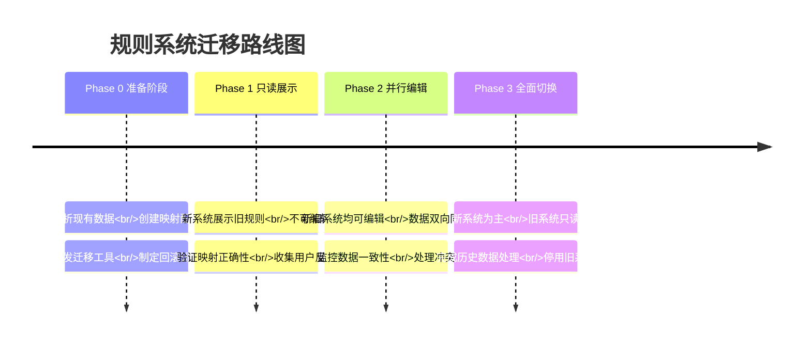

# Phase 2-A: 规则数据迁移策略与执行工具

> **日期**: 2026-04-15  
> **目标**: 平滑过渡现有规则系统，实现从Schema v1规则到新规则编排系统的迁移

---

## 一、迁移概览

### 1.1 迁移范围

**迁移源**：
1. **Schema v2 canonical YAML 中的规则定义** (`rule_definitions` + `rule_logics`)
2. **现有内存中的 RuleDefinitionV2 / RuleLogic 对象**
3. **现有数据库中的规则元数据**（如存在）

**迁移目标**：
- 新规则编排系统的 `rule_groups` 表
- 新规则编排系统的 `rule_steps` 表
- 完全支持规则四元素模型

### 1.2 迁移挑战

| 挑战 | 影响 | 解决方案 |
|------|------|----------|
| 数据结构不一致 | 字段映射复杂 | 创建映射解析器，支持自定义映射 |
| 逻辑表达式差异 | 语法不兼容 | 表达式转换工具，保留原始表达式 |
| 现有规则执行依赖 | 业务中断 | 双模式运行，渐进式切换 |
| 数据量大 | 迁移时间长 | 增量迁移，支持断点续传 |

### 1.3 迁移原则

1. **无损迁移**：所有规则逻辑、优先级、执行顺序保持不变
2. **可验证**：每条规则迁移后必须通过验证测试
3. **可回滚**：保留原始数据，支持完整回滚
4. **渐进式**：支持分批迁移，新旧系统并行
5. **自动化**：提供CLI工具，减少人工介入

---

## 二、现有数据结构分析

### 2.1 Schema v2 中的规则结构

根据示例文件分析，现有规则结构如下：

```yaml
# 规则定义 (L4)
rule_definitions:
  - id: RD001_eligibility_check
    name: "授信准入检查"
    rule_type: "constraint"
    applicable_to: [Supplier]  # 作用对象
    triggers: [...]            # 触发条件（扩展为适用场景）

# 规则逻辑 (L4)
rule_logics:
  - id: RL001_eligibility_check
    definition_id: RD001_eligibility_check
    name: "准入条件检查"
    when:
      expression: |            # 条件
        status == 'ACTIVE'
        AND registered_capital.value >= 1000000
    then_action:
      action_type: "set_flag"  # 动作类型
      output:                  # 输出
        eligible: true
    else_action:               # ELSE分支（可选）
      action_type: "reject"
      output:
        reject_reason: "不满足准入条件"
    priority: 100
    version: 1
```

### 2.2 与规则四元素模型的映射

| 现有字段 | 新系统字段 | 映射规则 | 备注 |
|----------|-----------|----------|------|
| `rule_definitions.id` | `rule_groups.id` | 直接映射 | 规则组ID |
| `rule_definitions.name` | `rule_groups.name` | 直接映射 | 规则组名称 |
| `rule_definitions.rule_type` | `rule_groups.rule_type` | 直接映射 | 类型转换 |
| `rule_definitions.applicable_to` | `rule_groups.applies_to` | 直接映射 | 作用对象 |
| `rule_definitions.triggers` | `rule_groups.applicable_categories` | 需要解析 | 复杂映射 |
| `rule_logics.when.expression` | `rule_steps.when_clause` | 表达式转换 | 条件转换 |
| `rule_logics.then_action.action_type` | `rule_steps.then_clause.type` + 算子 | 类型映射 | 动作类型到算子 |
| `rule_logics.priority` | `rule_steps.order` | 优先级转顺序 | 同一组内排序 |

### 2.3 算子映射表

现有动作类型到新系统算子的映射：

| 现有 `action_type` | 新系统算子 | 参数映射 | 备注 |
|-------------------|------------|----------|------|
| `set_flag` | `SET_FLAG` | `output` → `target`/`value` | 直接映射 |
| `reject` | `REJECT` | `output` → `reason` | 直接映射 |
| `compute` | `COMPUTE` | 表达式提取为算子 | 需要分析表达式 |
| `alert` | `ALERT` | 输出结构转换 | 预警配置映射 |
| `branch` | `SWITCH` | case结构转换 | 分支逻辑 |

> **注意**：现有 `compute` 动作可能包含复杂逻辑，需要升级为相应算子（BINNING等）

---

## 三、迁移路线图

### 3.1 四阶段迁移策略



### 3.2 时间安排

| 时期 | 周次 | 主要活动 | 状态 |
|------|------|----------|------|
| **准备阶段** | 第1-2周 | 数据分析和工具开发 | 技术准备 |
| **只读展示阶段** | 第3-4周 | 展示验证，用户培训 | 风险控制 |
| **并行编辑阶段** | 第5-8周 | 双向同步，冲突处理 | 平滑过渡 |
| **全面切换阶段** | 第9周 | 数据迁移完成，旧系统下线 | 完成迁移 |

---

## 四、迁移工具设计

### 4.1 CLI工具架构

```bash
# 工具入口
ontology-engine-cli migration
├── analyze            # 分析现有规则
├── convert-yaml       # YAML转换
├── migrate-schema     # Schema迁移
├── validate          # 验证迁移结果
├── rollback          # 回滚迁移
└── monitor           # 监控迁移状态
```

### 4.2 核心迁移脚本

```python
# ontology_engine/cli/migration/rule_migrator.py
"""
规则数据迁移器。

功能：
1. 从Schema v2解析现有规则
2. 转换为新系统数据模型
3. 存储到新数据库表
4. 验证迁移结果
5. 生成迁移报告
"""

class RuleMigrator:
    def __init__(self, source_schema_path: str, target_db_path: str):
        self.source_schema_path = source_schema_path
        self.target_db = DuckDBStorage(target_db_path)
        self.migration_stats = MigrationStats()
        
    async def analyze_source(self) -> AnalysisReport:
        """分析源系统规则结构和复杂度"""
        pass
    
    async def convert_rule_definitions(
        self, 
        definition: RuleDefinitionV2
    ) -> RuleGroup:
        """转换单个规则定义到规则组"""
        pass
    
    async def convert_rule_logics(
        self, 
        logic: RuleLogic,
        rule_group: RuleGroup
    ) -> List[RuleStep]:
        """转换规则逻辑到规则步骤"""
        pass
    
    async def migrate_batch(
        self, 
        batch_size: int = 100
    ) -> MigrationResult:
        """批量迁移规则"""
        pass
    
    async def validate_migration(self) -> ValidationResult:
        """验证迁移结果正确性"""
        pass
    
    async def rollback_migration(self, migration_id: str) -> bool:
        """回滚指定的迁移批次"""
        pass
    
    async def generate_report(self) -> MigrationReport:
        """生成迁移报告"""
        pass
```

### 4.3 表达式转换器

```python
# ontology_engine/cli/migration/expression_converter.py
"""
表达式转换器：将旧版表达式转换为新版语法
"""

class ExpressionConverter:
    # 关键字映射表
    KEYWORD_MAPPINGS = {
        'IS NULL': 'is_null({})',
        'IS NOT NULL': 'not is_null({})',
        'LIKE': 'str_contains({}, {})',
        'BETWEEN': '{0} >= {1} AND {0} <= {2}',
    }
    
    # 函数映射表
    FUNCTION_MAPPINGS = {
        'today()': 'datetime.today()',
        'datediff(d1, d2)': 'days_between(d1, d2)',
    }
    
    def convert_expression(self, expr: str) -> str:
        """转换表达式语法"""
        # 1. 处理关键字
        for old_keyword, new_template in self.KEYWORD_MAPPINGS.items():
            expr = self._replace_keyword(expr, old_keyword, new_template)
        
        # 2. 处理函数调用
        for old_func, new_func in self.FUNCTION_MAPPINGS.items():
            expr = expr.replace(old_func, new_func)
        
        # 3. 标准化运算符
        expr = self._standardize_operators(expr)
        
        return expr
    
    def detect_operator_type(self, expr: str) -> Optional[str]:
        """从表达式检测可能的算子类型"""
        patterns = {
            'BINNING': r'if.*score.*>=.*\d+.*AAA|grade.*=.*AA',
            'DECISION_TABLE': r'if.*elif.*else',
            'SCORECARD': r'base.*\+.*points|score.*=.*\d+',
            'WEIGHTED_SUM': r'\d+\.?\d*\s*\*\s*\d+|\d+\.?\d*\s*\+',  # 权重计算
        }
        
        for op_type, pattern in patterns.items():
            if re.search(pattern, expr, re.IGNORECASE | re.MULTILINE | re.DOTALL):
                return op_type
        return None
```

### 4.4 迁移配置文件

```yaml
# migrations/config.yaml
migration:
  version: "1.0"
  metadata:
    source_version: "Schema v2.0"
    target_version: "Rule Orchestration v1.0"
    migration_date: "2026-04-15"
  
  # 字段映射配置
  field_mappings:
    rule_definitions:
      id: "id"
      name: "name"
      rule_type: "rule_type"
      applicable_to: "applies_to"
      triggers: "applicable_categories"  # 需要转换器
    
    rule_logics:
      id: "id"
      definition_id: "rule_group_id"
      when.expression: "when_clause.expression"
      then_action: "then_clause"
      else_action: "else_clause"
      priority: "order"
  
  # 转换器配置
  converters:
    - name: "trigger_to_category"
      class: "TriggerConverter"
      config:
        dimension_field_map:
          company_scale: ["LARGE", "MEDIUM"]
          industry_type: ["MANUFACTURING", "LOGISTICS"]
    
    - name: "compute_to_operator"
      class: "ComputeExpressionAnalyzer"
      config:
        patterns:
          binning: "(?P<var>\\w+)\\s*>=\\s*(?P<threshold>\\d+)"
          decision_table: "if.*then.*elif.*else"
  
  # 分批策略
  batching:
    enabled: true
    batch_size: 50
    max_workers: 4
    retry_policy:
      max_attempts: 3
      backoff_factor: 2.0
      jitter: true
```

---

## 五、双模式运行策略

### 5.1 Phase 1: 只读展示（2周）

**前端实现**：
```tsx
// src/pages/legacy/LegacyRuleView.tsx
export const LegacyRuleView: React.FC = () => {
  const [isMigrationMode, setIsMigrationMode] = useState('readonly');
  
  return (
    <Tabs activeKey={isMigrationMode}>
      {/* 旧系统视图 */}
      <TabPane tab="旧规则系统" key="legacy">
        <LegacyRuleList />
      </TabPane>
      
      {/* 新系统只读视图 */}
      <TabPane tab="新规则系统" key="readonly">
        <RuleGroupListPage readonly={true} />
        <Alert 
          type="info"
          message="新系统处于只读模式"
          description="规则可查看，但不可编辑。完整编辑功能将在迁移完成后开放。"
        />
      </TabPane>
    </Tabs>
  );
};
```

**后端桥接**：
```python
# ontology_engine/compatibility/legacy_bridge.py
class LegacyRuleBridge:
    """新旧系统桥接服务"""
    
    async def get_legacy_rules(self) -> List[RuleGroup]:
        """获取旧规则并以新格式返回（只读）"""
        # 1. 从Schema v2加载规则
        # 2. 转换为RuleGroup格式
        # 3. 标记为readonly
        pass
    
    async def sync_new_to_legacy(self, rule_group: RuleGroup):
        """新系统编辑同步到旧系统（Phase 2）"""
        # 反向转换
        pass
```

### 5.2 Phase 2: 并行编辑（4周）

**数据同步机制**：

```python
# 乐观锁模式的双向同步
class RuleSyncManager:
    async def sync_changes(self, user_id: str, rule_id: str):
        """同步用户在两边系统的修改"""
        # 1. 检测两边修改情况
        legacy_changes = await self.get_legacy_changes(rule_id)
        new_changes = await self.get_new_system_changes(rule_id)
        
        # 2. 判断冲突
        if self.has_conflict(legacy_changes, new_changes):
            # 记录冲突，通知用户
            await self.notify_conflict(user_id, rule_id, legacy_changes, new_changes)
        else:
            # 自动同步
            await self.auto_sync(legacy_changes, new_changes)
    
    async def handle_conflict(self, rule_id: str, resolution: ConflictResolution):
        """用户解决冲突"""
        if resolution.choice == 'use_legacy':
            # 使用旧系统版本
            await self.apply_legacy_to_new(rule_id, resolution.legacy_data)
        elif resolution.choice == 'use_new':
            # 使用新系统版本
            await self.apply_new_to_legacy(rule_id, resolution.new_data)
        elif resolution.choice == 'merge':
            # 合并版本
            merged = self.merge_changes(resolution.legacy_data, resolution.new_data)
            await self.apply_merged(rule_id, merged)
```

**冲突解决UI**：
```tsx
<ConflictResolutionModal
  ruleName="授信准入检查"
  legacyChange={{
    description: "修改注册资金门槛为150万",
    timestamp: "2026-04-15 10:30",
    user: "张三"
  }}
  newChange={{
    description: "添加增值税合规性检查",
    timestamp: "2026-04-15 11:15", 
    user: "李四"
  }}
  onResolve={(choice) => {
    // 用户选择的解决方式
  }}
/>
```

### 5.3 Phase 3: 全面切换（1周）

**最终迁移**：
```bash
# 执行最终迁移
ontology-engine-cli migration finalize \
  --source-schema /path/to/schema.yaml \
  --target-db ./data/rule_orchestration.db \
  --validate-all \
  --generate-report \
  --create-backup ./backup/rule_migration_2026-04-15.zip
```

**切换验证**：

| 验证项目 | 方法 | 验收标准 |
|----------|------|----------|
| 规则完整性 | 规则条数比对 | 原始规则数 = 迁移后规则数 |
| 逻辑正确性 | 测试用例执行 | 所有测试用例通过率100% |
| 性能验证 | 并发执行测试 | 响应时间<200ms, 成功率>99.9% |
| 数据一致性 | 抽样对比验证 | 随机抽样100条，一致性100% |

---

## 六、回滚计划

### 6.1 快照策略

```python
# 每次迁移前创建快照
class MigrationBackup:
    async def create_snapshot(self, snapshot_id: str):
        """创建迁移前快照"""
        # 1. 备份现有规则表结构
        await self.backup_table_schema('rule_definitions')
        await self.backup_table_schema('rule_logics')
        
        # 2. 备份数据
        await self.backup_table_data('rule_definitions', snapshot_id)
        await self.backup_table_data('rule_logics', snapshot_id)
        
        # 3. 记录元数据
        await self.record_migration_metadata(snapshot_id)
        
        return snapshot_id
    
    async def restore_snapshot(self, snapshot_id: str):
        """恢复快照"""
        # 1. 验证快照完整性
        # 2. 恢复表结构
        # 3. 恢复数据
        # 4. 清理新系统表
        pass
```

### 6.2 回滚流程

```
回滚触发条件：
1. 迁移失败率 > 5%
2. 关键业务规则执行异常
3. 用户投诉量激增
4. 系统性能严重下降

回滚步骤：
1. 立即停止新规则系统编辑功能
2. 发送系统通知，告知用户回滚计划
3. 执行 snapshot restore 操作
4. 验证数据完整性
5. 重新启用旧系统
6. 分析失败原因，制定改进方案
```

### 6.3 回滚UI

```bash
# 回滚管理界面
系统管理员控制台 > 数据管理 > 迁移回滚

已创建的快照：
┌─────────────────────┬────────────────┬─────────────┐
│ 快照ID              │ 创建时间       │ 状态        │
├─────────────────────┼────────────────┼─────────────┤
│ backup_20260415_1   │ 2026-04-15 10:00 │ 可用       │
│ backup_20260415_2   │ 2026-04-15 14:00 │ 可用       │
└─────────────────────┴────────────────┴─────────────┘

[执行回滚] [只查看] [删除快照]
```

---

## 七、监控与运维

### 7.1 迁移监控指标

```python
# 关键性能指标
migration_metrics = {
    # 进度指标
    'migration.progress.percentage': 0.0,      # 迁移进度百分比
    'migration.rules.total': 0,                # 总规则数
    'migration.rules.processed': 0,            # 已处理规则数
    'migration.rules.failed': 0,               # 失败规则数
    
    # 性能指标
    'migration.duration.ms': 0,                # 迁移总耗时
    'migration.rate.rules_per_second': 0.0,    # 迁移速率
    
    # 质量指标
    'migration.success_rate.percent': 100.0,   # 成功率
    'migration.validation.passed': 0,          # 验证通过数
    'migration.validation.failed': 0,          # 验证失败数
    
    # 系统指标
    'migration.memory.usage_mb': 0,            # 内存使用
    'migration.cpu.percent': 0,                # CPU使用率
}
```

### 7.2 监控仪表盘

```yaml
# Grafana仪表盘配置
dashboard:
  title: "规则数据迁移监控"
  panels:
    - title: "迁移进度"
      type: "stat"
      sql: "SELECT progress_percentage FROM migration_metrics"
    
    - title: "迁移速率"
      type: "timeseries"
      sql: "SELECT time, rules_per_second FROM migration_performance"
    
    - title: "成功率"
      type: "gauge"
      sql: "SELECT success_rate FROM migration_quality"
    
    - title: "错误分布"
      type: "piechart"
      sql: "SELECT error_type, count(*) FROM migration_errors GROUP BY error_type"
```

### 7.3 告警配置

```python
# 关键告警规则
alert_rules = [
    {
        "name": "迁移进度停滞",
        "condition": "rate(migration.progress.percentage[5m]) < 0.1",
        "severity": "WARNING",
        "message": "迁移进度在过去5分钟内增长小于0.1%"
    },
    {
        "name": "迁移失败率过高",
        "condition": "migration.success_rate.percent < 95",
        "severity": "CRITICAL", 
        "message": "规则迁移成功率低于95%"
    },
    {
        "name": "内存使用超限",
        "condition": "migration.memory.usage_mb > 2048",
        "severity": "WARNING",
        "message": "迁移进程内存使用超过2GB"
    }
]
```

---

## 八、测试与验证

### 8.1 迁移测试套件

```python
# tests/integration/test_migration.py
class TestRuleMigration:
    """规则迁移集成测试"""
    
    @pytest.fixture
    def migrator(self):
        return RuleMigrator(
            source_schema_path=TEST_SCHEMA_PATH,
            target_db_path=":memory:"
        )
    
    @pytest.mark.asyncio
    async def test_migration_completeness(self, migrator):
        """测试迁移完整性"""
        result = await migrator.migrate_batch()
        
        # 验证规则数量
        source_count = len(await migrator.analyze_source())
        target_count = await migrator.get_target_count()
        
        assert source_count == target_count, \
            f"规则数量不匹配: 源={source_count}, 目标={target_count}"
    
    @pytest.mark.asyncio
    async def test_expression_conversion(self, migrator):
        """测试表达式转换"""
        test_cases = [
            ("status == 'ACTIVE'", "status == 'ACTIVE'"),
            ("total_amount IS NULL", "is_null(total_amount)"),
            ("score BETWEEN 60 AND 100", "score >= 60 AND score <= 100"),
        ]
        
        for old_expr, expected_new_expr in test_cases:
            new_expr = migrator.expression_converter.convert_expression(old_expr)
            assert new_expr == expected_new_expr, \
                f"表达式转换失败: {old_expr} -> {new_expr} (期望: {expected_new_expr})"
    
    @pytest.mark.asyncio 
    async def test_roundtrip_migration(self, migrator):
        """测试往返迁移（迁出再迁回）"""
        # 1. 执行正向迁移
        await migrator.migrate_batch()
        
        # 2. 从目标系统导出为YAML
        export_yaml = await migrator.export_to_yaml()
        
        # 3. 比较原始YAML和导出YAML
        original = await migrator.load_source_yaml()
        exported = yaml.safe_load(export_yaml)
        
        # 关键字段应该一致
        assert original['rule_definitions'] == exported['rule_definitions']
        assert original['rule_logics'] == exported['rule_logics']
```

### 8.2 性能基准测试

```python
# tests/performance/test_migration_performance.py
class TestMigrationPerformance:
    """迁移性能测试"""
    
    @pytest.mark.parametrize("rule_count", [100, 1000, 10000])
    def test_batch_migration_performance(self, rule_count):
        """测试批量迁移性能"""
        # 生成测试数据
        test_rules = generate_test_rules(rule_count)
        
        # 执行迁移并计时
        start_time = time.perf_counter()
        result = migrator.migrate_batch(test_rules)
        end_time = time.perf_counter()
        
        duration = end_time - start_time
        
        # 性能要求：1000条规则迁移时间 < 10秒
        if rule_count == 1000:
            assert duration < 10.0, \
                f"1000条规则迁移耗时{duration:.2f}秒，超过10秒阈值"
        
        # 计算并记录性能指标
        rate = rule_count / duration  # 条/秒
        print(f"性能: {rule_count}条规则, 耗时{duration:.2f}秒, 速率{rate:.1f}条/秒")
```

### 8.3 生产验证流程

**验证阶段**：

| 阶段 | 验证方法 | 通过标准 |
|------|----------|----------|
| 单元验证 | 静态分析+单元测试 | 迁移代码覆盖率>90% |
| 集成验证 | 端到端测试 | 所有测试用例通过 |
| 性能验证 | 负载测试 | 迁移速率>500条/秒 |
| 生产验证 | 真实数据抽样 | 抽样正确率>99.5% |
| 用户体验 | A/B测试 | 用户满意度>90% |

**验证脚本**：
```bash
# 完整验证流程
./scripts/validate_migration.sh \
  --schema ./examples/supply_chain_finance/schema.yaml \
  --test-data ./test_data/rules.json \
  --output-report ./reports/migration_validation_$(date +%Y%m%d).html
```

---

## 九、风险与缓解措施

### 9.1 风险矩阵

| 风险项 | 影响 | 概率 | 等级 | 缓解措施 |
|--------|------|------|------|----------|
| 映射规则错误 | 数据丢失 | 中 | 高 | 严格测试，小批量试迁移 |
| 表达式转换失败 | 规则执行异常 | 高 | 高 | 保留原始表达式，人工审核 |
| 性能瓶颈 | 迁移超时 | 中 | 中 | 分批迁移，增量处理 |
| 新旧系统不一致 | 业务中断 | 低 | 高 | 双模式运行，回滚计划 |
| 用户操作冲突 | 数据不一致 | 高 | 中 | 冲突检测+解决机制 |

### 9.2 应急预案

**场景1：迁移工具异常**

```
预案：
1. 立即暂停迁移进程
2. 记录错误上下文和栈跟踪
3. 通知运维团队
4. 如果处于生产环境，回滚到上一个快照
5. 修复问题后，从检查点恢复
```

**场景2：新系统性能问题**

```
预案：
1. 启用只读模式，禁止编辑
2. 调低并发请求限制
3. 增加应用服务器资源
4. 开启查询缓存
5. 优化数据库索引
```

**场景3：用户投诉激增**

```
预案：
1. 客服团队标准应对话术
2. 技术人员快速响应通道
3. 临时回退到旧系统
4. 用户补偿方案
5. 问题根因分析
```

---

## 十、文档与培训

### 10.1 迁移文档

| 文档名称 | 受众 | 内容要点 |
|----------|------|----------|
| `docs/migration/technical-guide.md` | 开发人员 | 架构设计、API、数据模型 |
| `docs/migration/operational-guide.md` | 运维人员 | 部署、监控、备份恢复 |
| `docs/migration/user-migration-guide.md` | 业务用户 | 操作变化、新功能 |
| `docs/migration/troubleshooting.md` | 支持团队 | 常见问题解决方案 |

### 10.2 培训计划

| 角色 | 培训内容 | 培训方式 | 时间 |
|------|----------|----------|------|
| 管理员 | 迁移工具使用、监控系统 | 现场培训+实操 | 第1周 |
| 业务用户 | 新系统操作、功能差异 | 在线视频+实操 | 第2-3周 |
| 支持团队 | 问题排查、应急处理 | 情景演练 | 第4周 |
| 开发团队 | 系统架构、扩展开发 | 技术分享 | 第5周 |

### 10.3 沟通计划

**内部沟通**：
- 每周迁移进度会议
- 技术决策评审会
- 风险预警通报

**外部沟通**：
- 迁移公告（提前2周）
- 系统维护通知
- 迁移完成通告

---

## 十一、工具清单

### 11.1 开发工具

```bash
# 核心工具
ontology-engine-cli migration      # 主要迁移工具
ontology-engine-cli diff           # 规则差异对比
ontology-engine-cli validate       # 迁移验证

# 辅助工具
./scripts/generate_test_data.py    # 测试数据生成
./scripts/check_migration.py       # 数据一致性检查
./scripts/backup_rules.py          # 规则备份工具
```

### 11.2 监控工具

- **Grafana仪表盘**: 迁移监控
- **Prometheus**: 指标收集
- **Sentry**: 错误追踪
- **系统日志**: 操作审计

### 11.3 部署脚本

```bash
# 部署流程
./deploy/setup_migration.sh        # 环境准备
./deploy/start_migration.sh        # 启动迁移
./deploy/monitor_migration.sh      # 监控进程
./deploy/finalize_migration.sh     # 完成迁移
./deploy/rollback_migration.sh     # 回滚操作
```

---

## 十二、总结

这套迁移策略提供了从现有Schema v2规则系统到新规则编排系统的完整路径。核心特点：

1. **零停机迁移**：通过双模式运行实现无缝切换
2. **数据完整性**：严格的验证测试确保数据质量
3. **可回滚设计**：完整的备份和恢复机制
4. **渐进式过渡**：分阶段降低迁移风险
5. **全面监控**：实时掌握迁移状态和性能

**建议启动时间**：开发团队完成Phase 2-A基础框架后，可同步启动迁移工具开发。

**预计总耗时**：10周（包含准备、迁移、验证、切换全过程）

**关键成功因素**：
- 充分的测试验证
- 用户参与和反馈
- 有效的沟通管理
- 完善的监控体系