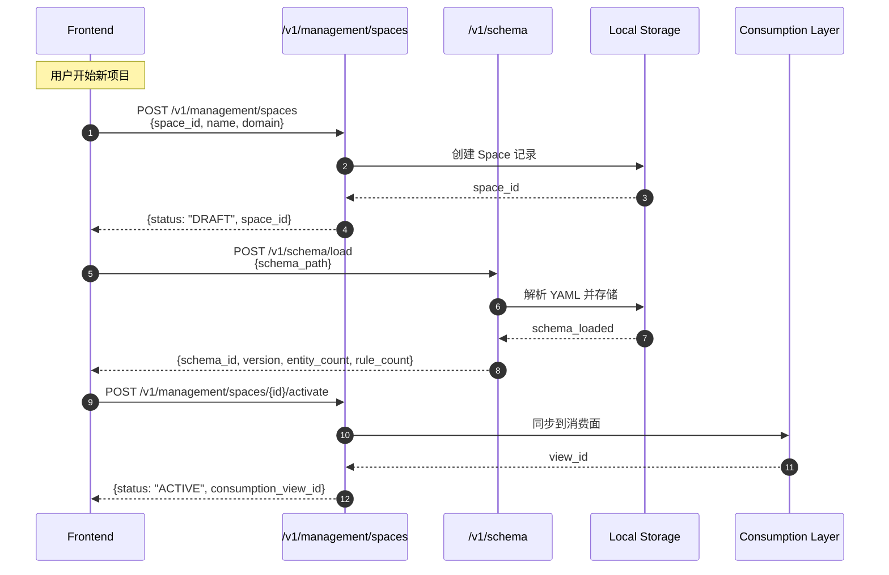
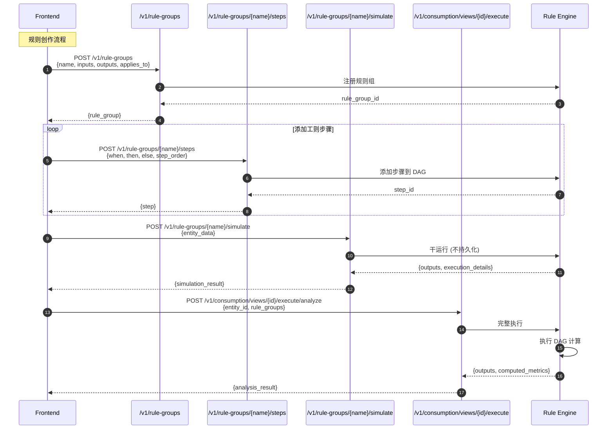
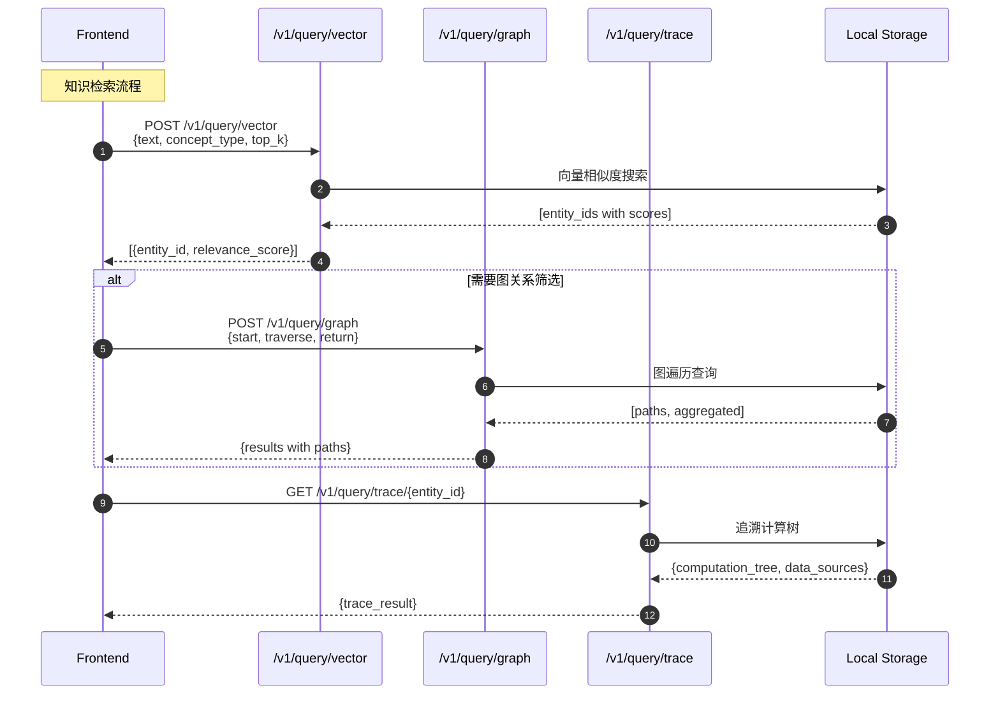
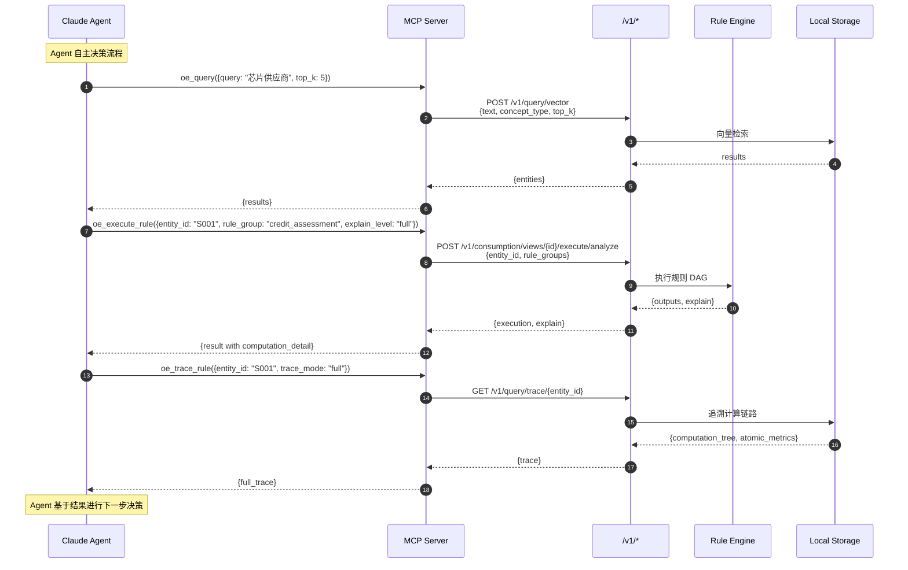
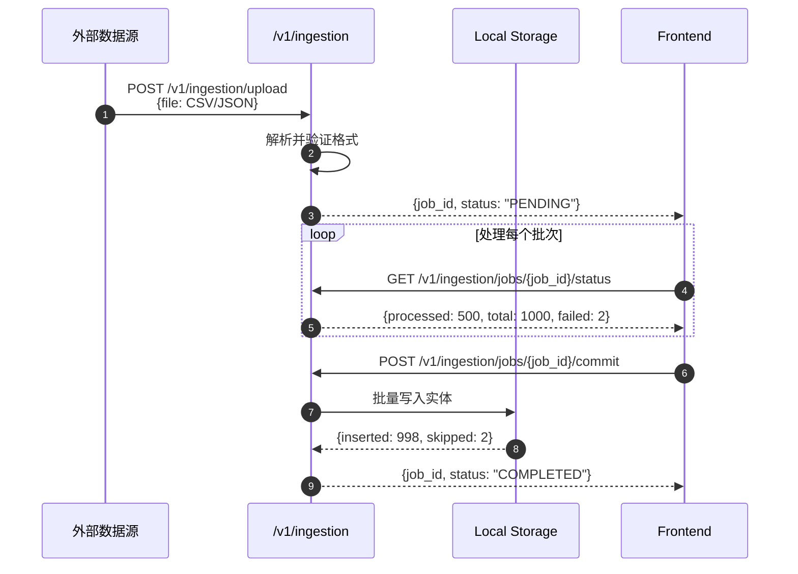

# API 设计文档

> **Version**: v2.1 (Phase 2 - Migration Complete)
> **Protocol**: REST (FastAPI)
> **状态**: 与代码一致
> **最后核验**: 2026-04-17

## 目录

1. [设计原则](#1-设计原则)
2. [响应格式](#2-响应格式)
3. [用户旅程与触点分析](#3-用户旅程与触点分析)
4. [核心 API 端点详解](#4-核心-api-端点详解)
5. [Mermaid 时序图](#5-mermaid-时序图)
6. [关键字段说明](#6-关键字段说明)
7. [错误码](#7-错误码)
8. [前端/Agent 调用规范](#8-前端agent-调用规范)

---

## 1. 设计原则

| 原则 | 说明 | 实践 |
|------|------|------|
| **资源导向** | URL 表示资源，HTTP 方法表示操作 | `GET /v1/entities/{id}` |
| **版本化** | `/v1/` 前缀 | 所有端点使用 `/v1/` |
| **统一响应** | 标准化 success/data/error 结构 | 详见响应格式 |
| **字段规范** | 后端 snake_case，前端 camelCase | 自动转换 |
| **语义隔离** | Space 级别的多租户隔离 | `schema_id` 参数 |

---

## 2. 响应格式

### 2.1 成功响应

```json
{
  "success": true,
  "data": { ... },
  "error": null,
  "meta": {
    "request_id": "uuid",
    "timestamp": "2026-04-16T10:00:00Z"
  }
}
```

### 2.2 错误响应

```json
{
  "success": false,
  "data": null,
  "error": {
    "code": "ENTITY_NOT_FOUND",
    "message": "Supplier S001 not found",
    "details": { "entity_id": "S001" }
  },
  "meta": {
    "request_id": "uuid",
    "timestamp": "2026-04-16T10:00:00Z"
  }
}
```

---

## 3. 用户旅程与触点分析

### 3.1 核心用户旅程

```
┌─────────────────────────────────────────────────────────────────────────────┐
│                           用户旅程总览                                        │
├─────────────────────────────────────────────────────────────────────────────┤
│                                                                             │
│  旅程 A: Schema 初始化                                                      │
│  ┌─────┐   ┌─────────────┐   ┌─────────────┐   ┌─────────────┐              │
│  │用户 │──▶│ 创建 Space  │──▶│ 加载 Schema │──▶│ 激活 Space  │              │
│  └─────┘   └─────────────┘   └─────────────┘   └─────────────┘              │
│                                                                             │
│  旅程 B: 规则创作与执行                                                      │
│  ┌─────┐   ┌─────────────┐   ┌─────────────┐   ┌─────────────┐   ┌─────────┐ │
│  │用户 │──▶│ 定义 Rule   │──▶│ 添加 Steps  │──▶│ 模拟执行    │──▶│ 执行分析│ │
│  └─────┘   └─────────────┘   └─────────────┘   └─────────────┘   └─────────┘ │
│                                                                             │
│  旅程 C: 实体知识检索                                                        │
│  ┌─────┐   ┌─────────────┐   ┌─────────────┐   ┌─────────────┐   ┌─────────┐ │
│  │用户 │──▶│ 向量检索    │──▶│ 图遍历     │──▶│ 规则追溯   │──▶│ 结果展示│ │
│  └─────┘   └─────────────┘   └─────────────┘   └─────────────┘   └─────────┘ │
│                                                                             │
│  旅程 D: Agent 外部调用                                                     │
│  ┌────────┐  ┌─────────────┐  ┌─────────────┐  ┌─────────────┐  ┌──────────┐  │
│  │ Agent │──▶│ MCP Tool   │──▶│ 规则执行   │──▶│ 结果解释   │──▶│ 知识更新 │  │
│  └────────┘  └─────────────┘  └─────────────┘  └─────────────┘  └──────────┘  │
│                                                                             │
└─────────────────────────────────────────────────────────────────────────────┘
```

### 3.2 前端/Agent 触点矩阵

| 触点类型 | 入口点 | 调用 API | 用途 |
|---------|--------|----------|------|
| **前端 - Space 管理** | `RuleGroupLayout` | `POST /v1/management/spaces` | 创建语义空间 |
| **前端 - Schema 加载** | `RuleGroupCreatePage` | `POST /v1/schema/load` | 加载 Schema YAML |
| **前端 - 规则组 CRUD** | `RuleGroupListPage` | `GET/POST/PUT/DELETE /v1/rule-groups` | 规则组管理 |
| **前端 - 规则步骤** | `RuleEditorModal` | `POST /v1/rule-groups/{name}/steps` | 规则步骤编辑 |
| **前端 - 模拟执行** | `RuleGroupForm` | `POST /v1/rule-groups/{name}/simulate` | 规则模拟 |
| **前端 - 实体查询** | 知识检索页面 | `POST /v1/query/vector`, `/graph` | 混合检索 |
| **Agent - MCP 工具** | Claude Desktop | MCP Server | 外部 Agent 调用 |
| **Agent - CLI** | Terminal | CLI Commands | 命令行操作 |

---

## 4. 核心 API 端点详解

### 4.1 Schema 管理

#### `POST /v1/schema/load` - 加载 Schema

**请求:**
```json
{
  "schema_path": "examples/supply_chain_finance/schema.yaml"
}
```

**响应:**
```json
{
  "success": true,
  "data": {
    "schema_id": "schema.supply_chain",
    "version": "1.0.0",
    "loaded_at": "2026-04-16T10:00:00Z",
    "entity_count": 5,
    "rule_count": 12
  }
}
```

| 字段 | 类型 | 必填 | 说明 |
|------|------|------|------|
| `schema_path` | string | ✅ | Schema YAML 文件路径 |
| `schema_id` | string | 返回 | 加载后的 Schema ID |
| `version` | string | 返回 | Schema 版本 |
| `entity_count` | int | 返回 | 实体类型数量 |
| `rule_count` | int | 返回 | 规则数量 |

#### `GET /v1/schema` - 获取当前 Schema

**响应:**
```json
{
  "success": true,
  "data": {
    "schema_id": "schema.supply_chain",
    "schema_version": "1.0.0",
    "layers": {
      "L1_fact_objects": [...],
      "L2_categorizations": [...],
      "L3_analytical_elements": [...],
      "L4_business_logic": {...}
    }
  }
}
```

---

### 4.2 Space 管理

#### `POST /v1/management/spaces` - 创建 Semantic Space

**请求:**
```json
{
  "space_id": "space.supply_chain_finance",
  "name": "供应链金融空间",
  "description": "用于供应链金融场景的语义空间",
  "space_type": "domain",
  "domain": "supply_chain_finance"
}
```

**响应:**
```json
{
  "success": true,
  "data": {
    "space_id": "space.supply_chain_finance",
    "name": "供应链金融空间",
    "status": "DRAFT",
    "created_at": "2026-04-16T10:00:00Z"
  }
}
```

| 字段 | 类型 | 必填 | 说明 |
|------|------|------|------|
| `space_id` | string | ✅ | 格式: `space.{name}` |
| `name` | string | ✅ | 人类可读名称 |
| `description` | string | 否 | 描述 |
| `space_type` | enum | 否 | `domain`/`project`/`sandbox` |
| `domain` | string | 否 | 领域标识 |
| `status` | string | 返回 | `DRAFT`/`ACTIVE`/`ARCHIVED` |

#### `POST /v1/management/spaces/{space_id}/activate` - 激活 Space

激活后 Space 同步到消费面。

**响应:**
```json
{
  "success": true,
  "data": {
    "space_id": "space.supply_chain_finance",
    "status": "ACTIVE",
    "consumption_view_id": "view.scf.001",
    "activated_at": "2026-04-16T10:05:00Z"
  }
}
```

---

### 4.3 实体管理

#### `POST /v1/entities` - 创建实体

**请求:**
```json
{
  "concept_type": "Supplier",
  "entity_id": "S001",
  "attributes": {
    "company_name": "供应商A",
    "registered_capital": { "value": 5000000, "currency": "CNY" },
    "status": "ACTIVE"
  }
}
```

| 字段 | 类型 | 必填 | 说明 |
|------|------|------|------|
| `concept_type` | string | ✅ | Schema 中的概念类型 |
| `entity_id` | string | ✅ | 实体唯一标识 |
| `attributes` | object | ✅ | 属性键值对 |
| `attributes.*.value` | any | 否 | 带单位的值 |
| `attributes.*.currency` | string | 否 | 货币单位 |

#### `POST /v1/entities/batch` - 批量创建

**请求:**
```json
{
  "entities": [
    { "concept_type": "Supplier", "entity_id": "S001", "attributes": {...} },
    { "concept_type": "Supplier", "entity_id": "S002", "attributes": {...} }
  ]
}
```

#### `POST /v1/entities/query` - 条件查询

**请求:**
```json
{
  "concept_type": "Supplier",
  "filter": {
    "status": { "eq": "ACTIVE" },
    "registered_capital.value": { "gte": 1000000 }
  },
  "limit": 100,
  "offset": 0
}
```

**过滤操作符:**
| 操作符 | 说明 | 示例 |
|--------|------|------|
| `eq` | 等于 | `{"status": {"eq": "ACTIVE"}}` |
| `ne` | 不等于 | `{"status": {"ne": "INACTIVE"}}` |
| `gt` / `gte` | 大于/大于等于 | `{"value": {"gt": 1000}}` |
| `lt` / `lte` | 小于/小于等于 | `{"value": {"lte": 5000}}` |
| `in` | 包含在列表 | `{"status": {"in": ["ACTIVE", "PENDING"]}}` |
| `contains` | 字符串包含 | `{"name": {"contains": "科技"}}` |

---

### 4.4 关系管理

#### `POST /v1/relations` - 创建关系

**请求:**
```json
{
  "relation_type": "guarantees",
  "from_id": "S001",
  "to_id": "S002",
  "attributes": {
    "amount": { "value": 1000000, "currency": "CNY" },
    "start_date": "2026-01-01"
  }
}
```

| 字段 | 类型 | 必填 | 说明 |
|------|------|------|------|
| `relation_type` | string | ✅ | 关系类型 (guarantees/supplies/...) |
| `from_id` | string | ✅ | 起始实体 ID |
| `to_id` | string | ✅ | 目标实体 ID |
| `attributes` | object | 否 | 关系属性 |

#### `GET /v1/entities/{entity_id}/neighbors` - 查询邻居

**参数:**
| 参数 | 类型 | 说明 |
|------|------|------|
| `relation_type` | string | 过滤关系类型 |
| `depth` | int | 深度 (默认 1, 最大 2) |
| `direction` | enum | `outgoing`/`incoming`/`both` |

---

### 4.5 规则管理

#### `GET /v1/rule-groups` - 列出规则组

**参数:**
| 参数 | 类型 | 说明 |
|------|------|------|
| `schema_id` | string | ✅ | Semantic Space ID |
| `enabled` | boolean | 否 | 仅返回启用的规则 |

**响应:**
```json
{
  "success": true,
  "data": {
    "rule_groups": [
      {
        "id": "rg.credit.assessment",
        "name": "credit_assessment",
        "schema_id": "space.scf",
        "description": "信用评估规则组",
        "type": "decision",
        "priority": 100,
        "applies_to": {
          "fact_objects": ["Supplier"],
          "categories": {}
        },
        "inputs": [
          { "name": "registered_capital", "type": "attribute", "attribute": "registered_capital" }
        ],
        "outputs": [
          { "name": "eligible", "type": "boolean" },
          { "name": "credit_score", "type": "integer" }
        ],
        "preconditions": [
          { "expression": "status == 'ACTIVE'", "fail": { "eligible": false } }
        ],
        "enabled": true
      }
    ]
  }
}
```

#### `POST /v1/rule-groups` - 创建规则组

**请求:**
```json
{
  "name": "credit_assessment",
  "description": "信用评估规则组",
  "type": "decision",
  "priority": 100,
  "applies_to": {
    "fact_objects": ["Supplier"],
    "categories": {}
  },
  "inputs": [
    { "name": "registered_capital", "type": "attribute", "attribute": "registered_capital", "description": "注册资本" }
  ],
  "outputs": [
    { "name": "eligible", "type": "boolean" },
    { "name": "credit_score", "type": "integer" }
  ],
  "preconditions": [
    { "expression": "status == 'ACTIVE'", "fail": { "eligible": false } }
  ],
  "enabled": true
}
```

| 字段 | 类型 | 必填 | 说明 |
|------|------|------|------|
| `name` | string | ✅ | 规则组名称 (唯一) |
| `description` | string | 否 | 描述 |
| `type` | enum | 否 | `decision`/`calculation`/`validation` |
| `priority` | int | 否 | 优先级 (默认 100) |
| `applies_to.fact_objects` | string[] | ✅ | 适用的实体类型 |
| `applies_to.categories` | object | 否 | 适用的分类条件 |
| `inputs` | array | ✅ | 输入定义 |
| `outputs` | array | ✅ | 输出定义 |
| `preconditions` | array | 否 | 前置条件 |
| `enabled` | boolean | 否 | 是否启用 |

#### `POST /v1/rule-groups/{name}/steps` - 添加规则步骤

**请求:**
```json
{
  "id": "step.uuid-xxx",
  "name": "计算信用分数",
  "step_order": 1,
  "when": {
    "type": "expression",
    "expression": "registered_capital.value >= 1000000"
  },
  "then": {
    "operator": "COMPUTE",
    "params": {
      "formula": "min(registered_capital.value * 0.5, 10000000)"
    },
    "output_mapping": {
      "credit_limit": "result"
    }
  },
  "else": {
    "operator": "COMPUTE",
    "params": {
      "formula": "registered_capital.value * 0.3"
    },
    "output_mapping": {
      "credit_limit": "result"
    }
  },
  "enabled": true
}
```

| 字段 | 类型 | 必填 | 说明 |
|------|------|------|------|
| `id` | string | ✅ | 步骤 ID (客户端生成 UUID) |
| `name` | string | ✅ | 步骤名称 |
| `step_order` | int | ✅ | 执行顺序 |
| `when.type` | enum | ✅ | `expression`/`all_of`/`any_of` |
| `when.expression` | string | 当 type=expression | 条件表达式 |
| `when.sub_conditions` | string[] | 当 type=all_of/any_of | 子条件列表 |
| `then.operator` | string | ✅ | 算子名称 |
| `then.params` | object | 否 | 算子参数 |
| `then.output_mapping` | object | 否 | 输出映射 |
| `else.operator` | string | 否 | else 分支算子 |
| `enabled` | boolean | 否 | 是否启用 |

#### `POST /v1/rule-groups/{name}/simulate` - 模拟执行

**请求:**
```json
{
  "entity_data": {
    "entity_id": "S001",
    "concept_type": "Supplier",
    "attributes": {
      "company_name": "供应商A",
      "registered_capital": { "value": 5000000, "currency": "CNY" },
      "status": "ACTIVE"
    }
  }
}
```

**响应:**
```json
{
  "success": true,
  "data": {
    "rule_group": "credit_assessment",
    "entity_id": "S001",
    "execution_time_ms": 15,
    "results": {
      "steps_executed": [
        {
          "step_id": "step.uuid-xxx",
          "step_name": "计算信用分数",
          "condition_evaluated": "True",
          "action_taken": "then",
          "computation": {
            "formula": "min(5000000 * 0.5, 10000000)",
            "result": 2500000
          }
        }
      ]
    },
    "outputs": {
      "eligible": true,
      "credit_limit": 2500000
    }
  }
}
```

---

### 4.6 规则执行 (消费面)

#### `POST /v1/consumption/views/{view_id}/execute/analyze` - 执行分析

**请求:**
```json
{
  "entity_id": "S001",
  "rule_groups": ["credit_assessment"],
  "context_overrides": {
    "market_condition": "BULL"
  }
}
```

**响应:**
```json
{
  "success": true,
  "data": {
    "entity_id": "S001",
    "rule_results": {
      "credit_assessment": {
        "outputs": {
          "eligible": true,
          "credit_score": 85,
          "credit_grade": "A"
        },
        "execution_details": {
          "steps_executed": 3,
          "execution_time_ms": 12
        }
      }
    },
    "computed_metrics": {
      "credit_score": 85,
      "credit_grade": "A"
    }
  }
}
```

---

### 4.7 图查询

#### `POST /v1/query/graph` - 图遍历 DSL

**请求:**
```json
{
  "start": {
    "concept_type": "Supplier",
    "filter": { "status": { "eq": "ACTIVE" } }
  },
  "traverse": [
    {
      "relation": "guarantees",
      "direction": "both",
      "depth": 2,
      "target_filter": {
        "concept_type": "Supplier",
        "attributes": { "risk_level": { "eq": "HIGH" } }
      }
    }
  ],
  "return": {
    "attributes": ["company_name", "registered_capital"],
    "include_path": true,
    "aggregate": [
      { "type": "sum", "field": "guarantee_amount.value" },
      { "type": "count", "field": "related_entities" }
    ]
  },
  "limit": 50
}
```

**DSL 能力边界:**

| 能力 | 支持 | 说明 |
|------|------|------|
| 节点查找 | ✅ | 按 concept_type + 属性过滤 |
| 1-2 跳邻居扩展 | ✅ | 指定关系类型、方向、深度 |
| 属性过滤 | ✅ | eq/gte/lte/in/contains |
| 路径返回 | ✅ | include_path=true |
| 聚合计算 | ✅ | sum/count/avg/max |
| 3+ 跳遍历 | ❌ | Phase 2 考虑 |
| 任意路径匹配 | ❌ | 不支持通配符路径 |
| Cypher 语法 | ❌ | 不开放 Cypher |

#### `POST /v1/query/vector` - 向量检索

**请求:**
```json
{
  "text": "芯片供应商",
  "concept_type": "Supplier",
  "top_k": 10,
  "filters": {
    "status": { "eq": "ACTIVE" }
  }
}
```

**响应:**
```json
{
  "success": true,
  "data": {
    "results": [
      {
        "entity_id": "S003",
        "concept_type": "Supplier",
        "relevance_score": 0.95,
        "attributes": {
          "company_name": "芯片供应商A",
          "products": ["CPU", "GPU"]
        }
      }
    ]
  }
}
```

#### `POST /v1/query/hybrid` - 混合检索

**请求:**
```json
{
  "query": "高信用的芯片供应商",
  "match_mode": "hybrid",
  "concept_type": "Supplier",
  "top_k": 10,
  "weights": {
    "semantic": 0.6,
    "graph": 0.4
  }
}
```

---

## 5. Mermaid 时序图

### 5.1 用户旅程 A: Space 初始化与 Schema 加载



### 5.2 用户旅程 B: 规则创建与执行



### 5.3 用户旅程 C: 知识检索与追溯



### 5.4 Agent 外部调用 (MCP)



### 5.5 批量数据导入流程



---

## 6. 关键字段说明

### 6.1 统一字段规范

| 后端字段 (snake_case) | 前端字段 (camelCase) | 类型 | 说明 |
|----------------------|---------------------|------|------|
| `entity_id` | `entityId` | string | 实体唯一标识 |
| `schema_id` | `schemaId` | string | Schema 标识 |
| `space_id` | `spaceId` | string | Semantic Space 标识 |
| `rule_group` | `ruleGroup` | string | 规则组名称 |
| `step_order` | `order` | int | 步骤执行顺序 |
| `output_mapping` | `outputMapping` | object | 输出字段映射 |
| `sub_conditions` | `subConditions` | string[] | 子条件列表 |
| `concept_type` | `conceptType` | string | 概念类型 |
| `relation_type` | `relationType` | string | 关系类型 |
| `applies_to` | `appliesTo` | object | 规则适用范围 |
| `fact_objects` | `factObjects` | string[] | 适用的实体类型 |
| `rule_groups` | `ruleGroups` | string[] | 规则组列表 |
| `context_overrides` | `contextOverrides` | object | 上下文覆盖 |
| `dry_run` | `dryRun` | boolean | 干运行标志 |

### 6.2 核心枚举值

**Space Status:**
| 值 | 说明 |
|-----|------|
| `DRAFT` | 草稿态，未激活 |
| `ACTIVE` | 已激活，可用于消费 |
| `ARCHIVED` | 已归档，禁用 |

**Rule Group Type:**
| 值 | 说明 |
|-----|------|
| `decision` | 决策规则 |
| `calculation` | 计算规则 |
| `validation` | 校验规则 |

**Rule Step When Type:**
| 值 | 说明 |
|-----|------|
| `expression` | 单表达式条件 |
| `all_of` | 所有子条件都为真 |
| `any_of` | 任一子条件为真 |

**Query Match Mode:**
| 值 | 说明 |
|-----|------|
| `semantic` | 仅向量相似 |
| `graph` | 仅图关系匹配 |
| `hybrid` | 加权融合 (默认) |
| `path` | 路径模式匹配 |

**Trace Mode:**
| 值 | 说明 |
|-----|------|
| `categorization` | 仅归类分析 |
| `rules` | 仅适用规则 |
| `dependency` | 规则依赖树 |
| `full` | 完整链路 |

### 6.3 嵌套对象结构

**AttributeValue (带单位的值):**
```typescript
interface AttributeValue {
  value: number | string | boolean;  // 实际值
  currency?: string;                  // 货币单位 (如 "CNY", "USD")
  unit?: string;                      // 其他单位 (如 "km", "kg")
}
```

**RuleInput:**
```typescript
interface RuleInput {
  name: string;           // 输入名称
  type: 'attribute' | 'metric' | 'rule_output';
  attribute?: string;     // 当 type=attribute 时
  metric?: string;        // 当 type=metric 时
  description?: string;
}
```

**RuleOutput:**
```typescript
interface RuleOutput {
  name: string;           // 输出名称
  type: 'boolean' | 'integer' | 'float' | 'string' | 'object';
}
```

**Precondition:**
```typescript
interface Precondition {
  expression: string;      // 条件表达式
  fail?: object;          // 条件失败时的默认输出
}
```

---

## 7. 错误码

### 7.1 客户端错误 (4xx)

| Code | HTTP | 说明 | 修复建议 |
|------|------|------|----------|
| `ENTITY_NOT_FOUND` | 404 | 实体不存在 | 检查 entity_id |
| `CONCEPT_NOT_DEFINED` | 400 | Schema 未定义该概念 | 检查 concept_type |
| `INVALID_ATTRIBUTE` | 400 | 属性类型错误 | 检查 attributes 格式 |
| `RULE_NOT_FOUND` | 404 | 规则不存在 | 检查 rule_group name |
| `RULE_GROUP_NOT_FOUND` | 404 | 规则组不存在 | 检查 rule_groups 列表 |
| `STEP_NOT_FOUND` | 404 | 规则步骤不存在 | 检查 step_id |
| `EXPRESSION_ERROR` | 400 | 表达式语法错误 | 检查表达式语法 |
| `GRAPH_TRAVERSAL_TOO_DEEP` | 400 | 图遍历深度超限 | depth 最大为 2 |
| `OVERRIDABLE_VIOLATION` | 400 | L3 指标 overridable=false | 不可覆盖 |
| `FORMULA_SANDBOX_VIOLATION` | 400 | Formula 沙箱安全约束违反 | 检查公式内容 |
| `VALIDATION_ERROR` | 400 | 通用验证错误 | 查看 details |
| `SPACE_NOT_FOUND` | 404 | Space 不存在 | 检查 space_id |
| `SPACE_NOT_ACTIVE` | 400 | Space 未激活 | 先激活 Space |

### 7.2 服务端错误 (5xx)

| Code | HTTP | 说明 | 修复建议 |
|------|------|------|----------|
| `SCHEMA_NOT_LOADED` | 500 | Schema 未加载 | 先加载 Schema |
| `RULE_EXECUTION_ERROR` | 500 | 规则执行失败 | 检查规则定义 |
| `STORAGE_ERROR` | 500 | 存储层错误 | 检查存储配置 |
| `INTERNAL_ERROR` | 500 | 内部错误 | 查看服务器日志 |

### 7.3 同步相关错误

| Code | HTTP | 说明 |
|------|------|------|
| `ASSET_NOT_FOUND` | 404 | 资产不存在 |
| `ASSET_CONFLICT` | 409 | 同步冲突 |
| `PERMISSION_DENIED` | 403 | 无权限 |
| `SYNC_FAILED` | 500 | 同步失败 |
| `INVALID_SCHEMA` | 400 | Schema 格式错误 |
| `NETWORK_ERROR` | 503 | 云端连接失败 |

---

## 8. 前端/Agent 调用规范

### 8.1 前端 API 客户端规范

```typescript
// ontology-engine-ui/src/api/client.ts

import axios from 'axios';

const BASE_URL = import.meta.env.VITE_API_BASE_URL || '/v1';

export const apiClient = axios.create({
  baseURL: BASE_URL,
  timeout: 30000,
  headers: { 'Content-Type': 'application/json' },
});

// 请求拦截器: 添加认证 Token
apiClient.interceptors.request.use((config) => {
  const token = localStorage.getItem('auth_token');
  if (token) config.headers.Authorization = `Bearer ${token}`;
  return config;
});

// 响应拦截器: 错误处理
apiClient.interceptors.response.use(
  (response) => response,
  (error) => {
    if (error.response?.status === 401) {
      console.error('Unauthorized');
    } else if (error.response?.status === 403) {
      console.error('Forbidden');
    } else if (error.response?.status === 404) {
      console.error('Not Found');
    }
    return Promise.reject(error);
  }
);
```

### 8.2 字段转换规范

```typescript
// 后端 snake_case -> 前端 camelCase 转换
// 使用 ruleGroups.ts 中的 normalizeRuleGroup / normalizeRuleStep

// 示例: 创建规则组
const ruleGroup = {
  name: 'credit_assessment',
  appliesTo: {                // 前端 camelCase
    factObjects: ['Supplier'],
    categories: {}
  }
};

// serializeRuleGroup 转换为 snake_case
const body = {
  name: 'credit_assessment',
  applies_to: {               // 后端期望 snake_case
    fact_objects: ['Supplier'],
    categories: {}
  }
};
```

### 8.3 Agent MCP 工具映射

| MCP Tool | REST API Endpoint | 用途 |
|----------|-------------------|------|
| `oe_load_schema` | `POST /v1/schema/load` | 加载 Schema |
| `oe_create_entity` | `POST /v1/entities` | 创建实体 |
| `oe_execute_rule` | `POST /v1/consumption/views/{id}/execute/analyze` | 执行规则 |
| `oe_query` | `POST /v1/query/vector` | 向量检索 |
| `oe_trace_rule` | `GET /v1/query/trace/{entity_id}` | 规则追溯 |
| `oe_create_space` | `POST /v1/management/spaces` | 创建 Space |
| `oe_activate_space` | `POST /v1/management/spaces/{id}/activate` | 激活 Space |
| `oe_define_rule` | `POST /v1/rule-groups` | 定义规则组 |
| `oe_attach_rule_logic` | `POST /v1/rule-groups/{name}/steps` | 添加规则步骤 |
| `oe_snapshot` | `POST /v1/management/{space_id}/versions` | 创建快照 |

### 8.4 权限层级

| 权限 | 可操作范围 |
|------|-----------|
| `management:read` | 读取 Space、Schema、Dataset |
| `management:write` | 创建/修改/删除 Space、Schema、Rule、View |
| `consumption:read` | 读取 View、查询 Entity |
| `consumption:execute` | 执行规则、模拟 What-if |

---

## 附录 A: 完整端点列表 (v2.1)

> **架构决策** (2026-04-16):
> - `/v1/schema` → 标记为 deprecated，history 迁移到 Space
> - `/v1/visualize` → 合并到 `/v1/consumption/views`
> - `/v1/ingestion` → 增加 `?space_id=xxx_id` 参数
> - 所有 asset 管理必须关联 Space

### Schema 管理 (`/v1/schema`) ⚠️ DEPRECATED
| Method | Endpoint | 说明 |
|--------|----------|------|
| POST | `/v1/schema/load` | ~~加载 Schema~~ → 使用 `POST /v1/management/spaces/load-from-json` |
| GET | `/v1/schema` | ~~获取当前 Schema~~ → 使用 `GET /v1/management/spaces/{space_id}` |
| POST | `/v1/schema/reload` | ~~热重载~~ → 使用 `POST /v1/management/spaces/{space_id}/activate` |
| GET | `/v1/schema/versions` | ~~版本历史~~ → 使用 `GET /v1/management/{space_id}/versions` |
| POST | `/v1/schema/rollback/{version}` | ~~版本回滚~~ → 使用 `POST /v1/management/{space_id}/versions/{version}/rollback` |

### Space 管理 (`/v1/management`) ⭐ PRIMARY
| Method | Endpoint | 说明 |
|--------|----------|------|
| POST | `/v1/management/spaces` | 创建 Space |
| GET | `/v1/management/spaces` | 列出 Spaces |
| GET | `/v1/management/spaces/{space_id}` | 获取 Space (含内部 L1-L4 schema) |
| PUT | `/v1/management/spaces/{space_id}` | 更新 Space |
| DELETE | `/v1/management/spaces/{space_id}` | 删除 Space |
| POST | `/v1/management/spaces/{space_id}/activate` | 激活 Space |
| POST | `/v1/management/spaces/{space_id}/archive` | 归档 Space |
| GET | `/v1/management/{space_id}/versions` | 获取版本历史 |
| POST | `/v1/management/{space_id}/versions` | 创建快照 |
| POST | `/v1/management/{space_id}/versions/{version}/rollback` | 版本回滚 |

### Schema Layer 管理 (`/v1/management/{space_id}/schema/`)
| Method | Endpoint | 说明 |
|--------|----------|------|
| GET | `/v1/management/{space_id}/schema/L1/fact-objects` | 获取 L1 要素对象 |
| POST | `/v1/management/{space_id}/schema/L1/fact-objects` | 创建 L1 要素对象 |
| GET | `/v1/management/{space_id}/schema/L2/categorizations` | 获取 L2 分类 |
| POST | `/v1/management/{space_id}/schema/L2/categorizations` | 创建 L2 分类 |
| GET | `/v1/management/{space_id}/schema/L3/analytical-elements` | 获取 L3 分析元素 |
| POST | `/v1/management/{space_id}/schema/L3/analytical-elements` | 创建 L3 分析元素 |
| GET | `/v1/management/{space_id}/schema/L4/rules/definitions` | 获取 L4 规则定义 |
| POST | `/v1/management/{space_id}/schema/L4/rules/definitions` | 创建 L4 规则定义 |

### 实体管理 (`/v1/entities`) ⚠️ DEPRECATED → 迁移到 Space
| Method | Endpoint | 说明 |
|--------|----------|------|
| POST | `/v1/entities` | ~~创建实体~~ → 使用 `POST /v1/management/{space_id}/instances/entities` |
| POST | `/v1/entities/batch` | ~~批量创建~~ → 使用 `POST /v1/management/{space_id}/instances/entities` |
| GET | `/v1/entities/{entity_id}` | ~~获取实体~~ → 使用 `GET /v1/management/{space_id}/instances/entities` |
| POST | `/v1/entities/query` | ~~条件查询~~ → 使用 `POST /v1/management/{space_id}/instances/entities` |
| GET | `/v1/entities/{entity_id}/neighbors` | ~~查询邻居~~ → 使用 `GET /v1/management/{space_id}/instances/entities` |

### 规则管理 (`/v1/rule-groups`)
| Method | Endpoint | 说明 |
|--------|----------|------|
| GET | `/v1/rule-groups` | 列出规则组 (需 `?schema_id=xxx`) |
| POST | `/v1/rule-groups` | 创建规则组 (需 `?schema_id=xxx`) |
| GET | `/v1/rule-groups/{id}` | 获取规则组 |
| PUT | `/v1/rule-groups/{id}` | 更新规则组 |
| DELETE | `/v1/rule-groups/{id}` | 删除规则组 |
| POST | `/v1/rule-groups/{name}/steps` | 添加步骤 |
| GET | `/v1/rule-groups/{name}/steps` | 列出步骤 |
| PUT | `/v1/rule-groups/{name}/steps/{id}` | 更新步骤 |
| DELETE | `/v1/rule-groups/{name}/steps/{id}` | 删除步骤 |
| POST | `/v1/rule-groups/{name}/simulate` | 模拟执行 |
| POST | `/v1/rule-groups/import` | 从 YAML 导入 |
| GET | `/v1/rule-groups/{name}/export` | 导出为 YAML |

### 查询 (`/v1/query`)
| Method | Endpoint | 说明 |
|--------|----------|------|
| POST | `/v1/query/vector` | 向量检索 |
| POST | `/v1/query/hybrid` | 混合检索 |
| POST | `/v1/query/graph` | 图遍历 |
| GET | `/v1/query/trace/{entity_id}` | 规则追溯 |

### 消费面 (`/v1/consumption/views`) ⭐ CONSOLIDATED
| Method | Endpoint | 说明 |
|--------|----------|------|
| GET | `/v1/consumption/views` | 列出视图 |
| GET | `/v1/consumption/views/{view_id}` | 获取视图 |
| POST | `/v1/consumption/views/{view_id}/execute/analyze` | 执行分析 |
| POST | `/v1/consumption/views/{view_id}/execute/simulate` | What-if 模拟 |
| GET | `/v1/consumption/views/{view_id}/visualize/schema-graph` | Schema 图 |
| GET | `/v1/consumption/views/{view_id}/entities` | 视图实体 |
| GET | `/v1/consumption/views/{view_id}/metrics/{entity_id}/snapshot` | Metric 快照 |
| GET | `/v1/consumption/views/{view_id}/rules/dependency-graph` | 规则依赖图 |

### 数据导入 (`/v1/ingestion`) ⭐ WITH SPACE_ID PARAM
| Method | Endpoint | 说明 |
|--------|----------|------|
| POST | `/v1/ingestion/import` | 导入实体/关系 (需 `?space_id=xxx`) |
| POST | `/v1/ingestion/import/dict` | Dict 导入 (需 `?space_id=xxx`) |
| POST | `/v1/ingestion/validate` | 验证导入 (需 `?space_id=xxx`) |

### 数据集 (`/v1/datasets`)
| Method | Endpoint | 说明 |
|--------|----------|------|
| GET | `/v1/datasets` | 列出数据集 |
| POST | `/v1/datasets` | 创建数据集 |
| GET | `/v1/datasets/{id}` | 获取数据集 |
| DELETE | `/v1/datasets/{id}` | 删除数据集 |
| POST | `/v1/datasets/{id}/export` | 导出数据集 |

### 分类管理 (`/v1/categories`)
| Method | Endpoint | 说明 |
|--------|----------|------|
| GET | `/v1/categories` | 列出分类 |
| POST | `/v1/categories` | 创建分类 |
| GET | `/v1/categories/{id}` | 获取分类 |
| PUT | `/v1/categories/{id}` | 更新分类 |
| DELETE | `/v1/categories/{id}` | 删除分类 |

### 增量更新 (`/v1/incremental`)
| Method | Endpoint | 说明 |
|--------|----------|------|
| POST | `/v1/incremental/push` | 推送增量 |
| GET | `/v1/incremental/sync/{job_id}` | 同步状态 |
| POST | `/v1/incremental/batch` | 批量增量 |
| GET | `/v1/incremental/history` | 增量历史 |

### DAG 与 Operators
| Method | Endpoint | 说明 |
|--------|----------|------|
| GET | `/v1/dag/full` | 完整计算 DAG |
| GET | `/v1/dag/path` | DAG 路径查询 |
| GET | `/v1/metrics/{name}/dag` | Metric 依赖 DAG |
| GET | `/v1/operators` | 算子列表 |
| GET | `/v1/operators/{name}/schema` | 算子 Schema |

---

## 附录 B: 迁移检查清单

> **验证状态**: ✅ 代码审查完成 - 所有迁移项均已实现

### Phase 1 → Phase 2 迁移项

| 旧端点 | 新端点 (实际路径) | 状态 | 实施日期 |
|--------|-------------------|------|----------|
| `GET /v1/schema` | `GET /v1/management/{space_id}` | ✅ 已迁移 + deprecated header | 2026-04-17 |
| `POST /v1/schema/load` | `POST /v1/management/{space_id}/schema/load-from-yaml` | ✅ 已迁移 + deprecated header | 2026-04-17 |
| `GET /v1/entities` | `GET /v1/management/{space_id}/instances/entities` | ✅ 已迁移 + deprecated header | 2026-04-17 |
| `POST /v1/entities` | `POST /v1/management/{space_id}/instances/entities` | ✅ 已迁移 + deprecated header | 2026-04-17 |
| `GET /v1/visualize/schema/graph` | `GET /v1/consumption/views/{view_id}/visualize/schema-graph` | ✅ 已实现 | 2026-04-17 |
| `GET /v1/visualize/entities` | `GET /v1/consumption/views/{view_id}/entities` | ✅ 已实现 | 2026-04-17 |
| `GET /v1/visualize/metrics/{id}` | `GET /v1/consumption/views/{view_id}/metrics/{entity_id}/snapshot` | ✅ 已实现 | 2026-04-17 |
| `GET /v1/visualize/rule-chain/{dim}` | `GET /v1/consumption/views/{view_id}/rules/dependency-graph` | ✅ 已实现 | 2026-04-17 |
| `POST /v1/ingestion/import` | `POST /v1/ingestion/import?space_id=xxx` | ✅ 已实现 | 2026-04-17 |
| `DELETE /v1/schema/rollback/{v}` | `POST /v1/management/{space_id}/versions/{v}/rollback` | ✅ 路径已存在 | 2026-04-17 |

### 已完成项

#### 1. ingestion.py space_id 参数 ✅
- `POST /v1/ingestion/import?space_id=xxx`
- `POST /v1/ingestion/import/dict?space_id=xxx`
- `POST /v1/ingestion/validate?space_id=xxx`
- 缺失 space_id 返回 400 `MISSING_PARAMETER`

#### 2. visualization.ts 前端重构 ✅
- `fetchSchemaGraph` → `spaceApi.getSchemaGraph(viewId, ...)`
- `fetchVisualizationEntities` → `spaceApi.listViewEntities(viewId, ...)`
- `fetchMetricSnapshot` → `spaceApi.getMetricSnapshot(viewId, entityId, ...)`
- `fetchRuleChainGraph` → `spaceApi.getRuleDependencyGraph(viewId)`
- `simulateExecution` → `spaceApi.executeSimulate(viewId, ...)`
- `fetchExecutionTrace` → `spaceApi.executeAnalyze(viewId, ..., true)`

#### 3. Deprecation Headers ✅
- `schema.py`: 5 个端点全部添加 `X-Deprecation-Warning`
- `entities.py`: 5 个端点全部添加 `X-Deprecation-Warning`
- `visualization.py`: 6 个端点全部添加 `X-Deprecation-Warning`

#### 4. 新端点实现 ✅
- `GET /v1/consumption/views/{view_id}/metrics/{entity_id}/snapshot` (consumption.py)

---

## 附录 C: 流式响应 (待实现)

> **当前状态**: ❌ 未实现

```http
GET /v1/rules/execute/stream
Accept: text/event-stream
```

```
event: rule_start
data: {"rule_id": "R001"}

event: rule_complete
data: {"rule_id": "R001", "result": {...}}

event: step_progress
data: {"rule_id": "R001", "step": 2, "total_steps": 5}

event: complete
data: {"final_result": {...}}
```

---

*文档版本: v2.1 | 最后更新: 2026-04-17 | 迁移状态: ✅ 完成*
