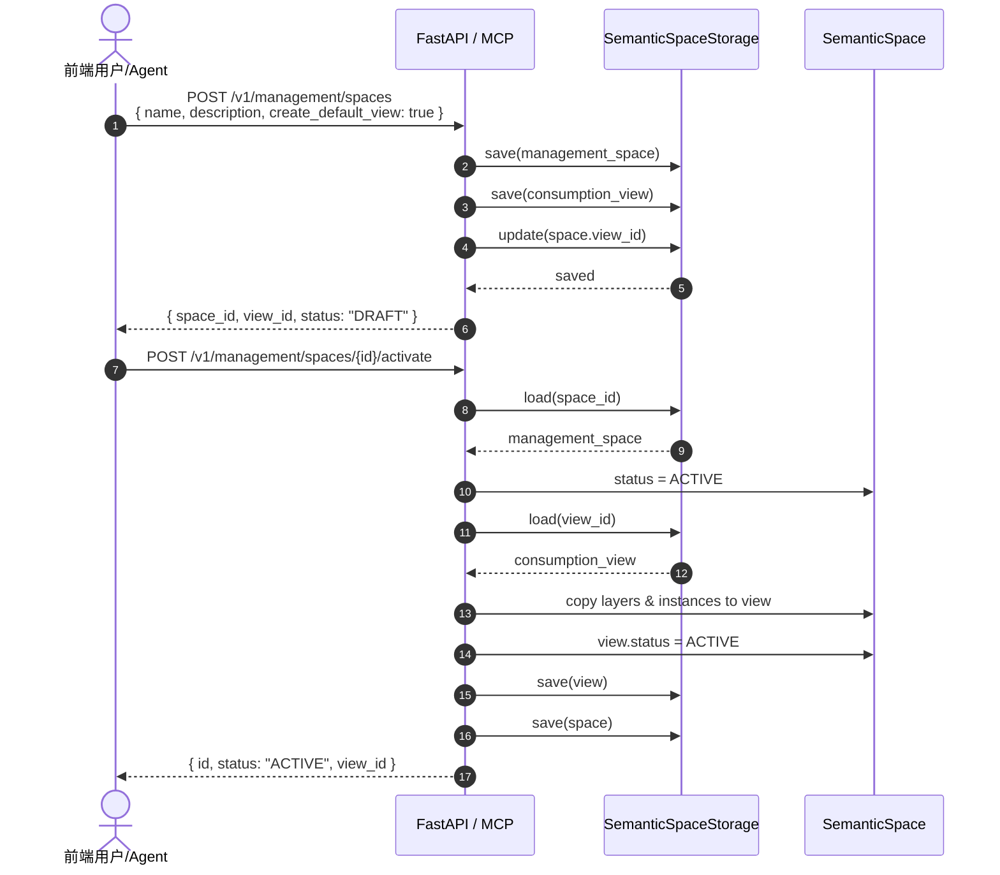
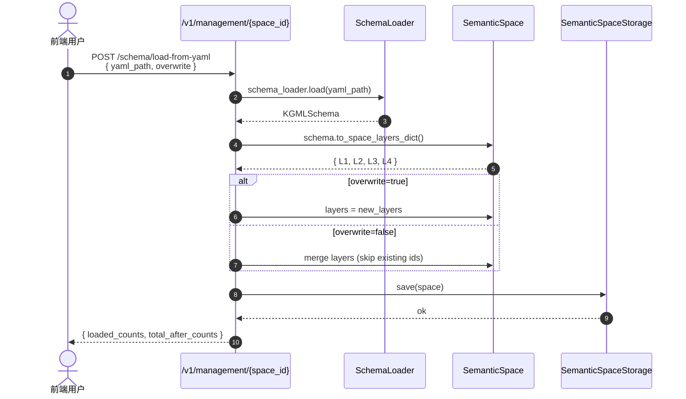
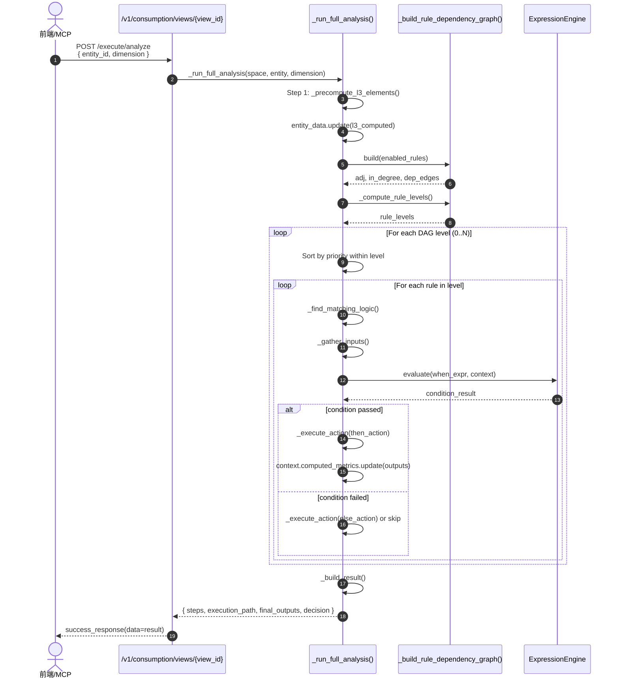
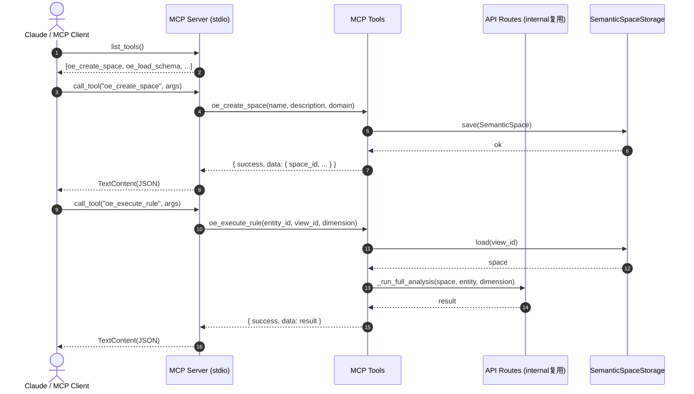

# API 架构设计

---
status: current
phase: phase1+phase2
source_of_truth: true
last_verified: 2026-04-16
verified_against: ontology_engine/api/
related_docs:
  - 06-module-detailed-design/10-api-layer.md
  - 07-agent-interface.md
  - 04-migration-and-gap/README.md
---

> **状态**: 本文档基于当前代码编写，描述已实现的 API 结构
> **最后核验**: 2026-04-16 (已核对 `api/routes/`、`api/server.py`、`mcp/server.py`)

## 1. 外部调用触点总览

OntologyEngine 当前支持三类外部调用者：

| 调用方 | 入口 | 协议 | 用途 |
|--------|------|------|------|
| **前端 Web UI** | FastAPI HTTP | REST | 管理面操作、可视化、规则执行 |
| **AI Agent / Claude** | MCP Server | stdio JSON-RPC | 通过 7 个 MCP 工具与引擎交互 |
| **Legacy 客户端** | FastAPI HTTP | REST | 兼容旧版 `/v1/entities`、`/v1/rules` 等路由 |

```
                         ┌─────────────────────────────────────┐
                         │         OntologyEngine              │
    ┌────────────────────┼─────────────────────────────────────┤
    │                    │                                     │
  Frontend              │    FastAPI Server                   │
  (React/Web)           │    ├── /v1/management/*  (管理面)   │
    │                   │    ├── /v1/consumption/* (消费面)   │
    │                   │    ├── /v1/visualize/*   (可视化)   │
    │                   │    └── /v1/* (Legacy 兼容路由)      │
    └───────────────────┼─────────────────────────────────────┘
                        │                                     │
  AI Agent              │    MCP Server (stdio)               │
  (Claude/Cursor)       │    ├── oe_create_space              │
    │                   │    ├── oe_execute_rule              │
    │                   │    ├── oe_simulate                  │
    │                   │    └── ... (共 7 个工具)            │
    └───────────────────┼─────────────────────────────────────┘
                        │                                     │
                        │    Engine Layer                     │
                        │    └── SemanticSpaceStorage         │
                        └─────────────────────────────────────┘
```

---

## 2. 完整用户旅程

### 旅程 A: 供应链金融授信评估 (前端用户)

```
1. 系统初始化
   └── 启动时自动加载 examples/supply_chain_finance/
       ├── schema.yaml → Management Space (space_supply_chain_finance)
       ├── instances.yaml → 实体/关系实例
       └── 自动生成 Consumption View (view_supply_chain_finance)

2. 管理面操作 (Business Analyst)
   ├── GET  /v1/management/spaces          → 查看所有管理空间
   ├── GET  /v1/management/spaces/{id}     → 查看空间详情
   ├── POST /v1/management/spaces/{id}/activate
   │   → 激活空间，数据同步到消费视图
   │
   ├── GET  /v1/management/{space_id}/schema/overview
   │   → 查看 L1-L4 完整 Schema 概览
   ├── POST /v1/management/{space_id}/schema/L4/rules/definitions
   │   → 添加规则定义 (ADR-008)
   └── POST /v1/management/{space_id}/schema/L4/rules/logics
       → 添加规则逻辑

3. 消费面分析 (Credit Officer)
   ├── GET  /v1/consumption/views                    → 列出消费视图
   ├── GET  /v1/consumption/views/{view_id}/entities → 查看视图内实体
   │
   ├── POST /v1/consumption/views/{view_id}/execute/analyze
   │   { "entity_id": "SUP_2024_001", "dimension": "credit_assessment" }
   │   → 执行授信评估，返回决策结果 (APPROVED/REJECTED/REVIEW)
   │
   └── POST /v1/consumption/views/{view_id}/execute/simulate
       { "entity_id": "SUP_2024_001", "overrides": { "registered_capital": 100000000 } }
       → What-if 模拟，对比 baseline/simulated 差异

4. 可视化 (Risk Manager)
   ├── GET /v1/visualize/schema/graph?graph_type=full
   │   → 获取 Schema 图数据 (G6 格式)
   ├── GET /v1/visualize/rule-chain/{dimension}
   │   → 获取规则链 DAG (X6 格式)
   └── GET /v1/consumption/views/{view_id}/visualize/schema-graph
       → 消费视图层面的 Schema 图
```

### 旅程 B: Agent 辅助决策 (MCP 调用)

```
1. Agent 识别用户需要创建新空间
   → MCP: oe_create_space(name="新能源车企授信", domain="auto_finance")
   ← 返回 space_id

2. Agent 帮助加载已有 Schema
   → MCP: oe_load_schema(space_id="space_xxx")
   ← 返回空间各层统计

3. Agent 执行规则分析
   → MCP: oe_execute_rule(
        entity_id="BYD_2024",
        view_id="view_xxx",
        dimension="credit_assessment",
        explain_level="full"
     )
   ← 返回完整分析步骤、决策结果、每一步的条件评估

4. Agent 进行假设分析
   → MCP: oe_simulate(
        entity_id="BYD_2024",
        view_id="view_xxx",
        overrides={ "debt_ratio": 0.35 }
     )
   ← 返回 baseline vs simulated 对比、差异字段、影响链路
```

---

## 3. 关键时序图

### 3.1 空间创建与激活



### 3.2 Schema YAML 导入流程



### 3.3 规则执行 DAG 驱动流程



### 3.4 Agent MCP 调用流程



---

## 4. API 端点清单 (Current Implementation)

### 4.1 管理面 API (`/v1/management`)

#### Space 生命周期

| Method | Path | 说明 | 代码位置 |
|--------|------|------|----------|
| `POST` | `/spaces` | 创建管理空间（可选自动创建消费视图） | `management.py:184` |
| `GET` | `/spaces` | 列出所有管理空间及关联视图 | `management.py:264` |
| `GET` | `/spaces/{space_id}` | 获取空间详情 | `management.py:307` |
| `PUT` | `/spaces/{space_id}` | 更新空间元数据 | `management.py:349` |
| `POST` | `/spaces/{space_id}/activate` | 激活空间，同步数据到消费视图 | `management.py:376` |
| `POST` | `/spaces/{space_id}/deactivate` | 停用空间 | `management.py:442` |
| `POST` | `/spaces/{space_id}/archive` | 归档空间 | `management.py:485` |
| `DELETE` | `/spaces/{space_id}` | 删除空间及关联视图 | `management.py:465` |

#### Schema L1-L4 管理

| Method | Path | 说明 | 代码位置 |
|--------|------|------|----------|
| `GET` | `/{space_id}/schema/overview` | L1-L4 完整概览 | `management.py:1313` |
| `GET` | `/{space_id}/schema/L1/fact-objects` | 列出事实对象 | `management.py:599` |
| `POST` | `/{space_id}/schema/L1/fact-objects` | 添加事实对象 | `management.py:611` |
| `GET` | `/{space_id}/schema/L2/categorizations` | 列出分类 | `management.py:643` |
| `POST` | `/{space_id}/schema/L2/categorizations` | 添加分类 | `management.py:655` |
| `GET` | `/{space_id}/schema/L3/analytical-elements` | 列出分析要素 | `management.py:687` |
| `POST` | `/{space_id}/schema/L3/analytical-elements` | 添加分析要素 | `management.py:699` |
| `GET` | `/{space_id}/schema/L4/rules/definitions` | 列出规则定义 | `management.py:732` |
| `POST` | `/{space_id}/schema/L4/rules/definitions` | 添加规则定义 | `management.py:744` |
| `GET` | `/{space_id}/schema/L4/rules/definitions/{rule_id}` | 获取规则定义 | `management.py:777` |
| `PUT` | `/{space_id}/schema/L4/rules/definitions/{rule_id}` | 更新规则定义 | `management.py:797` |
| `DELETE` | `/{space_id}/schema/L4/rules/definitions/{rule_id}` | 删除规则定义 | `management.py:834` |
| `GET` | `/{space_id}/schema/L4/rules/logics` | 列出规则逻辑 | `management.py:860` |
| `POST` | `/{space_id}/schema/L4/rules/logics` | 添加规则逻辑 | `management.py:872` |
| `GET` | `/{space_id}/schema/L4/rules/logics/{logic_id}` | 获取规则逻辑 | `management.py:910` |
| `PUT` | `/{space_id}/schema/L4/rules/logics/{logic_id}` | 更新规则逻辑 | `management.py:930` |
| `DELETE` | `/{space_id}/schema/L4/rules/logics/{logic_id}` | 删除规则逻辑 | `management.py:967` |
| `GET` | `/{space_id}/schema/L4/rules/dependency-graph` | 规则依赖图分析 | `management.py:1384` |

#### 实例与版本管理

| Method | Path | 说明 | 代码位置 |
|--------|------|------|----------|
| `GET` | `/{space_id}/instances/entities` | 列出实体实例 | `management.py:993` |
| `POST` | `/{space_id}/instances/entities` | 添加实体实例 | `management.py:1012` |
| `GET` | `/{space_id}/instances/relations` | 列出关系实例 | `management.py:1282` |
| `POST` | `/{space_id}/instances/relations` | 添加关系实例 | `management.py:1294` |
| `GET` | `/{space_id}/versions` | 列出版本历史 | `management.py:1044` |
| `POST` | `/{space_id}/versions` | 创建版本快照 | `management.py:1067` |
| `POST` | `/{space_id}/versions/{version}/rollback` | 回滚版本 | `management.py:1091` |

#### 批量导入

| Method | Path | 说明 | 代码位置 |
|--------|------|------|----------|
| `POST` | `/spaces/load-from-json` | 从 JSON 导入完整空间 | `management.py:512` |
| `POST` | `/{space_id}/schema/load-from-yaml` | 从 YAML 导入 Schema | `management.py:1111` |
| `POST` | `/{space_id}/instances/load-from-yaml` | 从 YAML 导入实例 | `management.py:1216` |

### 4.2 消费面 API (`/v1/consumption`)

| Method | Path | 说明 | 代码位置 |
|--------|------|------|----------|
| `GET` | `/views` | 列出所有消费视图 | `consumption.py:75` |
| `GET` | `/views/{view_id}` | 获取消费视图详情 | `consumption.py:102` |
| `GET` | `/views/{view_id}/entities` | 列出视图内实体 | `consumption.py:133` |
| `POST` | `/views/{view_id}/execute/analyze` | 执行规则分析 | `consumption.py:583` |
| `POST` | `/views/{view_id}/execute/simulate` | What-if 模拟 | `consumption.py:604` |
| `GET` | `/views/{view_id}/rules/dependency-graph` | 消费视图规则依赖图 | `consumption.py:323` |
| `GET` | `/views/{view_id}/rules/for-entity/{entity_id}` | 实体适用的规则 | `consumption.py:469` |
| `GET` | `/views/{view_id}/visualize/schema-graph` | Schema 图数据 | `consumption.py:156` |

### 4.3 可视化 API (`/v1/visualize`)

| Method | Path | 说明 | 代码位置 |
|--------|------|------|----------|
| `GET` | `/schema/graph` | Schema 图数据 (G6) | `visualization.py:23` |
| `GET` | `/entities` | 可视化实体列表 | `visualization.py:46` |
| `GET` | `/metrics/{entity_id}` | 实体指标快照 | `visualization.py:62` |
| `GET` | `/rule-chain/{dimension}` | 规则链 DAG (X6) | `visualization.py:80` |

### 4.4 Legacy 兼容路由

| Method | Path | 说明 | 代码位置 |
|--------|------|------|----------|
| `POST` | `/v1/schema/load` | 加载 Schema (旧版) | `schema.py` |
| `GET` | `/v1/schema` | 获取当前 Schema | `schema.py` |
| `POST` | `/v1/entities` | 创建实体 | `entities.py` |
| `POST` | `/v1/entities/batch` | 批量创建实体 | `entities.py` |
| `GET` | `/v1/entities/{entity_id}` | 获取实体 | `entities.py` |
| `POST` | `/v1/relations` | 创建关系 | `relations.py` |
| `GET` | `/v1/rules` | 列出规则 | `rules.py:43` |
| `POST` | `/v1/rules/execute` | 执行规则 | `rules.py:80` |
| `POST` | `/v1/analysis/execute` | 执行分析 | `analysis.py:27` |
| `POST` | `/v1/analysis/dry-run` | 分析预览 | `analysis.py:58` |
| `POST` | `/v1/query/vector` | 向量查询 | `query.py:37` |
| `POST` | `/v1/query/hybrid` | 混合查询 | `query.py:60` |
| `POST` | `/v1/query/graph` | 图遍历 | `query.py:86` |

---

## 5. MCP 工具清单

### 5.1 空间管理工具

| 工具名 | 功能 | 关键参数 | 对应内部逻辑 |
|--------|------|----------|--------------|
| `oe_create_space` | 创建语义空间 | `name`, `description`, `domain` | `mcp/tools/space.py` |
| `oe_load_schema` | 加载空间 Schema | `space_id` | `mcp/tools/space.py` |

### 5.2 数据集与同步工具

| 工具名 | 功能 | 关键参数 | 对应内部逻辑 |
|--------|------|----------|--------------|
| `oe_register_dataset` | 注册数据集 | `space_id`, `name`, `source_config` | `mcp/tools/dataset.py` |
| `oe_trigger_sync` | 触发同步 | `dataset_id`, `space_id`, `mode` | `mcp/tools/dataset.py` |

### 5.3 执行与查询工具

| 工具名 | 功能 | 关键参数 | 对应内部逻辑 |
|--------|------|----------|--------------|
| `oe_execute_rule` | 执行规则分析 | `entity_id`, `view_id`, `dimension`, `explain_level` | `mcp/tools/execution.py` → `_run_full_analysis` |
| `oe_simulate` | 模拟执行 | `entity_id`, `view_id`, `dimension`, `overrides` | `mcp/tools/execution.py` → `_run_full_analysis` |
| `oe_query` | 知识检索 | `query`, `match_mode`, `top_k` | `mcp/tools/query.py` → `QueryService` |

### 5.4 MCP 响应格式

```json
{
  "success": true,
  "data": { ... },
  "error": null
}
```

所有 MCP 工具统一返回 `{success, data, error}` 三元组，与 FastAPI HTTP 响应结构保持一致。

---

## 6. 关键字段说明

### 6.1 SemanticSpace 核心字段

```json
{
  "metadata": {
    "id": "space_supply_chain_finance",
    "name": "供应链金融授信",
    "space_type": "MANAGEMENT | CONSUMPTION",
    "status": "DRAFT | ACTIVE | ARCHIVED",
    "domain": "supply_chain_finance",
    "view_id": "view_supply_chain_finance",
    "created_at": "2026-04-16T10:00:00",
    "updated_at": "2026-04-16T10:00:00"
  },
  "layers": {
    "L1_fact_objects": [ ... ],
    "L2_categorizations": [ ... ],
    "L3_analytical_elements": [ ... ],
    "L4_business_logic": {
      "rule_definitions": [ ... ],
      "rule_logics": [ ... ]
    }
  },
  "instances": {
    "entities": [ { "entity_id": "...", "_concept": "..." } ],
    "relations": [ { "from_entity_id": "...", "to_entity_id": "..." } ],
    "category_tags": [ ... ],
    "metric_values": [ ... ]
  },
  "versions": [ ... ]
}
```

### 6.2 RuleDefinition / RuleLogic 字段 (ADR-008)

**RuleDefinition** (规则声明): 描述 "这是什么规则、适用于什么、输入输出是什么"

```json
{
  "id": "R001_eligibility",
  "name": "准入检查",
  "rule_type": "constraint",
  "priority": 100,
  "applies_to": ["Supplier"],
  "inputs": [
    { "name": "registered_capital", "type": "fact" }
  ],
  "outputs": [
    { "name": "eligible", "type": "flag" }
  ],
  "preconditions": [ ... ],
  "enabled": true,
  "logic_ids": ["RL001_basic", "RL001_advanced"]
}
```

**RuleLogic** (规则逻辑): 描述 "条件满足时做什么"

```json
{
  "id": "RL001_basic",
  "definition_id": "R001_eligibility",
  "applicable_conditions": [
    { "classification": "risk_level", "operator": "eq", "value": "LOW" }
  ],
  "when": {
    "expression": "registered_capital >= 1000000"
  },
  "then_action": {
    "action_type": "set_flag",
    "output": { "eligible": true }
  },
  "else_action": null,
  "priority": 100,
  "version": 1,
  "environment": "default"
}
```

### 6.3 Analysis 执行响应字段

```json
{
  "entity_id": "SUP_2024_001",
  "dimension": "credit_assessment",
  "steps": [
    {
      "step": 1,
      "rule_id": "R001_eligibility",
      "rule_name": "准入检查",
      "rule_type": "constraint",
      "condition_expression": "registered_capital >= 1000000",
      "condition_result": true,
      "condition_sub_conditions": [
        { "type": "expression", "expr": "...", "result": true }
      ],
      "status": "passed",
      "explanation": "准入 → 是",
      "inputs": [{ "name": "registered_capital", "value": 5000000 }],
      "outputs": [{ "name": "eligible", "value": true }],
      "matching_logic_id": "RL001_basic",
      "level": 0,
      "context_before": { ... },
      "context_after": { ... }
    }
  ],
  "execution_path": ["R001_eligibility", "R002_credit_score", ...],
  "skipped_rules": ["R003_guarantee_circle"],
  "final_outputs": {
    "eligible": true,
    "credit_score": 83.9,
    "credit_limit": 45000000,
    "decision": "APPROVED"
  },
  "decision": "APPROVED",
  "computed_metrics": { ... }
}
```

### 6.4 Simulation 响应字段

```json
{
  "entity_id": "SUP_2024_001",
  "dimension": "credit_assessment",
  "simulation_type": "what_if",
  "overrides": {
    "registered_capital": 100000000
  },
  "baseline_outputs": { ... },
  "simulated_outputs": { ... },
  "comparison": {
    "diffs": [
      {
        "field": "credit_limit",
        "baseline_value": 45000000,
        "simulated_value": 90000000,
        "change_type": "increased",
        "impact": "45000000 → 90000000"
      }
    ],
    "impact_chains": [
      {
        "source_field": "registered_capital",
        "override_value": 100000000,
        "affected_fields": ["credit_limit", "credit_score"],
        "description": "覆盖 registered_capital → 影响 2 个输出字段"
      }
    ],
    "changed_fields": 2
  }
}
```

---

## 7. 错误码规范

FastAPI 与 MCP 共用同一套错误码体系：

| Code | HTTP | 说明 |
|------|------|------|
| `NOT_FOUND` | 404 | 空间/实体/规则不存在 |
| `CONFLICT` | 409 | ID 已存在 |
| `FILE_NOT_FOUND` | 404 | YAML/JSON 文件不存在 |
| `SCHEMA_LOAD_ERROR` | 400 | Schema 加载失败 |
| `SCHEMA_CONVERT_ERROR` | 400 | Schema 转空间层失败 |
| `INSTANCE_LOAD_ERROR` | 400 | 实例加载失败 |
| `SPACE_LOAD_ERROR` | 400 | 空间 JSON 加载失败 |
| `SNAPSHOT_ERROR` | 500 | 版本快照创建失败 |
| `ROLLBACK_ERROR` | 500 | 版本回滚失败 |
| `INVALID_REQUEST` | 400 | 请求参数缺失或无效 |
| `QUERY_ERROR` | 400 | 查询执行错误 |
| `ANALYSIS_ERROR` | 500 | 分析执行错误 |
| `INTERNAL_ERROR` | 500 | 内部服务器错误 |

---

## 8. 设计原则与边界

1. **管理面与消费面分离**
   - Management Space: 可读写，支持 Schema 编辑、实例导入
   - Consumption View: 只读（当前实现），数据通过 `activate` 从 Management Space 同步

2. **ADR-008 规则双轨模型**
   - API 已同时支持 `RuleDefinition` + `RuleLogic` 结构
   - `RuleDefinition` 描述规则元数据、输入输出、适用对象
   - `RuleLogic` 描述条件、动作、适用环境
   - 执行时通过 `logic_ids` 关联，`applicable_conditions` 匹配最合适的逻辑

3. **DAG 驱动的规则执行**
   - `_run_full_analysis()` 内部已构建规则依赖图
   - 按 DAG level 分层执行，同层内按 `priority` 排序
   - 循环依赖检测后降级为 priority-only 执行

4. **MCP 与 HTTP API 内部复用**
   - MCP 工具不重复实现业务逻辑，直接调用 `api/routes/consumption.py` 中的 `_run_full_analysis`
   - 确保 Agent 执行结果与前端调用完全一致

---

*文档结束*
