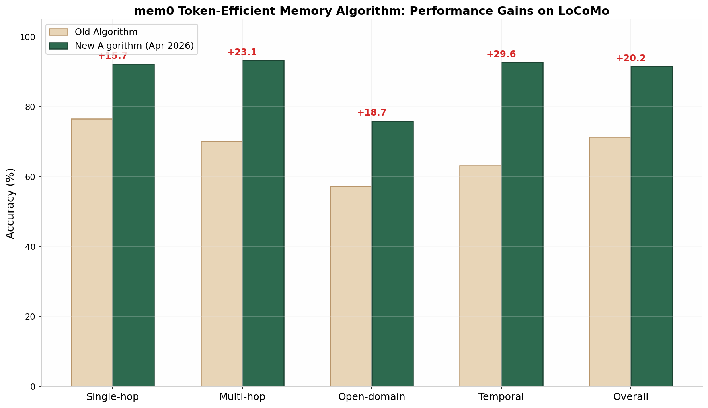
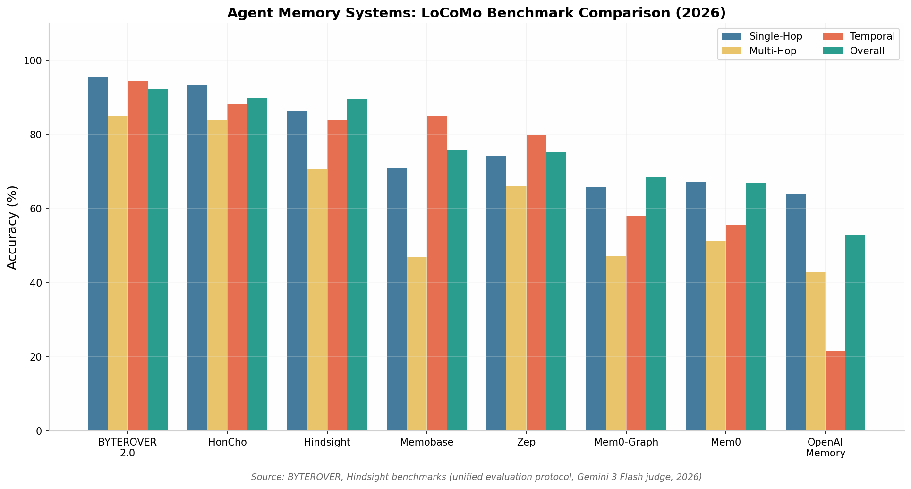
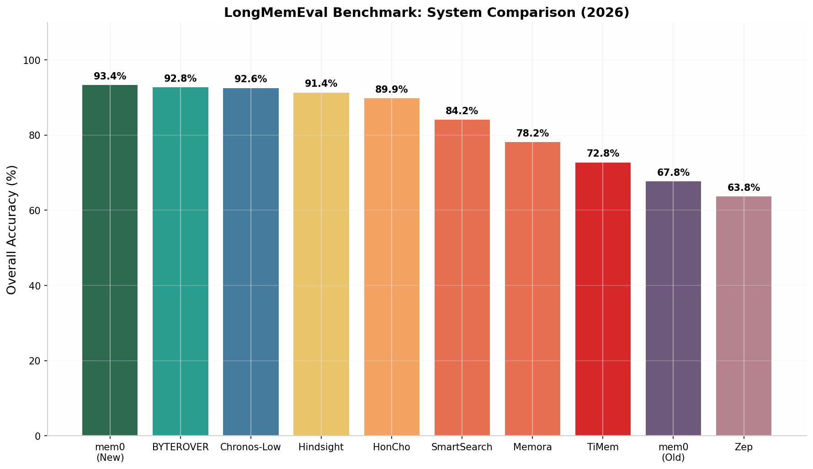
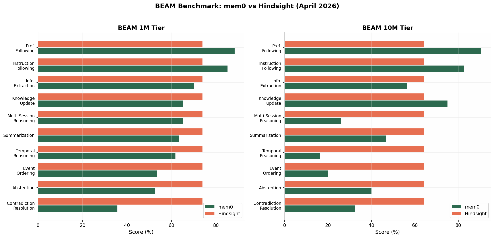
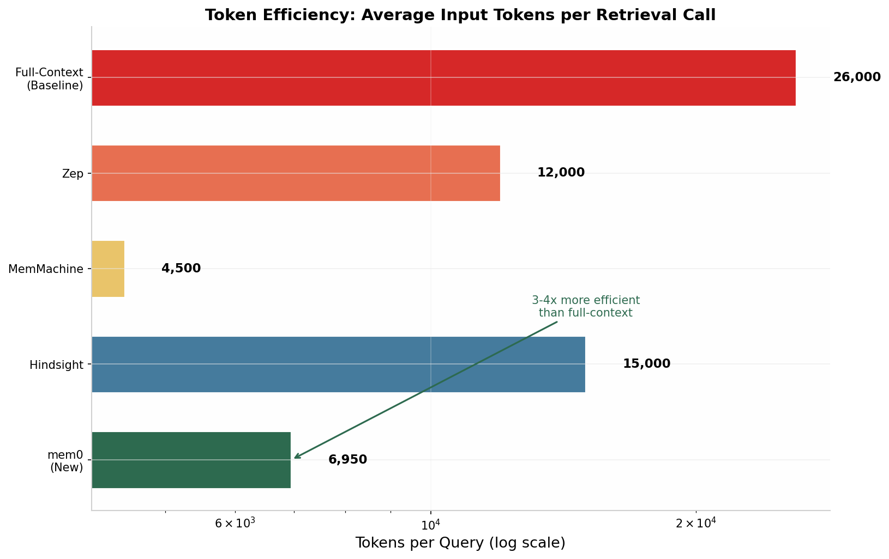

在2025至2026年间，Agent记忆系统领域经历了从简单向量存储向复杂认知架构的快速演进。**mem0**在2026年4月发布的**Token-Efficient Memory Algorithm**是其间最具代表性的技术突破，通过在LoCoMo（**91.6%**）、LongMemEval（**93.4%**）和BEAM-1M（**64.1%**）三大基准上实现跃升，证明了单次分层提取（single-pass hierarchical extraction）与多信号检索（multi-signal retrieval）组合架构的有效性。相较之下，**Zep/Graphiti**依托其时序知识图谱（Temporal Knowledge Graph）在关系型查询和时序推理上保持优势，而**Hindsight**的Retain→Recall→Reflect三阶段管道则通过信念网络分离实现了最高水平的开放性推理。BEAM基准测试的推出标志着评估范式从单纯的事实回忆转向对矛盾解决、事件排序和偏好追踪等复杂记忆能力的系统考察，所有系统在10M token规模下均出现显著性能衰减，表明长时记忆仍是未解难题。

# Agent记忆系统最新算法更新及框架架构深度分析

## 1. 2025-2026年Agent记忆系统技术演进概览

### 1.1 领域发展脉络与关键里程碑

Agent记忆系统作为弥补大型语言模型（LLM）固有状态缺失的核心基础设施，自2024年以来经历了爆发式增长。Transformer架构虽在自然语言处理任务中展现出卓越性能，但其固定的上下文窗口（通常为128K至1M token）和跨会话状态重置的先天限制，使得每一次新对话都从零开始，无法积累和利用历史交互中的有价值信息  [(arXiv.org)](https://arxiv.org/html/2604.21284v1) 。这一根本性缺陷催生了一个快速扩张的记忆增强系统生态系统，各系统在事实提取、知识图谱构建、分层存储和检索策略等维度展开了激烈竞争。**ICLR 2026的MemAgents Workshop被业界视为该领域成熟的重要标志**  [(arXiv.org)](https://arxiv.org/html/2603.17244v1) ，吸引了包括Mem0、Zep/Graphiti、Letta、LangMem等在内的众多代表性系统参与交流和比拼。

从技术演进脉络来看，Agent记忆系统的发展大致可划分为三个阶段。第一阶段以简单的RAG（检索增强生成）和向量存储为主，系统将对话历史切分为固定长度的块，通过语义相似度进行检索，代表性方案包括基础版MemoryBank和早期RAG实现  [(arXiv.org)](https://arxiv.org/html/2603.02473v2) 。第二阶段标志着结构化记忆管理的兴起，Mem0引入了基于LLM的四操作（ADD/UPDATE/DELETE/NOOP）事实提取和更新机制  [(arXiv.org)](https://arxiv.org/html/2504.19413v1) ，Zep/Graphiti则开创了基于Neo4j的时序知识图谱方法  [(arXiv.org)](https://arxiv.org/html/2501.13956v1) ，两者分别从扁平化事实存储和结构化关系建模两个方向推动了领域发展。第三阶段则是2025年末至2026年初的认知记忆架构探索期，系统不再满足于简单的事实回忆，而是开始追求更高阶的记忆能力，如时序推理、多跳推理、知识更新追踪和隐性约束记忆等  [(arXiv.org)](https://arxiv.org/html/2602.10715v1) 。**Hindsight的Retain→Recall→Reflect四网络架构**  [(arXiv.org)](https://arxiv.org/html/2512.12818v1) 、**MAGMA的多图正交表示**  [(arXiv.org)](https://arxiv.org/html/2601.03236v1) 、以及**Kumiho基于信念修正的形式化语义**  [(arXiv.org)](https://arxiv.org/html/2603.17244v1) 都是这一阶段的重要成果，它们共同将Agent记忆系统推向了一个更接近人类认知机制的新高度。

### 1.2 评估基准的演进：从LoCoMo到BEAM

Agent记忆系统的能力评估是推动技术进步的基石，而评估基准本身也在快速演进以适应日益复杂的记忆架构。**LoCoMo（Long-term Conversation Memory）**作为ACL 2024发布的开创性基准，包含10个跨越35个会话的长对话（平均约600轮、16,000 token），通过1,982个问题测试系统在单跳回忆、多跳推理、时序推理和开放域知识等方面的表现  [(byterover.dev)](https://www.byterover.dev/blog/benchmark-ai-agent-memory) 。LoCoMo的最大贡献在于建立了一个标准化的对话记忆测试环境，使其成为后续几乎所有记忆系统的必测项目。然而，LoCoMo的上下文规模相对有限，且问题类型主要集中在显式事实回忆，难以全面评估系统在真实生产环境中的表现。

**LongMemEval（ICLR 2025）**将评估推向了新的规模层次。该基准包含500个问题，覆盖单会话信息提取、多会话推理、时序推理、知识更新和偏好回忆五大能力类别，平均上下文长度超过**100K token**，部分测试甚至达到**1.5M token**  [(arXiv.org)](https://arxiv.org/html/2604.01599v1) 。LongMemEval通过更长的交互历史和更复杂的问题类型，对记忆系统的可扩展性和长程记忆保持能力提出了严峻挑战。Mem0最初在该基准上的表现仅为**49.0%**（旧算法），反映了早期提取式方法在长程记忆中的信息损失问题  [(arXiv.org)](https://arxiv.org/html/2604.19795v1) 。

2026年，**BEAM（Beyond a Million Tokens）**基准的推出标志着评估范式的重大转变  [( The Memory layer for your AI apps)](https://mem0.ai/blog/what-is-beam-memory-benchmark-the-paper-that-shows-1m-context-window-isnt-enough) 。BEAM在100K、500K、**1M**和**10M**四个token规模层级上评估系统，覆盖偏好追踪、指令遵循、信息提取、知识更新、多会话推理、摘要、时序推理、事件排序、弃权判断和**矛盾解决**十大记忆能力  [(arXiv.org)](https://arxiv.org/html/2510.27246v1) 。与先前基准最大的不同在于，BEAM引入了**nugget-based评分**机制，将每个参考答案分解为原子信息单元并独立评估（0/0.5/1.0分），能够捕捉部分记忆失败的细微情况  [( The Memory layer for your AI apps)](https://mem0.ai/blog/what-is-beam-memory-benchmark-the-paper-that-shows-1m-context-window-isnt-enough) 。BEAM的推出揭示了一个关键发现：**即便拥有百万token上下文窗口的模型，也无法仅靠扩大窗口来解决长时记忆问题**，结构化记忆系统的价值在1M和10M规模上愈发凸显  [( The Memory layer for your AI apps)](https://mem0.ai/blog/what-is-beam-memory-benchmark-the-paper-that-shows-1m-context-window-isnt-enough) 。

进入2026年，**LoCoMo-Plus**进一步拓展了评估的认知深度。该基准由西安交通大学和腾讯联合提出，针对现有基准过度关注显式事实回忆的局限，引入了**cue-trigger semantic disconnect**测试场景——模型必须在查询线索与原始记忆存在语义鸿沟的情况下，回忆并应用隐性约束  [(arXiv.org)](https://arxiv.org/html/2602.10715v1) 。LoCoMo-Plus的测试结果显示，包括使用百万token上下文窗口的顶级模型在内的所有基线系统，得分仅在**23%至46%**之间，揭示了认知记忆仍然是当前Agent记忆系统的重大短板  [(arXiv.org)](https://arxiv.org/html/2603.17244v1) 。

| 基准测试 | 发布时间 | 平均上下文长度 | 核心能力评估 | 评分机制 |
|---------|---------|-------------|------------|---------|
| LoCoMo  [(byterover.dev)](https://www.byterover.dev/blog/benchmark-ai-agent-memory)  | ACL 2024 | ~16K tokens (35 sessions) | 单跳回忆、多跳推理、时序推理、开放域知识 | Token-level F1 |
| LongMemEval  [(arXiv.org)](https://arxiv.org/html/2604.01599v1)  | ICLR 2025 | 100K-1.5M tokens | 信息提取、多会话推理、时序推理、知识更新、偏好回忆 | LLM-as-a-Judge |
| BEAM  [( The Memory layer for your AI apps)](https://mem0.ai/blog/what-is-beam-memory-benchmark-the-paper-that-shows-1m-context-window-isnt-enough)  | ICLR 2026 | 100K-10M tokens | 偏好追踪、指令遵循、矛盾解决、事件排序等10项能力 | Nugget-based (0/0.5/1.0) |
| LoCoMo-Plus  [(arXiv.org)](https://arxiv.org/html/2602.10715v1)  | 2026年2月 | ~16K tokens (扩展) | 隐性约束记忆、cue-trigger语义断开场景下的认知记忆 | 约束一致性评估 |

*表1：主要Agent记忆评估基准对比*

### 1.3 核心架构范式：从向量存储到认知记忆

Agent记忆系统的架构范式在2025-2026年间经历了从简单到复杂的根本性转变，大致可归纳为五种主要模式  [(Atlan)](https://atlan.com/know/agent-memory-architectures/) 。第一种是**进程内（In-Process）**架构，即将全部对话历史直接填充到LLM的上下文窗口中。虽然这种方法在准确性上表现最好（LoCoMo上达72.9%），但其极高的token成本（每会话约26,000 token）和灾难性的p95延迟（**17.12秒**）使其在生产环境中完全不可行  [( The Memory layer for your AI apps)](https://mem0.ai/blog/state-of-ai-agent-memory-2026) 。第二种是**扁平向量（Flat Vector）**架构，将提取的记忆事实存储在向量数据库中，通过语义相似度检索。这是Mem0早期版本和LangMem等系统的核心方法，虽然实现简单、延迟低，但在处理多跳推理和时序关系时存在根本性局限  [(Atlan)](https://atlan.com/know/agent-memory-architectures/) 。

第三种是**分层（Tiered）**架构，借鉴操作系统内存管理思想，将记忆划分为短期、中期和长期多个层级。Letta/MemGPT是该范式的代表，通过允许LLM自主决定何时在层级间"换页"来管理记忆  [(Dev Genius)](https://blog.devgenius.io/ai-agent-memory-systems-in-2026-mem0-zep-hindsight-memvid-and-everything-in-between-compared-96e35b818da8) 。第四种是**图混合（Graph Hybrid）**架构，在向量检索的基础上引入图结构来表示实体间的关系。Zep/Graphiti的时序知识图谱和Mem0g的图增强版本都属于这一类别，通过图遍历能力显著提升了关系型查询和时序推理的表现  [(Dev Genius)](https://blog.devgenius.io/ai-agent-memory-systems-in-2026-mem0-zep-hindsight-memvid-and-everything-in-between-compared-96e35b818da8) 。

第五种是最新出现的**认知记忆（Cognitive Memory）**范式，代表系统包括Hindsight、MAGMA和Kumiho。这些系统不再将记忆视为静态数据存储，而是构建了更接近人类认知机制的动态记忆架构。Hindsight通过**世界网络（World）**、**经验网络（Beliefs）**、**观点网络（Opinions）**和**观察网络（Sensory）**的分离，实现了事实与信念的区分  [(arXiv.org)](https://arxiv.org/html/2512.12818v1) 。MAGMA通过**语义、时序、因果和实体四个正交图层**的并行表示和策略引导遍历，赋予系统透明的推理路径  [(arXiv.org)](https://arxiv.org/html/2601.03236v1) 。Kumiho则基于**AGM信念修正框架**的形式化语义，确保记忆更新的逻辑一致性和可审计性  [(arXiv.org)](https://arxiv.org/html/2603.17244v1) 。这一认知记忆范式的兴起标志着Agent记忆系统从"存储更多"向"理解更好"的战略转型。

| 架构范式 | 代表系统 | LoCoMo Overall | p95延迟 | Token成本/查询 | 核心优势 | 主要局限 |
|---------|---------|--------------|--------|--------------|---------|---------|
| In-Process (全上下文) | 基线 | 72.9%  [( The Memory layer for your AI apps)](https://mem0.ai/blog/state-of-ai-agent-memory-2026)  | 17.12s  [( The Memory layer for your AI apps)](https://mem0.ai/blog/state-of-ai-agent-memory-2026)  | ~26,000  [( The Memory layer for your AI apps)](https://mem0.ai/blog/state-of-ai-agent-memory-2026)  | 最高准确性 | 延迟不可接受、成本极高 |
| Flat Vector | Mem0 (旧)、LangMem | 66.9%  [(byterover.dev)](https://www.byterover.dev/blog/benchmark-ai-agent-memory)  | 0.71-59.82s | ~1,700-1,800 | 简单、低延迟、易部署 | 多跳/时序推理弱 |
| Tiered (分层) | Letta/MemGPT | ~83%  [(arXiv.org)](https://arxiv.org/pdf/2604.04514)  | 中等 | 中等 | 自主记忆管理 | 架构复杂、OS开销 |
| Graph Hybrid | Zep、Mem0g、Cognee | 68.4-85.2%  [(Atlan)](https://atlan.com/know/agent-memory-architectures/)  | 1.09-2.59s | ~1,800-12,000 | 关系查询、时序推理 | 图构建成本高 |
| Cognitive (认知) | Hindsight、MAGMA、Kumiho | 89.6-96.1%  [(byterover.dev)](https://www.byterover.dev/blog/benchmark-ai-agent-memory)  | 中等 | 较高 | 事实/信念分离、推理可解释 | 架构复杂、较新 |

*表2：Agent记忆系统核心架构范式对比（2026年）*

## 2. mem0：Token-Efficient Memory Algorithm深度解析

### 2.1 算法核心：单次分层提取与多信号检索

Mem0在2026年4月发布的**Token-Efficient Memory Algorithm**代表了提取式记忆架构的重大技术突破，其核心创新在于两个关键组件：**单次分层提取（Single-Pass Hierarchical Extraction）**和**多信号检索（Multi-Signal Retrieval）**  [( The Memory layer for your AI apps)](https://mem0.ai/research) 。传统记忆系统（包括Mem0旧版）通常采用两阶段提取管道：第一阶段从输入中识别候选事实，第二阶段将新事实与现有记忆进行比对，执行ADD、UPDATE、DELETE或NOOP操作以维持一致性  [(arXiv.org)](https://arxiv.org/html/2504.19413v1) 。虽然这种四操作框架在概念上优雅，但第二阶段的协调步骤不仅消耗大量LLM token，还经常在更新过程中破坏原始上下文——覆盖操作可能擦除原始事实中的关键信息，删除操作有时会移除后续仍然相关的信息  [(Introducing The Token-Efficient Memory Algorithm)](https://mem0.ai/blog/mem0-the-token-efficient-memory-algorithm) 。

新算法将提取流程压缩为**单次LLM调用**，且仅执行ADD操作。每个提取到的事实都成为独立的记录，当信息发生变化时，新事实与旧事实并存，系统保留了完整的状态变更历史。这一设计带来了三重优势。首先，提取延迟大致减半，因为模型不再需要花费计算资源来比对现有记忆状态。其次，由于模型将全部容量用于理解输入而非执行diff操作，提取质量得到提升。第三，ADD-only架构天然支持时序推理——系统可以追溯"事物如何演变"而不仅仅是"事物最终落在何处"  [(Introducing The Token-Efficient Memory Algorithm)](https://mem0.ai/blog/mem0-the-token-efficient-memory-algorithm) 。Mem0官方数据显示，新算法在平均**6,950 token**的检索预算下（相比全上下文方法的25,000+ token实现了3-4倍效率提升），在LoCoMo Overall上从**71.4%跃升至91.6%**（+20.2），在LongMemEval Overall上从**67.8%跃升至93.4%**（+25.6），这是目前已知的最显著的单次算法升级效果之一  [(Introducing The Token-Efficient Memory Algorithm)](https://mem0.ai/blog/mem0-the-token-efficient-memory-algorithm) 。

*图1：mem0 Token-Efficient Memory Algorithm在LoCoMo基准上的性能提升（数据来源：mem0官方研究页面，2026年4月）*

### 2.2 四大技术组件解析

#### 2.2.1 Single-Pass ADD-only提取管道

新算法的提取管道经历了根本性重构。旧版的两阶段设计（事实识别→记忆协调）被替换为单次端到端提取流程：输入经过上下文查找后直接进入单遍提取，随后通过去重和实体链接写入持久化存储  [(Introducing The Token-Efficient Memory Algorithm)](https://mem0.ai/blog/mem0-the-token-efficient-memory-algorithm) 。这一流程的关键改变在于彻底放弃了UPDATE和DELETE操作。在传统方法中，当用户说"我喜欢吃芝士披萨"后来又表示"我喜欢鸡肉披萨"时，系统需要决定是更新原有记忆还是新增一条。ADD-only策略选择保留两者，让检索阶段根据查询上下文决定哪条记忆更相关。Mem0团队指出，这种方法特别有利于时序查询（"用户之前喜欢什么披萨？"）和演化追踪（"用户的口味偏好如何变化？"）。

另一个重要改进是将**Agent生成的事实提升为一等公民**。旧版系统存在对Agent自身发言的记忆盲区——当Agent确认某个动作或提供推荐时，旧系统往往完全忽略这些信息，只关注用户明确陈述的内容  [(Introducing The Token-Efficient Memory Algorithm)](https://mem0.ai/blog/mem0-the-token-efficient-memory-algorithm) 。这在实际应用中是严重缺陷：如果Agent告诉用户"已为您预订3月3日的航班"但系统未能记住这一事实，后续对话中Agent可能会再次询问用户是否需要预订。新算法将Agent确认、推荐和动作执行等量存储为记忆事实，显著提升了多轮任务执行的连贯性。测试数据显示，在LongMemEval的**单会话助手（Single-Session Assistant）**类别上，新算法实现了**+53.6的跃升**（从46.4%到100%），直接消除了Agent对自身发言的记忆盲区  [(Introducing The Token-Efficient Memory Algorithm)](https://mem0.ai/blog/mem0-the-token-efficient-memory-algorithm) 。

#### 2.2.2 实体链接层设计

实体链接是Token-Efficient Memory Algorithm的另一关键创新。每个提取到的事实都会被分析识别其中的实体，包括专有名词、引用文本和复合名词短语。这些实体被单独嵌入并存储在一个独立的查找层中，将关于同一人、地点或概念的记忆链接在一起  [(Introducing The Token-Efficient Memory Algorithm)](https://mem0.ai/blog/mem0-the-token-efficient-memory-algorithm) 。在查询阶段，系统从查询中识别实体并与实体层进行匹配，相关记忆会获得排名提升。这种设计的直觉是：当用户询问"Alice的工作怎么样？"时，即使某条记忆的字面内容与查询的语义相似度不高，只要该记忆包含实体"Alice"，它就应该在候选集中获得优先位置。

实体链接层特别有效地解决了**指代消解和实体一致性**问题。在长对话中，用户可能用"她"、"我的经理"、"那位设计师"等不同表述指代同一个人。实体链接层通过将各种指称映射到统一的实体节点上，确保关于同一实体的所有记忆都能在查询时被有效召回。Mem0官方数据显示，这一机制对多跳推理（+23.1）和时序查询（+29.6）的提升尤为显著，因为这些查询类型往往需要围绕特定实体组织分散在不同会话中的信息  [(Introducing The Token-Efficient Memory Algorithm)](https://mem0.ai/blog/mem0-the-token-efficient-memory-algorithm) 。

#### 2.2.3 多信号并行检索融合

Mem0新算法的检索栈同时运行三个评分通道并融合结果：**语义相似度（Semantic Similarity）**、**关键词匹配（Keyword Matching）**和**实体匹配（Entity Matching）**  [( The Memory layer for your AI apps)](https://mem0.ai/research) 。三种信号各自捕获不同类型的相关性：语义相似度通过向量嵌入找到概念上相关但措辞不同的记忆；关键词匹配通过BM25等稀疏检索方法找到包含查询中确切术语的记忆；实体匹配则通过前述实体链接层提升包含查询相关实体的记忆排名。最终的排名是三个信号的融合得分，而不是简单的一票否决。

这一设计背后的洞察是：**不同类型的查询依赖不同的检索信号**。事实性查询（"我的航班几点起飞？"）通常受益于关键词匹配，因为关键信息（航班号、时间）往往是精确的术语。概念性查询（"我之前讨论过什么旅行计划？"）更依赖语义相似度。而以特定人物或实体为中心的查询则主要受益于实体匹配。通过并行运行三种信号并融合结果，系统在各种查询类型上都能保持稳定的高性能。Mem0官方指出，融合得分的 consistently 优于任何单一信号  [(Introducing The Token-Efficient Memory Algorithm)](https://mem0.ai/blog/mem0-the-token-efficient-memory-algorithm) 。

#### 2.2.4 动词形态归一化

一个看似微小但影响显著的技术改进是**关键词搜索中的动词形态归一化**。Mem0团队发现，查询"我参加了哪些会议？"经常无法匹配包含"参加会议"的记忆，因为关键词搜索将动词的不同形态（参加、参加了、参加会议）视为不同的token  [(Introducing The Token-Efficient Memory Algorithm)](https://mem0.ai/blog/mem0-the-token-efficient-memory-algorithm) 。通过引入动词形态归一化，系统将查询和记忆文本中的动词还原为基本形式，显著提高了关键词通道的召回率。虽然这是一个相对简单的NLP处理步骤，但在实际对话数据中产生了可测量的影响，尤其对于那些用户回顾过去事件的时序查询。

### 2.3 Benchmark全面评估结果

#### 2.3.1 LoCoMo基准：从71.4%到91.6%的跃升

Mem0新算法在LoCoMo基准上实现了全方位的显著提升。Overall准确率从旧算法的**71.4%跃升至91.6%**，提升幅度达到**+20.2个百分点**。各维度的详细分解揭示了不同记忆能力类别的改进差异。**时序推理（Temporal）**是最大赢家，从63.2%飙升至92.8%（**+29.6**），这直接归因于ADD-only架构保留了完整的状态变更历史，使得"用户之前说什么？"、"用户何时首次提到X？"等时序查询能够得到精确回答  [(Introducing The Token-Efficient Memory Algorithm)](https://mem0.ai/blog/mem0-the-token-efficient-memory-algorithm) 。**多跳推理（Multi-hop）**从70.2%提升至93.3%（**+23.1**），反映出实体链接层在连接跨会话信息方面的有效性。**单跳回忆（Single-hop）**从76.6%提升至92.3%（+15.7），虽然绝对增幅较小，但这是因为单跳本就是旧算法相对较强的领域。**开放域知识（Open-domain）**从57.3%提升至76.0%（+18.7），表明新算法在需要综合推理和常识推断的开放性问题上也取得了实质性进步。

*图2：主要Agent记忆系统在LoCoMo基准上的分项对比（数据来源：BYTEROVER、Hindsight统一评估协议，2026年）*

值得注意的是，Mem0官方数据（91.6%）与独立第三方评估（66.9%）之间存在显著差异  [(byterover.dev)](https://www.byterover.dev/blog/benchmark-ai-agent-memory) 。这种差异主要源于评估配置的不同：Mem0官方使用其自有评估框架和专有的平台优化（可能包括reranking和提示工程优化），而独立评估通常在更标准化的条件下运行开源版本。Mem0官方页面也明确指出，**"开源SDK用户应期待方向性相似的提升，但不会获得完全相同的数字"**，并已将完整评估框架开源以供独立验证  [(Introducing The Token-Efficient Memory Algorithm)](https://mem0.ai/blog/mem0-the-token-efficient-memory-algorithm) 。这一透明度举措有助于缓解基准结果的可复现性担忧。

#### 2.3.2 LongMemEval基准：67.8%到93.4%的突破

LongMemEval基准的改进更为戏剧性。Overall准确率从旧算法的**67.8%跃升至93.4%**，提升幅度高达**+25.6个百分点**，这是所有公开报告中最显著的单次算法升级效果。分类别来看，**时序推理（Temporal Reasoning）**再次展现出最大增幅，从51.1%飙升至93.2%（**+42.1**），几乎翻了一番。这一飞跃表明ADD-only架构对处理时间敏感信息的根本性优势——当系统保留了"用户之前说X，后来又说Y"的完整历史时，时序推理从"猜测发生了什么"转变为"直接检索历史记录"。**单会话助手（Single-Session Assistant）**记忆从46.4%跃升至100.0%（**+53.6**），验证了一等公民Agent事实设计完全消除了Agent对自身发言的记忆盲区  [(Introducing The Token-Efficient Memory Algorithm)](https://mem0.ai/blog/mem0-the-token-efficient-memory-algorithm) 。

*图3：主要系统在LongMemEval基准上的Overall对比（数据来源：各系统公开报告，2026年）*

其他类别的提升同样显著：**知识更新（Knowledge Update）**从79.5%提升至96.2%（+16.7），表明ADD-only策略在处理信息过时和修正时比覆盖式更新更可靠；**单会话偏好（Single-Session Preference）**从76.7%提升至96.7%（+20.0），反映出系统在捕捉和保持用户细粒度偏好方面的进步；**多会话（Multi-session）**从70.7%提升至86.5%（+15.8），虽然绝对值相对较低，但考虑到多会话推理本身就是行业级难题，这一进步仍然具有实质性意义。Mem0新算法在LongMemEval上的平均检索token仅为**6,787**，相比全上下文方法实现了约3.7倍的效率提升  [(Introducing The Token-Efficient Memory Algorithm)](https://mem0.ai/blog/mem0-the-token-efficient-memory-algorithm) 。

#### 2.3.3 BEAM基准：1M与10M规模的表现分析

BEAM基准是检验记忆系统在真实生产规模下表现的最严格测试。Mem0新算法在BEAM-1M（100万token规模）上取得**64.1% Overall**，在BEAM-10M（1000万token规模）上取得**48.6% Overall**，平均检索token分别仅为6,719和6,914  [(Introducing The Token-Efficient Memory Algorithm)](https://mem0.ai/blog/mem0-the-token-efficient-memory-algorithm) 。这一表现需要放在BEAM的极端难度下理解：BEAM-10M的 conversation 包含超过7,757轮对话和10,435条用户/助手消息  [(Github)](https://github.com/mohammadtavakoli78/BEAM) ，在如此长的历史中进行精确回忆对任何记忆系统都是巨大挑战。

分类别分析揭示了系统在不同记忆能力上的差异化表现。在1M规模上，Mem0表现最强的类别是**偏好遵循（Preference Following，88.3%）**、**指令遵循（Instruction Following，85.2%）**和**知识更新（Knowledge Update，65.0%）**，这些任务受益于ADD-only架构对状态和偏好的干净保留。相对较弱的类别是**矛盾解决（Contradiction Resolution，35.7%）**、**事件排序（Event Ordering，53.6%）**和**弃权判断（Abstention，52.5%）**。Mem0官方坦承，这些弱项反映了当前系统的根本局限：事实级和实体级匹配对它们来说仍然不够，需要更高阶的表示来建模事件之间的跨时间关系  [(Introducing The Token-Efficient Memory Algorithm)](https://mem0.ai/blog/mem0-the-token-efficient-memory-algorithm) 。

*图4：BEAM基准1M和10M tier上mem0与Hindsight的分项对比（数据来源：各系统公开报告，2026年4月）*

从1M到10M的规模扩展揭示了所有记忆系统面临的共同衰减趋势。Mem0 Overall从64.1%下降至48.6%，但某些类别（如偏好遵循从88.3%上升至90.4%、知识更新从65.0%上升至75.0%）反而有所改善。Mem0团队解释称，这些类别的改善源于ADD-only架构在长时程上保持了干净的状态历史。然而，**多会话推理（从65.2%暴跌至26.1%）**、**时序推理（从61.8%暴跌至16.3%）**和**事件排序（从53.6%暴跌至20.2%）**在10M规模上遭受了灾难性下降。Mem0指出，这些正是整个行业尚未解决的开放问题，需要在更丰富的时序表示和跨会话事件结构建模方面取得突破  [(Introducing The Token-Efficient Memory Algorithm)](https://mem0.ai/blog/mem0-the-token-efficient-memory-algorithm) 。

| 基准测试 | 维度 | 旧算法 | 新算法 | 提升幅度 |
|---------|------|-------|-------|---------|
| LoCoMo  [(Introducing The Token-Efficient Memory Algorithm)](https://mem0.ai/blog/mem0-the-token-efficient-memory-algorithm)  | Overall | 71.4% | **91.6%** | +20.2 |
| | Single-hop | 76.6% | 92.3% | +15.7 |
| | Multi-hop | 70.2% | 93.3% | +23.1 |
| | Open-domain | 57.3% | 76.0% | +18.7 |
| | Temporal | 63.2% | 92.8% | +29.6 |
| | Mean tokens/query | — | **6,956** | — |
| LongMemEval  [(Introducing The Token-Efficient Memory Algorithm)](https://mem0.ai/blog/mem0-the-token-efficient-memory-algorithm)  | Overall | 67.8% | **93.4%** | +25.6 |
| | Temporal Reasoning | 51.1% | 93.2% | +42.1 |
| | Assistant Memory | 46.4% | 100.0% | +53.6 |
| | Knowledge Update | 79.5% | 96.2% | +16.7 |
| | Mean tokens/query | — | **6,787** | — |
| BEAM-1M  [(Introducing The Token-Efficient Memory Algorithm)](https://mem0.ai/blog/mem0-the-token-efficient-memory-algorithm)  | Overall | — | **64.1%** | — |
| BEAM-10M  [(Introducing The Token-Efficient Memory Algorithm)](https://mem0.ai/blog/mem0-the-token-efficient-memory-algorithm)  | Overall | — | **48.6%** | — |
| | Mean tokens/query | — | **6,914** | — |

*表3：mem0 Token-Efficient Memory Algorithm在三大基准上的全面评估结果（2026年4月）*

### 2.4 架构优势与局限分析

Mem0新算法的核心优势在于其**极高的token效率**和**卓越的实用性**。通过在单次LLM调用中完成提取，并将检索token预算控制在约7,000 token（相比全上下文方法的25,000+），系统实现了3-4倍的成本降低，同时保持了顶级水平的准确性  [(Introducing The Token-Efficient Memory Algorithm)](https://mem0.ai/blog/mem0-the-token-efficient-memory-algorithm) 。这使得Mem0在生产和商业化场景中具有强大竞争力——对于每天处理数百万次查询的AI助手平台而言，每次查询节省18,000 token意味着巨大的成本优势。ADD-only架构的另一个深层优势是其**自然支持时序推理和状态演化追踪**。传统覆盖式更新在"新信息覆盖旧信息"的过程中永久丢失了历史状态，而ADD-only通过保留完整变更历史，使系统能够回答"用户之前如何想的？"、"是什么导致用户改变主意的？"等高阶时序问题。

然而，Mem0新算法也存在显著局限。首先，**矛盾解决能力仍然薄弱**（BEAM-1M上仅35.7%）。ADD-only策略在保留所有历史状态的同时，也保留了所有历史矛盾——当用户先说"我喜欢A"后来又说"我讨厌A"时，两条矛盾的记忆并存于系统中，检索阶段可能同时召回两者，导致生成混乱的回答。解决这一问题需要更复杂的矛盾检测和消解机制，而这可能需要重新引入某种形式的UPDATE/DELETE逻辑。其次，**10M规模下的性能衰减**揭示了事实级和实体级表示的根本不足。当相似内容在长对话中反复出现时，基于相似度的检索难以从众多候选中精确选出最相关的一条。Mem0官方将"更丰富的时序表示"和"跨会话事件结构建模"列为下一步重点研究方向  [(Introducing The Token-Efficient Memory Algorithm)](https://mem0.ai/blog/mem0-the-token-efficient-memory-algorithm) 。

此外，Mem0作为商业产品，其**开源版本与托管版本之间存在功能差距**。图增强功能（Mem0g）需要每月249美元的专业版订阅，而最高分的benchmark结果往往来自包含专有优化的托管平台  [(vectorize.io)](https://vectorize.io/articles/best-ai-agent-memory-systems) 。这种分层策略虽然在商业上合理，但也意味着开源社区无法完全复现最佳性能，可能影响其在学术研究和独立开发者中的采用率。

## 3. Zep/Graphiti：时序知识图谱架构深度解析

### 3.1 Graphiti核心设计：时序知识图谱

Zep的记忆架构围绕其开源的**Graphiti**引擎构建，这是一个专为Agent记忆场景设计的**时序知识图谱（Temporal Knowledge Graph, TKG）**系统，底层基于Neo4j图数据库实现  [(arXiv.org)](https://arxiv.org/html/2501.13956v1) 。与Mem0的扁平事实存储不同，Graphiti将对话历史组织为一个多层次、时序感知的图结构，能够精确追踪"什么在何时发生"以及"信息如何随时间演变"。Graphiti的核心设计理念是：**记忆不仅仅是关于事实的存储，更是关于事实在时间中演化的建模**。

Graphiti的图结构由三个层次组成。**Episodes（片段子图）**是最底层，记录原始对话事件或消息，每个节点代表一个带时间戳的原始输入（如聊天消息、JSON文档或结构化业务事件）  [(Emergent Mind)](https://www.emergentmind.com/topics/zep-a-temporal-knowledge-graph-architecture) 。这一层保留了完整的原始数据作为真相来源（ground truth），任何后续提取的语义内容都可以追溯回其原始出处。**Semantic Entity Subgraph（语义实体子图）**是中间层，通过LLM驱动的实体提取和关系识别从Episodes中派生。每个实体被嵌入到高维空间（如1024维）中，支持通过余弦距离进行细粒度语义相似度计算。关系（边）可以是涉及多个实体的复杂超边，支持多实体事实和非二元关系  [(Emergent Mind)](https://www.emergentmind.com/topics/zep-a-temporal-knowledge-graph-architecture) 。**Community Subgraph（社区子图）**是最上层，通过动态标签传播算法将强连通的实体聚类为社区，用于高层检索和领域概览。

这种三层结构借鉴了人类认知科学中**情景记忆（episodic memory）**与**语义记忆（semantic memory）**的区分：Episodes对应情景记忆（保留原始经历的完整细节），Semantic Subgraph对应语义记忆（提取抽象的知识和关系），Community Subgraph则提供了概念层次的组织。这一设计使Graphiti既能回答"用户上周三说了什么？"（情景回忆），也能回答"用户对产品X的整体评价如何？"（语义综合），还能回答"哪些话题与用户最常讨论的主题相关？"（社区发现）。

### 3.2 双时序模型：事件时间与摄取时间

Graphiti最独特的架构特征是其**双时序模型（Bitemporal Modeling）**，为每个节点和边同时维护两条时间线  [(arXiv.org)](https://arxiv.org/html/2501.13956v1) 。**事件时间（Event Time, T）**记录事实或事件实际发生的时间，锚定事实的时间线。**摄取时间（Ingestion Time, T'）**追踪信息被系统观察或添加到记忆的时间，保留完整的事务谱系。这一设计在处理 retroactive data（追溯数据）、更正和更新时至关重要——当用户说"实际上，我上周说的那个日期是错的"时，Graphiti不仅能记录新的正确信息，还能保留旧信息作为历史状态，并通过时间逻辑确定在任何查询时刻哪条信息是有效的。

双时序模型的具体实现体现在**边的有效性区间（validity intervals）**上。每条边都带有明确的`t_valid`（有效起始时间）和`t_invalid`（失效时间）属性  [(Neo4j)](https://neo4j.com/blog/developer/graphiti-knowledge-graph-memory/) 。当新知识摄入时，Graphiti通过语义搜索、关键词搜索和图搜索判断新信息是否与现有知识冲突。如果存在冲突，系统利用时序元数据智能地更新或使旧信息失效，而不是直接丢弃。这使得Graphiti能够回答复杂的时序查询，如"在上周三那个会议之前，用户对项目X持什么看法？"——系统可以精确定位到该时间点上仍然有效的信念状态，即使这些信息后来已经被更新或取代。

这一时序精确性使Zep在时序推理查询上表现突出。在独立评估中，Zep在LoCoMo的Temporal类别上得分达到**79.8%**，远高于Mem0旧算法的55.5%  [(byterover.dev)](https://www.byterover.dev/blog/benchmark-ai-agent-memory) 。然而，时序模型的复杂性也带来了代价：图的构建和维护需要大量LLM调用和后台处理，Zep的每会话记忆足迹可超过**600,000 token**（相比Mem0的约1,764 token），且即时摄入后的检索经常需要等待后台图处理完成后才能正常工作  [(Dev Genius)](https://blog.devgenius.io/ai-agent-memory-systems-in-2026-mem0-zep-hindsight-memvid-and-everything-in-between-compared-96e35b818da8) 。

### 3.3 三元混合检索策略

Graphiti的检索系统整合了三种互补的搜索策略，形成**三元混合检索（Triple-Modality Hybrid Retrieval）**  [(arXiv.org)](https://arxiv.org/html/2501.13956v1) 。第一种是**余弦语义相似度搜索（φ_cos）**，利用Neo4j对Lucene的向量索引支持，通过嵌入向量的余弦距离找到语义上相关的内容。第二种是**Okapi BM25全文搜索（φ_bm25）**，基于词频的稀疏检索方法，擅长找到包含查询中确切术语的记忆。第三种是**广度优先图遍历搜索（φ_bfs）**，从初始搜索结果的实体节点出发，通过图的边关系在n跳范围内发现额外的相关节点和边  [(arXiv.org)](https://arxiv.org/html/2501.13956v1) 。

三种搜索策略针对不同对象类型的搜索字段也有所区别：对于语义边，搜索fact字段；对于实体节点，搜索entity name字段；对于社区节点，搜索由相关关键词和短语组成的community name字段  [(arXiv.org)](https://arxiv.org/html/2501.13956v1) 。φ_bfs的独特价值在于它能够**从已知推及未知**——当用户查询"Alice对项目Y的看法"时，即使系统没有直接存储这一关联，BFS可以从"Alice"节点出发，遍历与Alice相关的所有实体和关系，在图的邻域中发现项目Y的间接关联。这种基于图结构的探索能力是纯向量检索所不具备的。

三种检索信号的融合通过Reciprocal Rank Fusion（RRF）或类似的排名融合算法实现，最终经过cross-encoder reranking进行精细排序。Zep官方报告其P95检索延迟为**300毫秒**，这得益于Neo4j对向量和BM25索引的native支持，使得节点和边的访问时间与图规模基本无关（近常数时间）  [(Neo4j)](https://neo4j.com/blog/developer/graphiti-knowledge-graph-memory/) 。值得注意的是，Graphiti在检索阶段**完全避免LLM调用**，所有操作都通过数据库索引和图遍历完成，这在成本敏感的生产环境中是重要优势。

### 3.4 知识图谱构建流程

Graphiti的知识图谱构建是一个持续、增量、非破坏性的流程  [(Emergent Mind)](https://www.emergentmind.com/topics/zep-a-temporal-knowledge-graph-architecture) 。当新的对话数据流入时，系统首先将其解析并标记时间戳为Episodes，在这一层不执行任何有损转换，确保原始真相的完整保留。随后，LLM驱动的实体提取和关系识别模块从Episodes中派生语义子图——识别命名实体、提取事实关系、并为每个实体生成高维嵌入。接下来是**实体解析（Entity Resolution）**步骤，将新提取的实体与图中现有实体进行比对，判断它们是否指代同一真实世界实体（如"纽约"和"NYC"应解析为同一实体）。最后，动态社区聚类算法更新社区子图，通过标签传播维持领域的上下文摘要。

**边失效和知识更新**是构建流程中最复杂的部分。当新事实与现有知识冲突时（如用户更新了地址或改变了偏好），Graphiti不是直接删除旧信息，而是为旧边设置`t_invalid`时间戳，并为新信息创建带有新的`t_valid`的新边  [(Neo4j)](https://neo4j.com/blog/developer/graphiti-knowledge-graph-memory/) 。这意味着图保留了知识的完整演化历史，任何历史时间点的知识状态都可以被精确重建。这一设计对于需要审计追踪和合规性的企业应用尤为重要——系统可以完整回答"谁在何时说了什么，以及后来如何改变"的监管问题。

然而，这一构建流程的复杂性也带来了实际部署挑战。Mem0团队的基准测试发现，Zep的图构建需要大量LLM调用，且摄入后立即检索经常失败——正确答案只有在后台图处理完成（可能需要数小时）后才能出现  [(Dev Genius)](https://blog.devgenius.io/ai-agent-memory-systems-in-2026-mem0-zep-hindsight-memvid-and-everything-in-between-compared-96e35b818da8) 。Zep团队对此的回应是，他们的系统针对对话记忆进行了优化，背景处理是设计的一部分，适合不需要即时检索的场景。这一架构权衡使得Zep更适合那些时序精度和关系深度比即时响应更重要的应用场景。

### 3.5 Benchmark表现与架构适用场景

Zep在多个基准测试中展现了其架构的差异化优势。在Hindsight团队的统一评估中，Zep在LoCoMo上取得**75.1% Overall**，在Temporal类别上达到**79.8%**，显著高于Mem0旧算法的66.9%和55.5%  [(byterover.dev)](https://www.byterover.dev/blog/benchmark-ai-agent-memory) 。Graphiti官方报告在Deep Memory Retrieval（DMR）基准上达到**94.8%**准确率，并在LongMemEval上实现了**18.5%**的改进  [(arXiv.org)](https://arxiv.org/html/2603.17244v1) 。然而，独立评估中的LongMemEval Overall得分约为**63.8%**  [(arXiv.org)](https://arxiv.org/html/2604.19795v1) ，与官方报告存在差距，这可能源于评估配置和提示工程的差异。

Zep的架构优势集中在**关系中心型查询**和**时序复杂查询**场景。当查询涉及实体间的关系路径（"Alice和Bob是否讨论过同一家餐厅？"）、时间限定条件（"用户在上次会议前对项目持什么看法？"）或知识演化追踪（"用户对产品的评价如何随时间变化？"）时，知识图谱的结构化表示展现出显著优势。相比之下，对于**逐字回忆型查询**（"用户上周三的原话是什么？"），基于向量相似度的verbatim存储方法（如MemPalace）更为有效  [(arXiv.org)](https://arxiv.org/html/2604.21284v1) 。

Zep的适用场景可以归纳为三类。**企业级对话记忆**是核心场景——客服助手、销售助手和HR助手需要长期追踪客户关系、偏好和历史交互，时序知识图谱的精确性和可审计性在这些场景中至关重要。**时序敏感型应用**如医疗记录追踪、法律案件管理和金融交易审计，需要精确的时间逻辑和知识演化追踪，Graphiti的双时序模型提供了天然支持。**复杂关系推理**场景如社交网络分析、供应链追踪和知识图谱问答，受益于图遍历的多跳发现能力。

然而，Zep的架构也带来了明确的成本。图的构建和维护需要持续的LLM调用和后台计算资源，这使得Zep的运营成本显著高于纯向量方法。此外，Neo4j作为底层存储引入了额外的基础设施复杂性，团队需要维护图数据库集群并优化查询性能。Zep已经转向以云服务为主的商业模式，开源的Graphiti框架虽然仍然可用，但高级功能和性能优化主要保留在云产品中  [(Dev Genius)](https://blog.devgenius.io/ai-agent-memory-systems-in-2026-mem0-zep-hindsight-memvid-and-everything-in-between-compared-96e35b818da8) 。

## 4. 主要框架架构与检索算法对比分析

### 4.1 记忆表示层：事实提取 vs 知识图谱 vs 分层存储

Agent记忆系统的根本分歧始于**如何表示记忆**。当前主流框架在这一问题上形成了三条截然不同的路径。**事实提取路径**以Mem0为代表，将对话流压缩为原子化的事实陈述（如"用户喜欢咖啡"、"用户在Google工作"），以扁平的自然语言句子存储在向量数据库中。这种方法的优势在于紧凑（Mem0每会话仅需约1,764 token）、检索延迟低（p95约0.2-1.44秒）且易于理解。其根本局限在于信息损失——将丰富的对话上下文压缩为孤立的事实丢弃了大量语用信息和关系结构，且多跳推理需要多次检索拼接  [(Dev Genius)](https://blog.devgenius.io/ai-agent-memory-systems-in-2026-mem0-zep-hindsight-memvid-and-everything-in-between-compared-96e35b818da8) 。

**知识图谱路径**以Zep/Graphiti和Cognee为代表，将记忆建模为实体-关系-实体的三元组网络（或更复杂的超图结构）。Graphiti进一步引入了时序维度，使每条边都携带有效性时间区间  [(Neo4j)](https://neo4j.com/blog/developer/graphiti-knowledge-graph-memory/) 。知识图谱的优势在于保留了丰富的关系结构和时序信息，天然支持多跳推理（"通过图遍历找到Alice→项目X→预算问题→相关会议"）和时序查询（"在Y事件发生时，Z的状态是什么？"）。其代价是构建复杂度高（需要实体提取、关系识别、实体解析等多个LLM驱动步骤）、存储膨胀（Zep每会话可超600,000 token）和摄入延迟（后台图处理可能需要数小时）  [(Dev Genius)](https://blog.devgenius.io/ai-agent-memory-systems-in-2026-mem0-zep-hindsight-memvid-and-everything-in-between-compared-96e35b818da8) 。

**分层存储路径**以Letta/MemGPT为代表，借鉴操作系统虚拟内存管理，将记忆划分为"主上下文"（RAM，当前prompt中的内容）、"召回存储"（近期对话历史）和"归档存储"（外部长期记忆）。LLM本身通过函数调用决定何时在层级间移动信息  [(Dev Genius)](https://blog.devgenius.io/ai-agent-memory-systems-in-2026-mem0-zep-hindsight-memvid-and-everything-in-between-compared-96e35b818da8) 。这一方法的最大创新是让**Agent自主管理自己的记忆**，而非由外部系统强制决定存储结构。然而，OS隐喻增加了显著的架构复杂性和延迟开销，且标准基准上的表现并未明显超越其他方法  [(Dev Genius)](https://blog.devgenius.io/ai-agent-memory-systems-in-2026-mem0-zep-hindsight-memvid-and-everything-in-between-compared-96e35b818da8) 。

新兴框架正在探索混合表示。Mem0g（Mem0的图增强版本）在向量存储之上添加了有向标记图（实体为节点，关系为边），试图兼具两者的优势  [(Dev Genius)](https://blog.devgenius.io/ai-agent-memory-systems-in-2026-mem0-zep-hindsight-memvid-and-everything-in-between-compared-96e35b818da8) 。Hindsight的**四网络架构**（World、Beliefs、Opinions、Sensory）将记忆按认知功能分离，而非按数据结构组织，代表了向人类认知科学更近一步的尝试  [(arXiv.org)](https://arxiv.org/html/2512.12818v1) 。MAGMA则提出了**四个正交图**（语义、时序、因果、实体）的并行表示，每个图专门处理一种关系维度，通过策略引导的路由实现查询自适应检索  [(arXiv.org)](https://arxiv.org/html/2601.03236v1) 。

| 维度 | Mem0 (新算法) | Zep/Graphiti | Hindsight | Letta/MemGPT | BYTEROVER |
|------|-------------|-------------|-----------|-------------|-----------|
| **核心表示** | 原子事实 + 实体链接 | 时序知识图谱 | 四网络分离（World/Beliefs/Opinions/Sensory） | 分层OS模型 | Context Tree层级结构 |
| **存储结构** | Vector DB + Entity Layer | Neo4j TKG | 图 + 向量混合 | Tiered (RAM/Recall/Archive) | File-based Context Tree |
| **提取方式** | Single-pass ADD-only | Episode→Entity→Fact LLM提取 | Retain (LLM fact extraction) | LLM self-managed paging | LLM-curated hierarchical |
| **时序支持** | 通过ADD-only保留历史 | 双时序模型 (T/T') | 四路并行检索+时序过滤 | Limited | 内嵌时间戳结构 |
| **LoCoMo Overall** | 91.6%  [(Introducing The Token-Efficient Memory Algorithm)](https://mem0.ai/blog/mem0-the-token-efficient-memory-algorithm)  | 75.1%  [(byterover.dev)](https://www.byterover.dev/blog/benchmark-ai-agent-memory)  | 89.6%  [(byterover.dev)](https://www.byterover.dev/blog/benchmark-ai-agent-memory)  | ~83%  [(arXiv.org)](https://arxiv.org/pdf/2604.04514)  | 92.2%  [(byterover.dev)](https://www.byterover.dev/blog/benchmark-ai-agent-memory)  |
| **LongMemEval Overall** | 93.4%  [(Introducing The Token-Efficient Memory Algorithm)](https://mem0.ai/blog/mem0-the-token-efficient-memory-algorithm)  | ~63.8%  [(arXiv.org)](https://arxiv.org/html/2604.19795v1)  | 91.4%  [(arXiv.org)](https://arxiv.org/html/2604.21284v1)  | N/A | 92.8%  [(arXiv.org)](https://arxiv.org/html/2604.01599v1)  |
| **BEAM-1M Overall** | 64.1%  [(Introducing The Token-Efficient Memory Algorithm)](https://mem0.ai/blog/mem0-the-token-efficient-memory-algorithm)  | N/A | 73.9%  [(Hindsight)](https://hindsight.vectorize.io/blog/2026/04/02/beam-sota)  | N/A | N/A |
| **Avg Tokens/Query** | ~6,950  [(Introducing The Token-Efficient Memory Algorithm)](https://mem0.ai/blog/mem0-the-token-efficient-memory-algorithm)  | ~12,000  [(Dev Genius)](https://blog.devgenius.io/ai-agent-memory-systems-in-2026-mem0-zep-hindsight-memvid-and-everything-in-between-compared-96e35b818da8)  | ~15,000 | N/A | N/A |
| **延迟 (p95)** | 0.2-1.44s  [( The Memory layer for your AI apps)](https://mem0.ai/blog/state-of-ai-agent-memory-2026)  | 0.3s  [(Neo4j)](https://neo4j.com/blog/developer/graphiti-knowledge-graph-memory/)  | Moderate | High | N/A |
| **开源协议** | Apache 2.0 | Graphiti开源 | MIT | Apache 2.0 | Partial OSS |
| **GitHub Stars** | ~51.4K  [(Comparison)](https://get-hermes.ai/memory/)  | ~24K | ~2.4K-4K | ~21K | ~4.2K |

*表4：主要Agent记忆系统全面架构对比（2026年4月）*

### 4.2 检索算法：语义搜索、关键词匹配与图遍历

检索算法是记忆系统的"灵魂"，决定了系统能否在需要时找到正确的信息。当前主流框架的检索策略可以归纳为三种范式，以及它们的组合形式。

**纯语义相似度检索**是最基础的方法，将查询和记忆都嵌入到同一向量空间，通过余弦距离找到最相似的k个记忆。这是Mem0旧版、LangMem和大多数基础RAG系统的默认策略  [(arXiv.org)](https://arxiv.org/html/2603.02473v2) 。其优势在于能够找到语义相关但措辞不同的内容（如查询"我喜欢咖啡"可以匹配"每天早上都喝一杯咖啡"）。其致命弱点在于：无法处理需要精确术语匹配的场景（如"航班UA123"的精确匹配），对多跳推理完全无力，且对嵌入质量有绝对依赖。

**混合检索（语义+关键词）**通过在语义相似度之外引入BM25等关键词匹配信号来弥补纯语义检索的不足。Mem0的新算法、Hindsight的TEMPR组件和Graphiti都采用了这一策略  [(arXiv.org)](https://arxiv.org/html/2501.13956v1) 。BM25擅长找到包含查询中确切名称、数字和特定短语的内容——这些信息往往在嵌入过程中被压缩或平滑掉了。Graphiti的进一步创新在于引入了**图遍历作为第三信号**  [(arXiv.org)](https://arxiv.org/html/2501.13956v1) ，通过BFS从已知的实体节点出发探索图的邻域，发现语义相似度和关键词匹配都无法直接找到的间接关联。Hindsight则采用了最激进的**四路并行检索**（语义向量搜索、BM25关键词搜索、图遍历、时序过滤），通过Reciprocal Rank Fusion融合四个信号源的排名，再经过cross-encoder reranking进行精细排序  [(arXiv.org)](https://arxiv.org/html/2512.12818v1) 。

新兴研究正在探索更智能的检索路由。**MAGMA的自适应遍历策略（Adaptive Traversal Policy）**将检索形式化为在多个关系图上的策略引导遍历，根据查询意图动态决定遍历路径，实现高效的剪枝和查询自适应的上下文构建  [(arXiv.org)](https://arxiv.org/html/2601.03236v1) 。**BYTEROVER的Context Tree架构**通过LLM策划的层级结构（domain→topic→subtopic）使检索引擎能够沿着语义层次高效遍历相关会话，而不是依赖扁平的相似度搜索  [(byterover.dev)](https://www.byterover.dev/blog/benchmark-ai-agent-memory) 。**Kumiho的前瞻索引（Prospective Indexing）**在写入时就让LLM生成假设性的未来场景并建立索引，从而在查询线索与原始记忆存在语义鸿沟时仍能有效召回  [(arXiv.org)](https://arxiv.org/html/2603.17244v1) 。

*图5：主要记忆系统的Token效率对比（数据来源：各系统公开报告，2026年）*

### 4.3 记忆更新机制：CRUD操作与信念修正

记忆更新机制决定了系统如何处理信息的演化和矛盾，是区分"存储系统"与"认知系统"的关键维度。当前框架在这一维度上形成了鲜明的两派。

**CRUD操作派**将记忆更新视为数据库操作。Mem0旧版是该方法的代表，通过LLM决策对每个新事实执行ADD、UPDATE、DELETE或NOOP操作  [(arXiv.org)](https://arxiv.org/html/2504.19413v1) 。Memory-R1进一步使用**强化学习（PPO和GRPO）**训练记忆管理器，以端到端问答正确性为奖励信号，学习最优的操作策略  [(arXiv.org)](https://arxiv.org/html/2508.19828v5) 。这种方法的优势在于操作语义清晰、可控性强。其根本问题在于：将记忆更新简化为CRUD操作忽视了人类记忆的非单调性和信念修正的复杂性——当新信息到达时，人类不是简单地"更新"旧信念，而是进行复杂的认知协调，可能产生新的推论、质疑已有假设或完全重构理解框架。

**信念修正派**则试图构建更接近人类认知科学的记忆更新机制。Kumiho是该方向的最深入探索，其架构基于**AGM信念修正框架**的形式化语义，证明了系统满足AGM的基本公设（K*2-K*6）和Hansson的信念基公设（Relevance、Core-Retainment）  [(arXiv.org)](https://arxiv.org/html/2603.17244v1) 。这意味着Kumiho的记忆更新不仅是数据层面的修改，更是逻辑上一致的信念演化——当新信息与旧信念冲突时，系统以最少的改变维持一致性，保留核心信念并只放弃那些直接导致矛盾的非核心信念。这种形式化基础使Kumiho在LoCoMo-Plus的认知记忆测试中取得了**93.3%**的惊人成绩，远超最佳基线（Gemini 2.5 Pro的45.7%）  [(arXiv.org)](https://arxiv.org/html/2603.17244v1) 。

Hindsight的**观点网络（Opinion Network）**提供了另一种信念修正路径。系统在Recall阶段检索相关事实，在Reflect阶段不仅生成回答，还会根据新证据**形成和强化观点**——当多个独立来源的证据支持同一结论时，观点的置信度上升；当新证据与现有观点冲突时，系统可能形成新观点或降低旧观点的置信度  [(arXiv.org)](https://arxiv.org/html/2512.12818v1) 。这种基于证据积累的观点演化机制，使Hindsight在开放性推理（LoCoMo Open-Domain达95.1%）上表现卓越  [(byterover.dev)](https://www.byterover.dev/blog/benchmark-ai-agent-memory) 。

### 4.4 时序推理能力对比

时序推理是评估Agent记忆系统认知深度的关键维度，要求系统不仅记住"什么"，还要理解"何时"以及"如何演化"。各框架在这一能力上展现出显著差异。

Mem0通过**ADD-only架构**间接获得了时序推理能力。由于系统保留了所有历史状态变更（"用户喜欢A"和"用户后来喜欢B"同时存在），时序查询可以通过检索所有相关事实并依赖LLM的推理能力来回答。这一方法在LoCoMo Temporal上取得了**92.8%**的优异成绩  [(Introducing The Token-Efficient Memory Algorithm)](https://mem0.ai/blog/mem0-the-token-efficient-memory-algorithm) ，但其本质上是"存储所有历史+让LLM推理"而非系统本身理解时序结构。在BEAM-10M的极端规模下，这种方法暴露出根本局限——当相似内容反复出现时，系统无法有效建模事件间的高阶时序关系  [(Introducing The Token-Efficient Memory Algorithm)](https://mem0.ai/blog/mem0-the-token-efficient-memory-algorithm) 。

Zep/Graphiti通过**双时序模型**提供了原生的时序推理支持。每条边都携带有效性时间区间，系统可以精确定位任何时间点的知识状态  [(Neo4j)](https://neo4j.com/blog/developer/graphiti-knowledge-graph-memory/) 。这使得Zep在时序查询上表现稳定（LoCoMo Temporal达79.8%），且不会随着对话增长而急剧退化。然而，Graphiti的时序表示主要关注"单个事实的有效期"，对"多个事件之间的相对顺序和因果关系"的建模仍然有限。

Hindsight的**时序过滤（Temporal Filtering）**作为四路并行检索的第四路，专门处理时间限定条件  [(arXiv.org)](https://arxiv.org/html/2512.12818v1) 。其优势在于将时序检索与其他信号（语义、关键词、图）融合，而不是作为独立的后处理步骤。BYTEROVER通过Context Tree内嵌的时间戳结构实现了时序关系的原生编码——树的层级组织天然保留了会话顺序和时间先后，使时序查询成为结构遍历而非相似度搜索。这种方法在LoCoMo Temporal上达到了**94.4%**的行业最高水平  [(byterover.dev)](https://www.byterover.dev/blog/benchmark-ai-agent-memory) 。

MAGMA通过**独立的时序图（Temporal Graph）**将时序关系从语义和因果关系中分离，提供了最纯净的时序表示  [(arXiv.org)](https://arxiv.org/html/2601.03236v1) 。每个记忆项在时序图中有明确的时间定位，检索可以通过策略引导在时序维度上精确导航。虽然MAGMA的完整评估数据尚未广泛报告，但其架构设计表明时序推理是其核心优势之一。

### 4.5 成本效率与扩展性分析

成本效率是记忆系统从研究原型走向生产部署的决定性因素，涵盖token消耗、延迟、基础设施和运营人力等多个维度。

**Token效率**方面，Mem0新算法以约**6,950 token/查询**处于行业领先水平，相比全上下文基线（25,000+ token）实现了约73%的节省  [(Introducing The Token-Efficient Memory Algorithm)](https://mem0.ai/blog/mem0-the-token-efficient-memory-algorithm) 。MemMachine通过ground-truth-preserving架构实现了约**80%的输入token减少**（相比Mem0），达到约4,500 token/查询的水平  [(arXiv.org)](https://arxiv.org/html/2604.04853v1) 。Hindsight由于四路并行检索和多阶段管道的复杂性，token消耗较高（估计约15,000 token/查询），但其在BEAM-10M上表现最强（64.1%），表明这一投入在长程记忆场景中具有合理回报  [(Hindsight)](https://hindsight.vectorize.io/blog/2026/04/02/beam-sota) 。Zep的图构建和遍历也需要大量token（估计约12,000 token/查询），且后台图处理的额外成本难以精确衡量  [(Dev Genius)](https://blog.devgenius.io/ai-agent-memory-systems-in-2026-mem0-zep-hindsight-memvid-and-everything-in-between-compared-96e35b818da8) 。

**延迟**方面，Mem0凭借简洁的架构实现了最快的响应时间，p95搜索延迟仅为**0.2秒**（托管平台）至**1.44秒**（开源版本）  [( The Memory layer for your AI apps)](https://mem0.ai/blog/state-of-ai-agent-memory-2026) 。Zep/Graphiti通过Neo4j的native索引实现了**300毫秒**的P95检索延迟，但这是在图构建完成后的查询延迟，不包括摄入处理时间  [(Neo4j)](https://neo4j.com/blog/developer/graphiti-knowledge-graph-memory/) 。LangMem的p95延迟高达**59.82秒**，使其在交互式实时应用中几乎不可用  [(Dev Genius)](https://blog.devgenius.io/ai-agent-memory-systems-in-2026-mem0-zep-hindsight-memvid-and-everything-in-between-compared-96e35b818da8) 。Hindsight的多阶段管道（Retain→Recall→Reflect）和四路并行检索带来了中等延迟，适合对准确性要求高于即时响应的场景。

**扩展性**方面，所有系统在10M token规模上都面临严峻挑战。Mem0在BEAM-10M上的Overall从64.1%下降至48.6%，多会话推理、时序推理和事件排序类别出现断崖式下跌  [(Introducing The Token-Efficient Memory Algorithm)](https://mem0.ai/blog/mem0-the-token-efficient-memory-algorithm) 。Hindsight虽然在BEAM-10M上以64.1%领先，但相比其1M水平的73.9%仍有显著衰减  [(Hindsight)](https://hindsight.vectorize.io/blog/2026/04/02/beam-sota) 。这一普遍趋势表明：**当前没有系统能够在10M token规模上保持1M水平的性能**，长程记忆的扩展性仍是整个领域的核心未解问题。

## 5. 新兴框架与前沿研究方向

### 5.1 Hindsight：Retain→Recall→Reflect管道

Hindsight作为2025年末至2026年初最受关注的新兴记忆框架之一，其架构设计体现了从"存储系统"向"认知系统"转型的前沿理念。系统由两大核心组件构成：**TEMPR（Temporal Entity Memory Priming Retrieval）**负责记忆的摄入和检索，**CARA（Context-Aware Reasoning Assistant）**负责基于记忆的推理和生成  [(arXiv.org)](https://arxiv.org/html/2512.12818v1) 。

Hindsight最独特的架构创新是其**四网络记忆结构**。**世界网络（World Network）**存储客观事实（"巴黎是法国的首都"、"用户住在纽约"）；**经验网络（Belief Network）**存储从交互中派生的叙事性事实（"用户去年去了日本旅行"、"用户对上次的产品体验不满意"）；**观点网络（Opinion Network）**存储系统形成的信念和评估（"用户可能偏好高端产品"、"用户对价格敏感"）；**观察网络（Sensory Network）**存储原始观察数据（完整的对话片段、文档摘录）  [(arXiv.org)](https://arxiv.org/html/2512.12818v1) 。这种按认知功能分离的设计使系统能够区分"用户说了什么"（Sensory）、"事实是什么"（World）、"从交互中得出的结论"（Beliefs）和"系统对用户的判断"（Opinions），从而在生成回答时进行精细的控制——例如，在回答事实性查询时主要依赖World网络，在进行个性化推荐时参考Opinions网络。

Hindsight的三核心操作定义了完整的记忆生命周期。**Retain(B, D)→M'**将输入数据摄入记忆库，执行事实提取、实体解析、图链接构建和观点强化；**Recall(B, Q, k)→{f₁, ..., fₙ}**通过四路并行检索（语义、BM25、图遍历、时序过滤）召回不超过token预算k的最相关记忆集合；**Reflect(B, Q, Θ)→(r, O')**在检索到的记忆基础上，根据行为配置Θ（包括怀疑主义、字面主义、共情三个性格参数）生成偏好条件化的回答，同时可能形成新观点  [(arXiv.org)](https://arxiv.org/html/2512.12818v1) 。这一完整的Retain→Recall→Reflect循环使Hindsight不仅是一个记忆存储系统，更是一个**持续学习和演化的认知代理**。

在基准测试中，Hindsight展现了顶级性能。在LoCoMo上达到**89.6% Overall**，在LongMemEval上达到**91.4%**，在BEAM-10M上以**64.1%**处于行业领先地位  [(arXiv.org)](https://arxiv.org/html/2604.21284v1) 。其在开放性推理（LoCoMo Open-Domain达95.1%）上的卓越表现，直接归因于Opinions网络对主观推断和常识推理的专门支持  [(byterover.dev)](https://www.byterover.dev/blog/benchmark-ai-agent-memory) 。Hindsight的开源MIT协议和本地优先设计（支持完全离线运行）也使其在隐私敏感场景中具有独特吸引力  [(Comparison)](https://get-hermes.ai/memory/) 。

### 5.2 BYTEROVER：Context Tree架构

BYTEROVER（ByteRover 2.0）通过其创新的**Context Tree架构**和**LLM策划的层级结构**在2026年初的记忆系统竞赛中异军突起。系统在LoCoMo上达到**92.2% Overall**（超越Hindsight的89.6%），在LongMemEval-S上达到**92.8%**，在Temporal类别上以**94.4%**创下行业纪录  [(byterover.dev)](https://www.byterover.dev/blog/benchmark-ai-agent-memory) 。

Context Tree的核心思想是让LLM在记忆构建阶段就主动组织信息的层级结构：将相关会话聚类为domain（领域），domain下分topic（主题），topic再细分为subtopic（子主题）。这种层级组织使检索引擎能够沿着语义层次高效遍历，而不是在扁平的向量空间中进行盲目的相似度搜索。当用户查询"Alice的工作情况"时，检索引擎可以直接定位到"Alice"相关的主题分支，然后在该分支下搜索具体的工作相关信息，而不是在整个记忆空间中进行全局搜索  [(byterover.dev)](https://www.byterover.dev/blog/benchmark-ai-agent-memory) 。

BYTEROVER架构包含两个关键层：**Agent Layer**负责理解查询意图并制定检索策略，**Execution Layer**按顺序执行检索计划并在Context Tree中导航。系统还引入了**自适应知识生命周期**机制，根据知识的访问频率和时效性自动调整其在层级结构中的位置和保留优先级  [(arXiv 2025)](https://memorypapers.org/) 。这种设计使BYTEROVER在多跳推理（85.1%，超越Hindsight 14.3个百分点）和时序推理（94.4%）上表现尤为出色——层级结构天然支持跨会话的信息连接，而内嵌的时间戳使时序关系成为结构属性而非需要推理的隐含信息  [(byterover.dev)](https://www.byterover.dev/blog/benchmark-ai-agent-memory) 。

### 5.3 强化学习驱动的记忆管理：Memory-R1

Memory-R1代表了将**强化学习（RL）**引入记忆管理操作的最前沿尝试，由Sikuan Yan等人于2025年8月提出  [(arXiv.org)](https://arxiv.org/abs/2508.19828) 。系统的核心洞察是：现有记忆系统的管理操作（ADD/UPDATE/DELETE/NOOP）依赖于静态启发式规则或 vanilla LLM 的in-context决策，缺乏与最终任务正确性挂钩的学习信号  [(arXiv.org)](https://arxiv.org/html/2508.19828v5) 。

Memory-R1架构包含两个专门化的Agent：**Memory Manager**学习执行结构化记忆操作（ADD、UPDATE、DELETE、NOOP），**Answer Agent**从检索到的记忆中预筛选并进行推理。两个Agent都通过 outcome-driven RL（PPO和GRPO）进行微调，以最终问答的正确性作为奖励信号。这意味着系统不是通过模仿人类标注的操作来学习记忆管理，而是通过试错发现哪些记忆操作最终导致了正确的回答。仅使用**152个训练QA对**，Memory-R1就在LoCoMo、MSC和LongMemEval三个基准上超越了强基线，并展现出跨问题类型、跨基准和跨模型规模（3B至14B）的强泛化能力  [(arXiv.org)](https://arxiv.org/html/2508.19828v5) 。

Memory-R1最令人印象深刻的结果是在模型扩展性上。随着基础模型从Qwen-2.5-3B扩展到14B，Memory-R1在所有三个指标（F1、BLEU-1、LLM-as-a-Judge）上都展现出一致的单调提升，证明了RL训练的记忆管理策略能够有效利用更强大的基础模型能力  [(arXiv.org)](https://arxiv.org/html/2508.19828) 。这一研究方向的重要性在于：它表明记忆管理不是需要大量人工标注数据的监督学习问题，而是可以通过 outcome-based RL 自动优化的策略学习问题，为记忆系统的自动化改进开辟了全新路径。

### 5.4 认知记忆新前沿：LoCoMo-Plus与Kumiho

2026年2月，西安交通大学和腾讯联合发布的**LoCoMo-Plus基准**将Agent记忆评估推向了认知科学的新高度。与现有基准主要测试显式事实回忆不同，LoCoMo-Plus引入了**cue-trigger semantic disconnect**场景：查询中的线索（cue）与原始记忆的触发条件在语义上存在故意设计的鸿沟，要求模型必须回忆并应用对话早期建立的**隐性约束**（如用户偏好、价值观、目标）才能正确回答  [(arXiv.org)](https://arxiv.org/html/2602.10715v1) 。

LoCoMo-Plus的测试结果对整个领域敲响了警钟。所有测试基线——包括使用百万token上下文窗口的顶级模型——得分仅在**23%至46%**之间  [(arXiv.org)](https://arxiv.org/html/2603.17244v1) 。这表明，即使系统在传统的显式记忆测试中表现优异，它们在面对需要**隐性约束回忆和语义桥接**的认知记忆任务时仍然极其脆弱。现有基准的高分在很大程度上测量的是在强语义对齐下的显式事实回忆，而非真正的认知记忆能力。

**Kumiho**是应对这一挑战的最先进系统，其架构基于**AGM信念修正框架**的形式化语义，实现了记忆更新的逻辑一致性保证。Kumiho在LoCoMo-Plus上取得了**93.3%**的法官准确率（n=401），召回准确率达到**98.5%**（395/401），剩余6.7%的端到端差距完全归因于答案模型在正确检索到的上下文上的fabrication（编造）  [(arXiv.org)](https://arxiv.org/html/2603.17244v1) 。这一成绩不仅超越了最佳基线（Gemini 2.5 Pro，45.7%）47.6个百分点，而且使用的是成本极低的GPT-4o-mini作为批量操作模型，全部401条评估的总成本仅约**14美元**。

Kumiho的三个架构创新驱动了这些突破性结果。**前瞻性索引（Prospective Indexing）**在写入时就让LLM生成假设性的未来场景并将这些推演索引到记忆旁边，从而在查询线索与原始记忆存在语义鸿沟时建立桥梁。**事件提取（Event Extraction）**将结构化事件及其后果附加到摘要上，保留了叙事压缩会丢弃的因果细节。**客户端LLM重排序（Client-side LLM Reranking）**让消费Agent自己的LLM从结构化元数据中选择最相关的兄弟修订版本，实现零额外推理成本的智能排序  [(arXiv.org)](https://arxiv.org/html/2603.17244v1) 。Kumiho的成功表明，在认知记忆这一新前沿上，**形式化的语义基础和前瞻性的索引策略**可能比纯粹的规模扩展更有效。

## 6. 领域趋势与未来展望

### 6.1 从事实回忆到认知记忆的范式转移

Agent记忆系统领域正在经历从**事实回忆（factual recall）**向**认知记忆（cognitive memory）**的根本范式转移。LoCoMo-Plus基准的推出和Kumiho的突破性表现标志着这一转移的关键拐点  [(arXiv.org)](https://arxiv.org/html/2602.10715v1) 。传统评估框架（包括LoCoMo和LongMemEval）主要测量系统在强语义对齐条件下检索显式事实的能力——查询中的关键词与记忆中的事实存在直接的语义对应关系。然而，真实的人类对话中，大量关键信息以隐性约束的形式存在（用户的价值观、未言明的偏好、情境化的目标），这些信息不会在后文中被直接提及，但却是正确理解和回应用户所必需的。

这一范式转移对记忆架构设计提出了全新要求。首先，系统需要**保留更多的上下文和语用信息**，而不是将对话压缩为孤立的事实。Kumiho的前瞻性索引策略表明，在写入时投入更多计算来生成和索引隐含推论，可能比在检索时依赖LLM的实时推理更有效。其次，记忆系统需要建立**跨时间段的语义桥梁**——当用户在第1会话中提到"我对海鲜过敏"，在第10会话中询问"推荐什么晚餐"时，系统需要跨越9个会话的语义鸿沟建立"海鲜过敏→晚餐选择受限"的推理链。这需要记忆系统不仅是存储和检索工具，更是**主动推理和联想机制**。最后，形式化的语义基础（如Kumiho的AGM信念修正框架）可能在确保认知记忆的一致性和可解释性方面发挥关键作用。

### 6.2 记忆系统与Agent工作流的深度融合

当前Agent记忆系统大多作为独立组件存在，通过API与Agent框架集成。然而，一个日益明显的趋势是**记忆系统与Agent工作流的深度融合**。Mem0在其2026年4月的发布中将"**Agent-native memory**"（Agent原生记忆）列为下一步重点方向——提取和检索作为基础设施异步运行，Agent不再花费自己的计算周期来管理上下文  [(Introducing The Token-Efficient Memory Algorithm)](https://mem0.ai/blog/mem0-the-token-efficient-memory-algorithm) 。这意味着记忆系统从被动的"查询-响应"模式转变为主动的"持续感知-自动索引"模式。

这一融合趋势在多个维度展开。**工作流感知的记忆提取**正在出现——系统不仅提取对话中的事实，还理解Agent正在执行的任务流程，将任务状态、决策理由和中间结果作为一等记忆存储。这使得Agent在长时间运行的任务中（如多步骤审批、复杂数据分析）能够恢复中断时的完整上下文。**跨Agent记忆共享**成为多Agent系统的关键需求——当多个Agent协作完成复杂任务时，它们需要共享共同的工作记忆而非各自维护独立的记忆库。Coral框架通过共享持久记忆（attempts、notes、skills三个文件夹）实现了多Agent的共同演化，在Anthropic的内核工程任务中将最佳已知得分从1363提升至1103个周期  [(arXiv.org)](https://arxiv.org/html/2604.19795v1) 。**记忆驱动的任务优化**代表更高层次的融合——系统不仅使用记忆来回答查询，还利用长期积累的经验来优化自身的工作流程，如学习用户的偏好格式、预测常见的后续请求、自动预加载可能需要的信息。

### 6.3 标准化评估与可复现性挑战

尽管Agent记忆系统领域取得了显著进展，但**评估标准化和结果可复现性**仍然是严重的系统性问题。Mem0官方在LoCoMo上报告91.6%，而独立评估仅66.9%  [(Introducing The Token-Efficient Memory Algorithm)](https://mem0.ai/blog/mem0-the-token-efficient-memory-algorithm) ；Zep官方声称的LoCoMo分数（75.14%自行修正）与Mem0论文中报告的65.99%存在显著差距  [(Dev Genius)](https://blog.devgenius.io/ai-agent-memory-systems-in-2026-mem0-zep-hindsight-memvid-and-everything-in-between-compared-96e35b818da8) 。这些差异并非源于系统本身的波动，而是由于评估配置的标准化缺失：不同的裁判模型（GPT-4o vs Gemini 3 Flash vs DeepSeek-V3.2）、不同的评估提示、不同的问题子集选择，甚至不同的评分脚本实现，都可能导致10-25个百分点的差异。

Kumiho论文明确指出了这一问题："**不存在标准化的LoCoMo排行榜——所有报告的数字都使用不同的评估配置**（不同的裁判模型、问题子集和评估提示）"  [(arXiv.org)](https://arxiv.org/html/2603.17244v1) 。EverMemOS声称的93.05%甚至是在其自有框架上评估的，没有任何独立复现。这一现状使得跨系统的公平比较几乎不可能，也让开发者在选择记忆系统时难以做出基于可靠证据的决策。

解决这一挑战需要社区共同努力。首先，**建立标准化的评估协议和共享 leaderboard**，规定统一的裁判模型、提示模板、评分函数和报告格式。其次，**推动评估代码和原始输出的开源**——Mem0已将其评估框架开源以供独立验证  [(Introducing The Token-Efficient Memory Algorithm)](https://mem0.ai/blog/mem0-the-token-efficient-memory-algorithm) ，BYTEROVER复用了Hindsight的公开评估提示  [(byterover.dev)](https://www.byterover.dev/blog/benchmark-ai-agent-memory) ，这些实践应成为行业标准。第三，**开发更细粒度的评估维度**——不仅报告Overall分数，还应按记忆能力类别（单跳、多跳、时序、开放域、矛盾解决等）分别报告，使不同系统的优势领域能够清晰呈现。最后，**引入成本-性能联合评估**——在追求更高准确率的同时，报告token消耗、延迟和基础设施成本，帮助开发者在准确性、效率和成本之间做出明智权衡。

### 6.4 长程记忆（10M+ token）的未解难题

BEAM基准的10M token tier揭示了Agent记忆系统面临的最严峻挑战：**在超大规模上下文中保持精确、可靠的长期记忆**。所有已报告的系统在BEAM-10M上都出现了显著的性能衰减。Mem0 Overall从1M的64.1%下降至48.6%，多会话推理暴跌至26.1%，时序 reasoning 仅剩16.3%  [(Introducing The Token-Efficient Memory Algorithm)](https://mem0.ai/blog/mem0-the-token-efficient-memory-algorithm) 。Hindsight虽然以64.1%领先，但相比其1M水平的73.9%仍有近10个百分点的差距  [(Hindsight)](https://hindsight.vectorize.io/blog/2026/04/02/beam-sota) 。Honcho在10M上从63.1%骤降至40.6%  [(Hindsight)](https://hindsight.vectorize.io/blog/2026/04/02/beam-sota) 。这些一致的趋势表明，当前架构在1M token以下表现相对稳定的系统，在10M scale上面临根本性的扩展性瓶颈。

这一挑战的本质在于**信噪比的急剧恶化**。在1M token的对话中，任何特定查询可能只关联少数几条记忆，检索系统相对容易从候选池中精确选出。在10M token的对话中，相似主题可能在数十个不同会话中以不同形式反复出现，基于相似度的检索系统难以从大量"看起来相似"的候选中精确识别"真正相关"的那几条。Mem0官方将这一问题描述为"相似内容在窗口中多次出现，记忆系统无法总是从其他接近的匹配中浮现出确切正确的记忆"  [(Introducing The Token-Efficient Memory Algorithm)](https://mem0.ai/blog/mem0-the-token-efficient-memory-algorithm) 。

解决10M+ token记忆问题可能需要多方面的架构创新。**更高阶的事件结构表示**——不仅存储单个事实，还存储事件之间的因果关系、层次结构和演化模式——可能帮助系统在超大规模上下文中进行更有效的信息组织和检索。**层次化的时间抽象**——从原始时间戳到会话级、日级、周级、月级的时间摘要——可能使时序推理在宏观时间尺度上成为可能。**主动的记忆巩固和遗忘机制**——类似人类睡眠中的记忆巩固，系统定期对长期记忆进行重组，将频繁访问的信息提升到更易检索的位置，将陈旧无关的信息归档或遗忘——可能成为维持大规模记忆库可用性的必要机制。这些方向的研究将决定Agent记忆系统能否真正跨越从"实验室演示"到"生产级长期助手"的最后鸿沟。