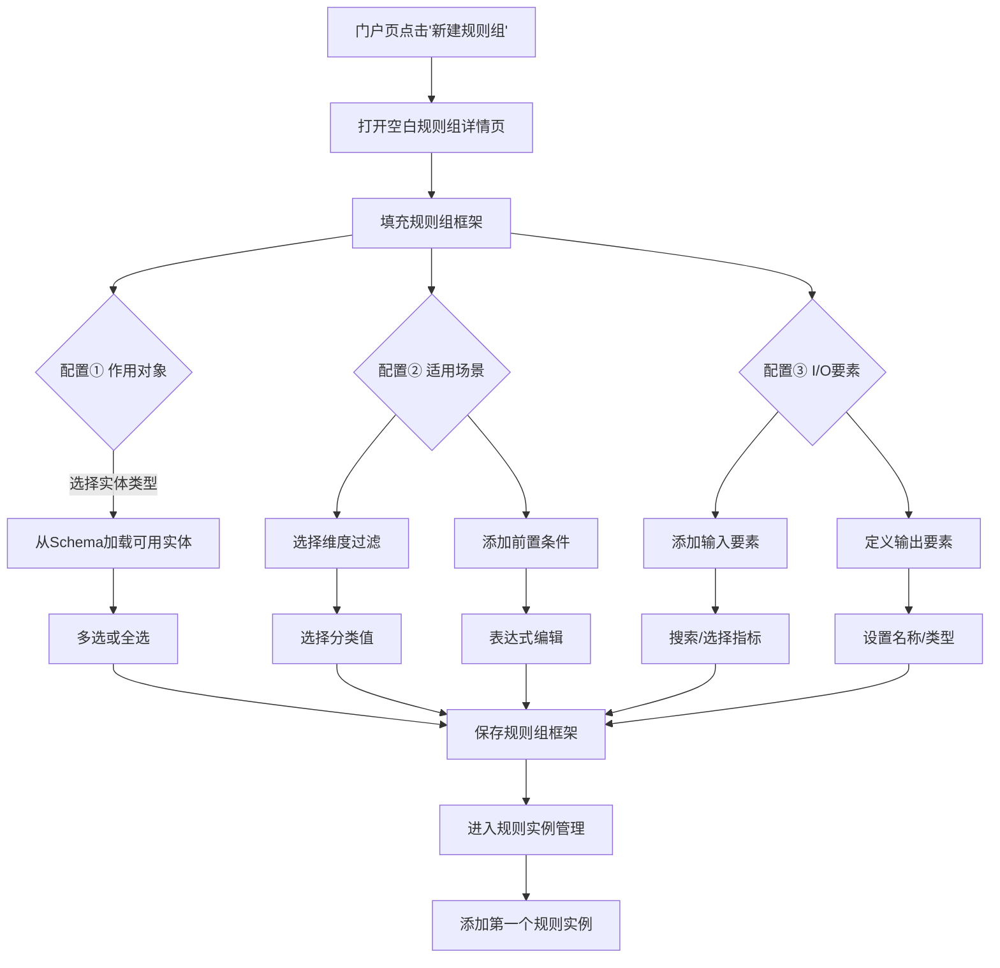
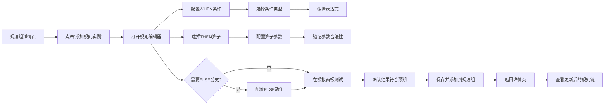

# 规则管理页面需求设计文档

> **状态**: DRAFT  
> **日期**: 2026-04-15  
> **阶段**: Phase 2 用户界面设计  
> **基准代码**: `ontology-engine-ui/src/pages/spaces/RuleDeclarationsPage.tsx`、`RuleLogicsPage.tsx`  
> **关联设计**: `detail/plans/2026-04-15-rule-orchestration-system-design.md`

---

## 一、当前现状与问题分析

### 1.1 现有页面结构

当前规则管理分为两个独立页面：

| 页面 | 路径 | 对应后端模型 | 主要功能 |
|------|------|--------------|---------|
| 规则声明管理 | `/spaces/{spaceId}/rule/declarations` | `rule_definitions` | 声明规则的框架结构 |
| 规则逻辑管理 | `/spaces/{spaceId}/rule/logics` | `rule_logics.steps` | 具体的 when/then/else 逻辑 |

### 1.2 用户流程中断点

**问题 1: 声明与逻辑分离，认知负担重**
- 用户必须先创建规则声明，然后切换到另一个页面创建规则逻辑
- 无法直观看到哪个声明下有哪些具体规则逻辑
- 需要记住声明 ID 并手动关联

**问题 2: 规则四元素未完整暴露**
- 声明页面只收集部分四元素（目标对象概念、适用范畴）
- 缺乏完整的**作用对象**（①）和**适用场景**（②）配置
- **输入输出要素**（③）编辑体验原始（JSON文本）

**问题 3: 规则逻辑编辑门槛高**
- 条件表达式需手动输入 JSON
- 动作配置需理解后端 ActionType 枚举
- 缺乏算子参数引导（如 BINNING 区间定义、SCORECARD 得分表）

**问题 4: 无编排画布，依赖关系不可视**
- 无法拖动排序规则实例
- 看不到要素的计算 DAG
- 不知道规则的执行顺序依赖

---

## 二、目标用户体验

### 2.1 用户旅程总览

```
用户旅程：创建业务规则流程

1. 进入规则管理页面
   └─ 统一入口：/spaces/{spaceId}/rules

2. 选择/创建规则组
   ├─ 方式 A: 从空白模板创建新规则组
   ├─ 方式 B: 导入已有 YAML（Schema v2 格式）
   └─ 方式 C: 复制现有规则组

3. 配置规则组框架（规则四元素 ①②③）
   ├─ ① 作用对象：选择实体类型（Supplier/Invoice...）
   ├─ ② 适用场景：维度过滤 + 前置条件
   ├─ ③ 输入输出要素：从 L1/L3 选择或新建
   └─ ④ 可跳过：分析逻辑后面配置

4. 在规则组内添加规则实例
   ├─ 点击"添加规则" → 打开规则编辑器
   ├─ 配置 when 条件（表达式/组合条件）
   ├─ 选择算子类型（5种）
   ├─ 配置算子参数（UI 表单）
   └─ 可选配置 else 分支

5. 编排与排序
   ├─ 拖拽排序规则实例
   ├─ 查看要素依赖图
   └─ 查看完整执行 DAG

6. 验证与发布
   ├─ 单个规则模拟测试
   ├─ 完整规则链模拟
   ├─ 导出为 YAML（Schema v2 合规）
   └─ 保存并激活
```

### 2.2 页面布局重构

```
当前结构：                      重构后结构：
├─ 规则声明管理（独立页面）         ├─ 规则管理门户（入口页）
└─ 规则逻辑管理（独立页面）         │   ├─ 规则组列表
                                    │   ├─ 规则组框架筛选
                                    │   ├─ 快速创建按钮
                                    │   └─ 导入/导出入口
                                    │
                                    ├─ 规则组详情页
                                    │   ├─ 框架配置面板（①②③）
                                    │   ├─ 规则实例列表（可拖拽）
                                    │   ├─ 添加规则按钮
                                    │   ├─ 要素依赖图（内嵌）
                                    │   └─ 模拟测试入口
                                    │
                                    └─ 规则编辑器（模态框）
                                        ├─ WHEN 条件配置
                                        ├─ THEN 算子选择 + 参数
                                        ├─ ELSE 分支配置
                                        └─ 模拟验证面板
```

---

## 三、页面详细设计

### 3.1 规则管理门户页 (`/spaces/{spaceId}/rules`)

**URL**: `/spaces/{spaceId}/rules`

**布局**:

```
┌─────────────────────────────────────────────────────────────────────────┐
│  规则组 (Rule Groups)                                   [新建规则组 +]    │
├─────────────────────────────────────────────────────────────────────────┤
│  🔍 搜索: __________     应用对象: [所有 ▼]     类型: [所有 ▼]       启用状态: □  │
│                                                                         │
│  📋 规则组清单                                                            │
│  ┌────────────────┬──────────┬─────────────┬────────────┬──────────┐  │
│  │  规则组ID      │  名称    │  应用对象    │  规则数量   │  状态    │  │
│  ├────────────────┼──────────┼─────────────┼────────────┼──────────┤  │
│  │ credit_rules   │ 信用规则 │ Supplier    │ 7          │ ✅ 启用   │  │
│  │ guarantee_rule │ 担保审查 │ Guarantor   │ 4          │ ✅ 启用   │  │
│  │ invoice_audit  │ 发票稽核 │ Invoice     │ 3          │ ⚠️ 草稿   │  │
│  │ risk_assessment│ 风险预审 │ Supplier    │ 5          │ ✅ 启用   │  │
│  └────────────────┴──────────┴─────────────┴────────────┴──────────┘  │
│                                                                         │
│  操作按钮：[📝 编辑] [🔗 复制] [📤 导出 YAML] [🗑️ 删除] [🚀 模拟]       │
│                                                                         │
│  筛选/统计面板                                                          │
│  ┌────────────────┬─────────────┬────────────────┬───────────────────┐│
│  │  活跃规则组: 3 │  总规则实例:19│  类型分布:... │  操作入口         ││
│  └────────────────┴─────────────┴────────────────┴───────────────────┘│
└─────────────────────────────────────────────────────────────────────────┘
```

**功能要点**:

1. **快速筛选**：按应用对象、规则类型、启用状态
2. **规则组卡片**：显示关键元数据（ID/名称/应用对象/规则数量/状态）
3. **批量操作**：导出选中规则组为 YAML 包
4. **新建规则组**：跳转到详情页开始创建流程

### 3.2 规则组详情页 (`/spaces/{spaceId}/rules/{groupId}`)

**URL**: `/spaces/{spaceId}/rules/{groupId}`

**布局（三栏式）**:

```
┌────────────────────────────────┬─────────────────────────────────┬────────────────────┐
│  左侧：框架配置 (F1)            │  中间：规则实例列表 (F2)          │  右侧：要素图 (F3)    │
│  (固定宽度: 320px)             │  (可缩放)                       │  (固定宽度: 380px)  │
├────────────────────────────────┼─────────────────────────────────┼────────────────────┤
│  ┌────────────────┐            │  ┌─────────────────┐           │  ┌──────────────┐ │
│  │ ① 作用对象     │            │  │ 📋 规则实例     │           │  │📊 要素依赖图 │ │
│  │   - Supplier   │            │  ├─────────────────┤           │  └──────────────┘ │
│  │   - Invoice    │            │  │ 1. R001: 资质检查│           │  registered_capital │
│  │                │            │  │    WHEN: 表达式   │           │      ↓              │
│  └────────────────┘            │  │    → SET_FLAG   │           │  credit_score      │
│                                │  │                  │ (拖拽手柄)  │       ↓            │
│  ┌────────────────┐            │  │ 2. R002: 评分卡  │           │  credit_grade      │
│  │ ② 适用场景     │            │  │    WHEN: 表达式   │◀──┐       │       ↘            │
│  │  维度过滤:     │            │  │    → SCORECARD  │   │       │       BINNING     │
│  │    company_scale│           │  │                  │   │       │         ↓          │
│  │    in [LARGE...]│           │  │ 3. R003: 决策表  │   │       │       decision    │
│  │                │            │  │                  │   ┼──...  │                    │
│  │  前置条件:     │            │  │ 4. R004: 额度计算│   │       │  [展开/收起图例]    │
│  │    status=ACTIVE│           │  │                  │   │       │  [刷新依赖图]      │
│  └────────────────┘            │  │ 5. R005: 加权计算│   │       └────────────────────┘
│                                │  │    WHEN: 表达式   │   │
│  ┌────────────────┐            │  │    → WEIGHTED_SUM│   │
│  │ ③ I/O 要素     │            │  └─────────────────┘   │
│  │  输入:         │            │                        │
│  │   - credit_score│           │  [➕ 添加规则]         │
│  │   - guar_depth │           │                        │
│  │                │            │  [🎯 执行顺序: 拖拽调整] │
│  │  输出:         │            │                        │
│  │   - decision   │ (折叠/展开) │  [🔄 重新编号 (R001~)] │
│  │   - credit_limit│           │                        │
│  └────────────────┘            │  [📤 导出为 YAML]      │
│                                │  [🚀 完整模拟]         │
│  [快速保存框架]                 │                        │
│  [框架状态: 草稿/启用]          │                        │
└────────────────────────────────┴─────────────────────────────────┴────────────────────┘
```

**功能要点**:

**F1: 框架配置面板** 规则四元素 ①②③
- ① 作用对象：多选实体类型（从 L1 Schema 加载）
- ② 适用场景：
  - **维度过滤**：选择维度 + 分类值（从 L2 Schema 加载）
  - **前置条件**：表达式编辑器（字段自动补全）
- ③ I/O 要素：
  - **输入要素**：从 L1 属性或 L3 指标选择（搜索 + 自动完成）
  - **输出要素**：配置名称 + 类型 + 描述

**F2: 规则实例列表** 规则执行顺序
- 可拖拽排序（通过手柄）
- 支持折叠/展开查看 when/then 摘要
- 编号自动生成（R001、R002…）
- 右键菜单：编辑/复制/删除/禁用/模拟单个

**F3: 实时要素依赖图**
- 显示该规则组涉及的所有要素依赖
- 节点着色：L1灰色 / L3指标绿色橙色/ 规则实例蓝色 / 输出紫色
- 点击节点可查看要素详情或跳转到 Schema 管理页
- 支持展开/收起，聚焦特定路径

### 3.3 规则编辑器（模态框）

**触发**：点击规则实例列表中的"添加规则"或"编辑"

**布局**：

```
┌─────────────────────────────────────────────────────────────────────────┐
│  编辑规则: R002 - 信用评分卡                           [❌] [✅ 保存/应用] │
├──────────────────────────┬─────────────────────────────────────────────┤
│  [1] WHEN 条件配置        │  [4] 模拟验证面板                           │
│  ┌──────────────────────┐│  ┌─────────────────────────────────────────┐│
│  │ ○ 单一表达式          ││  │ 模拟测试数据                            ││
│  │  ○ ALL_OF (AND)      ││  │  ┌─────────────────────────┐            ││
│  │  ○ ANY_OF (OR)       ││  │  │ credit_score: 85        │   [🚀 模拟] ││
│  └──────────────────────┘│  │  │ total_revenue: 5000k    │            ││
│                          ││  │  ├─────────────────────────┤            ││
│  当前: ALL_OF (AND)       ││  │  ├─ 执行结果 ──────────────┤            ││
│  ┌──────────────────────┐││  │  │ when条件: ✅ 通过       │            ││
│  │ 1. status == 'ACTIVE'│││  │  │ then动作: SCORECARD    │            ││
│  │ 2. reg_cap >= 1000k  │││  │  │ 输出: credit_grade='AA'│            ││
│  [➕ 添加条件]           │││  │  │ 耗时: 2ms               │            ││
│                          │││  │  └─────────────────────────┘            ││
├──────────────────────────┼─────────────────────────────────────────────┤
│  [2] THEN 动作配置        │  [高级选项]                                 │
│  算子类型: [SCORECARD ▼] │  ⚙️ 执行优先级: [100_________]               │
│                          │  🏷️ 标签: [评分,信用,关键_________]          │
│  参数配置面板             │  📝 描述: (可选) ___________________________ │
│  ┌─────────────────────┐ │  ⚠️ 错误处理: [跳过继续 ▼]                   │
│  │ 基准分: [600______] │ │  🚫 失败时: [标记失败 ▼]                     │
│  │ 输出变量: [final_..]│ │  [⏰ 超时: 5000ms]                          │
│  │ 变量得分表:          │ │  [👁️ 可追踪: ✅]                            │
│  │  1) overdue_ratio   │ │  [🧪 仅测试模式: □]                         │
│  │     <5%: +50        │ └──────────────────────────────────────────┘ │
│  │     5-15%: +20      │                                                │
│  │     >=15%: -30      │                                                │
│  │  2) negative_news   │                                                │
│  └─────────────────────┘ │  [3] ELSE 分支配置（可选）                     │
│                          │  □ 启用 ELSE 分支                             │
│                          │  ┌────────────────────┐                      │
│                          │  │ 算子: [ALERT___▼]  │                      │
│                          │  │ 消息: [信用评分失败] │                      │
│                          │  │ 级别: [WARNING_▼]  │                      │
│                          │  └────────────────────┘                      │
│                          │                                                │
│  [操作]                  │  [预览 YAML] <点击查看生成代码>                 │
│  • [🎯 验证表达式]       │                                                │
│  • [📋 可用变量]         │                                                │
│  • [💡 示例]             │                                                │
│  • [⎘ 复制结构]         │                                                │
├──────────────────────────┴─────────────────────────────────────────────┤
│  底部导航: [⬅️ 上一个规则] [保存草稿] [✅ 保存并关闭] [➡️ 下一个规则]       │
└─────────────────────────────────────────────────────────────────────────┘
```

**功能要点**:

1. **页签式流程**: [1] WHEN → [2] THEN → [3] ELSE → [4] 模拟
2. **条件配置**: 支持单一表达式 / ALL_OF (AND) / ANY_OF (OR)
3. **算子参数面板**: 根据选择的算子类型动态渲染参数表单
4. **实时模拟**: 右侧面板输入测试数据，即时验证规则输出
5. **高级选项**: 优先级、标签、错误处理策略、超时设置
6. **YAML 预览**: 查看生成的后端配置格式

### 3.4 算子参数面板设计（5种算子）

#### 3.4.1 BINNING 算子参数面板

```
┌────────────────────────────────────────────┐
│  分箱 (BINNING) 参数配置                    │
├────────────────────────────────────────────┤
│  输入变量: [credit_score__________]        │
│  输出变量: [credit_grade__________]        │
│  分组变量: [___________]  (可选，多实体分组)  │
│                                            │
│  区间定义规则:                              │
│  ○ 等宽分箱   ○ 等频分箱   ○ 自定义分箱      │
│                                            │
│  [当前: 自定义分箱]                          │
│  ┌──────────┬──────────┬──────────────┐    │
│  │  下界     │  上界    │  标签        │    │
│  ├──────────┼──────────┼──────────────┤    │
│  │  90      │  +∞      │  AAA         │    │
│  │  85      │  90      │  AA          │    │
│  │  75      │  85      │  A           │    │
│  │  60      │  75      │  B           │    │
│  │  -∞      │  60      │  C           │    │
│  └──────────┴──────────┴──────────────┘    │
│                                            │
│  边界包含性:                                │
│  □ 包含上界 (inclusive_max)                 │
│  □ 包含下界 (inclusive_min)                 │
│                                            │
│  标签映射:  [自动生成标签]  [导入CSV]         │
│  [ + 添加区间 ]  [排序]  [删除空区间]         │
└────────────────────────────────────────────┘
```

#### 3.4.2 SCORECARD 算子参数面板

```
┌────────────────────────────────────────────┐
│  评分卡 (SCORECARD) 参数配置               │
├────────────────────────────────────────────┤
│  基准分: [600]  输出变量: [final_score___] │
│  总分布查表: [使用WOE/IV转换 □]              │
│                                            │
│  变量得分配置:                              │
│  1. 变量: [overdue_ratio_______________]    │
│     类型: [连续值▼]  [离散值▼]  [分类值▼]    │
│     计分模式: [区间得分▼] [WOE/IV转换▼]      │
│     ┌──────────────────┬──────────────┐    │
│     │      条件        │    得分       │    │
│     ├──────────────────┼──────────────┤    │
│     │  < 5%            │    +50        │    │
│     │  5% - 15%        │    +20        │    │
│     │  >= 15%          │    -30        │    │
│     └──────────────────┴──────────────┘    │
│     [ + 添加得分条件 ]                     │
│                                            │
│  2. [ + 添加变量 ]                         │
│                                            │
│  后处理公式:                               │
│  [baseline + total_points_______________]  │
│  公式助手: [max/min限制] [归一化]  [Sigmoid]│
│                                            │
│  [预览得分卡表格]                          │
└────────────────────────────────────────────┘
```

#### 3.4.3 WEIGHTED_SUM 算子参数面板

```
┌────────────────────────────────────────────┐
│  加权计算 (WEIGHTED_SUM) 参数配置           │
├────────────────────────────────────────────┤
│  输出变量: [credit_score]                  │
│  总分范围: [0] ~ [100]                     │
│  自动归一化: [✅ 启用]                      │
│                                            │
│  分量权重表:                                │
│  ┌─────────────────────┬─────┬──────┐      │
│  │  指标/输入          │ 权重 │  权重% │    │
│  ├─────────────────────┼─────┼──────┤      │
│  │  business_stability │ 0.30 │  30% │    │
│  │  tax_compliance     │ 0.25 │  25% │    │
│  │  network_centrality │ 0.15 │  15% │    │
│  │  reputation_score   │ 0.15 │  15% │    │
│  │  guarantee_risk_adj │ 0.15 │  15% │    │
│  └─────────────────────┴─────┴──────┘      │
│                                            │
│  权重总和: 1.00 ✅                         │
│  等级乘数:                                 │
│  □ 启用等级系数调整                         │
│  ┌────────┬──────┐                        │
│  │  等级   │ 乘数  │                        │
│  ├────────┼──────┤                        │
│  │  AAA   │ 1.8  │                        │
│  │  AA    │ 1.5  │                        │
│  │  A     │ 1.2  │                        │
│  │  B     │ 0.8  │                        │
│  │  C     │ 0.3  │                        │
│  └────────┴──────┘                        │
│                                            │
│  [ + 添加分量 ]  [权重分配向导]              │
└────────────────────────────────────────────┘
```

#### 3.4.4 DECISION_TABLE 算子参数面板

```
┌────────────────────────────────────────────┐
│  决策表 (DECISION_TABLE) 参数配置           │
├────────────────────────────────────────────┤
│  输出变量: [decision___]                   │
│  决策类型: [单一结果▼] [复合结果▼]           │
│  默认结果: [REJECT________] (不匹配时)      │
│                                            │
│  条件变量配置:                              │
│  1. 变量: [credit_grade_________]          │
│     类型: [枚举值▼] [连续值▼] [离散值▼]      │
│     匹配模式: [精确匹配▼] [区间匹配▼]        │
│     可取值: [AAA, AA, A, B, C]            │
│                                            │
│  2. 变量: [overdue_ratio________]          │
│     类型: [百分比▼]                         │
│     匹配模式: [区间匹配▼]                    │
│     区间标签: < 10%, 10%-20%, >= 20%       │
│                                            │
│  [ + 添加条件变量 ]                         │
│                                            │
│  决策矩阵:                                 │
│  ┌──────────┬──────────────┬───────────┐  │
│  │ 规则 #   │ credit_grade │ overdue.. │  │
│  ├──────────┼──────────────┼───────────┤  │
│  │   R1     │  AAA/AA      │  < 15%    │  │
│  │   R2     │  AAA/AA      │  >= 15%   │  │
│  │   R3     │  A/B         │  < 10%    │  │
│  │   R4     │  A/B         │  >= 10%   │  │
│  │   R5     │  C           │  ANY      │  │
│  └──────────┴──────────────┴───────────┘  │
│                                            │
│  结果列:                                   │
│  ┌──────────┬───────────────────────────┐│
│  │ 规则 #   │  decision                 ││
│  ├──────────┼───────────────────────────┤│
│  │   R1     │  APPROVE                  ││
│  │   R2     │  APPROVE_WITH_CONDITIONS  ││
│  │   R3     │  APPROVE_WITH_CONDITIONS  ││
│  │   R4     │  REJECT                   ││
│  │   R5     │  REJECT                   ││
│  └──────────┴───────────────────────────┘│
│                                            │
│  [自动生成矩阵] [导入CSV] [验证完整性]        │
└────────────────────────────────────────────┘
```

#### 3.4.5 LLM_JUDGE 算子参数面板

```
┌────────────────────────────────────────────┐
│  LLM定性分析 (LLM_JUDGE) 参数配置           │
├────────────────────────────────────────────┤
│  输出变量: [qualitative_risk________]      │
│  输出类型: [枚举▼] [布尔值▼] [数值▼] [文本▼]  │
│  预期格式: [HIGH/MEDIUM/LOW______________]│
│                                            │
│  Prompt 模板:                              │
│  ┌────────────────────────────────────┐   │
│  │请对以下{{company_name}}进行风险定性 │   │
│  │分析，考虑以下信息：                  │   │
│  │• 负面新闻数: {{negative_news_count}}│   │
│  │• 行业: {{industry}}                │   │
│  │• 担保链深度: {{guarantee_depth}}    │   │
│  │                                    │   │
│  │请输出风险等级: HIGH/MEDIUM/LOW      │   │
│  │并简要说明理由。                      │   │
│  └────────────────────────────────────┘   │
│  [使用系统变量: {{...}} 引用]               │
│                                            │
│  变量映射:                                │
│  ┌────────────────┬──────────────────┐   │
│  │  Prompt占位符   │  对应数据源       │   │
│  ├────────────────┼──────────────────┤   │
│  │ company_name   │ company.name      │   │
│  │ negative_news..│ L3.negative_news  │   │
│  │ industry       │ L3.industry_group │   │
│  │ guarantee_depth│ L3.担保链深度      │   │
│  └────────────────┴──────────────────┘   │
│                                            │
│  质量控制:                                │
│  置信度阈值: [0.7__] (低于则标记低置信)      │
│  超时(ms): [5000]  重试次数: [1]           │
│  降级值: [MEDIUM_] (LLM不可用时的默认值)    │
│                                            │
│  [💬 测试Prompt] [📊 置信度分析]           │
└────────────────────────────────────────────┘
```

---

## 四、用户交互流程

### 4.1 创建新规则组流程



### 4.2 编辑规则实例流程



### 4.3 批量操作流程

**场景**: 将供应商信用规则组复制给保理商使用

```
1. 门户页勾选 `credit_rules` 规则组
2. 点击"复制" → 弹出复制对话框
3. 配置新规则组参数:
   - 新名称: `factoring_credit_rules`
   - 新ID: `factoring_credit`
   - 转换映射: Supplier → Factor
4. 系统自动:
   - 复制框架结构和所有规则实例
   - 转换实体引用 (Supplier → Factor)
   - 保持条件逻辑不变
   - 生成新规则组
5. 用户在新规则组中进行微调
```

---

## 五、API 集成设计

### 5.1 前端 API 封装

```typescript
// ruleApi.ts - 前端规则管理 API 封装
class RuleApi {
  // 规则组管理
  getRuleGroups(spaceId: string, filter?: RuleGroupFilter): Promise<RuleGroup[]>;
  getRuleGroup(spaceId: string, groupId: string): Promise<RuleGroupDetail>;
  createRuleGroup(spaceId: string, data: CreateRuleGroupRequest): Promise<RuleGroup>;
  updateRuleGroup(spaceId: string, groupId: string, data: UpdateRuleGroupRequest): Promise<void>;
  deleteRuleGroup(spaceId: string, groupId: string): Promise<void>;
  
  // 规则实例管理
  getRuleSteps(spaceId: string, groupId: string): Promise<RuleStep[]>;
  createRuleStep(spaceId: string, groupId: string, data: CreateRuleStepRequest): Promise<RuleStep>;
  updateRuleStep(spaceId: string, groupId: string, stepId: string, data: UpdateRuleStepRequest): Promise<void>;
  deleteRuleStep(spaceId: string, groupId: string, stepId: string): Promise<void>;
  reorderRuleSteps(spaceId: string, groupId: string, stepOrder: string[]): Promise<void>;
  
  // 模拟执行
  simulateStep(spaceId: string, groupId: string, stepId: string, testData: any): Promise<SimulationResult>;
  simulateGroup(spaceId: string, groupId: string, testData: any): Promise<GroupSimulationResult>;
  
  // 导入导出
  importFromYaml(spaceId: string, yamlContent: string): Promise<ImportResult>;
  exportToYaml(spaceId: string, groupId?: string): Promise<string>;
  
  // 算子参数验证
  validateOperatorParams(operator: string, params: any): Promise<ValidationResult>;
  
  // DAG 查询
  getGroupDAG(spaceId: string, groupId: string): Promise<DAGData>;
  getFullDAG(spaceId: string, target?: string): Promise<DAGData>;
}
```

### 5.2 前端数据模型

```typescript
// types/rules.ts
interface RuleGroup {
  id: string;
  name: string;
  description?: string;
  type: 'constraint' | 'inference' | 'alert' | 'decision';
  appliesTo: AppliesToConfig;
  inputs: IOElement[];
  outputs: IOElement[];
  status: 'draft' | 'active' | 'archived';
  stepCount: number;
  createdAt: string;
  updatedAt: string;
}

interface RuleStep {
  id: string;
  name: string;
  description?: string;
  order: number;
  groupId: string;
  when: ConditionClause;
  then: ActionClause;
  else?: ActionClause;
  tags?: string[];
  priority: number;
  timeoutMs?: number;
  enabled: boolean;
  errorHandling: ErrorHandlingStrategy;
}

interface ConditionClause {
  type: 'expression' | 'allOf' | 'anyOf';
  expression?: string;
  conditions?: ConditionClause[];
}

interface ActionClause {
  operator: string;
  params: Record<string, any>;
  output?: Record<string, any>;
}
```

### 5.3 Zustand 状态管理

```typescript
// stores/ruleStore.ts
interface RuleStore {
  // 状态
  currentSpaceId: string | null;
  ruleGroups: RuleGroup[];
  currentGroup: RuleGroupDetail | null;
  ruleSteps: RuleStep[];
  loading: boolean;
  
  // 操作 - 规则组
  loadRuleGroups: (spaceId: string) => Promise<void>;
  selectGroup: (groupId: string) => Promise<void>;
  createGroup: (data: CreateRuleGroupRequest) => Promise<RuleGroup>;
  updateGroup: (groupId: string, data: UpdateRuleGroupRequest) => Promise<void>;
  deleteGroup: (groupId: string) => Promise<void>;
  
  // 操作 - 规则实例
  loadSteps: (groupId: string) => Promise<void>;
  addStep: (step: CreateRuleStepRequest) => Promise<RuleStep>;
  updateStep: (stepId: string, data: UpdateRuleStepRequest) => Promise<void>;
  deleteStep: (stepId: string) => Promise<void>;
  reorderSteps: (stepIds: string[]) => Promise<void>;
  
  // 操作 - 模拟
  simulateStep: (stepId: string, testData: any) => Promise<SimulationResult>;
  simulateGroup: (testData: any) => Promise<GroupSimulationResult>;
  
  // 操作 - 导入导出
  importYaml: (yaml: string) => Promise<ImportResult>;
  exportYaml: (groupId?: string) => Promise<string>;
}
```

---

## 六、实施路线

### Phase 1: 基础框架重构 (2周)

| 任务 | 前端 | 后端 | 说明 |
|------|------|------|------|
| 统一规则管理入口 | `/spaces/{id}/rules` | API: `/api/v1/rule-groups` | 合并声明与逻辑页面 |
| 规则组列表与筛选 | RuleGroupListPage | 查询接口支持分页/过滤 | 门户页基础功能 |
| 规则组详情页框架 | RuleGroupDetailPage | API: 规则组 CRUD | 三栏布局框架 |

### Phase 2: 规则组框架编辑 (2周)

| 任务 | 前端 | 后端 | 说明 |
|------|------|------|------|
| 规则四元素编辑 | 左侧框架配置面板 | 模型扩展: AppliesTo | ① ② ③ 完整编辑 |
| 实体类型选择器 | EntityTypeSelector 组件 | API: 获取 L1 实体列表 | 多选/全选支持 |
| 维度过滤编辑器 | DimensionFilterEditor | API: 获取 L2 维度分类 | 选择维度+分类值 |
| I/O 要素配置器 | IOElementSelector 组件 | API: 搜索 L1/L3 要素 | 自动完成 + 类型验证 |

### Phase 3: 规则实例编辑 (3周)

| 任务 | 前端 | 后端 | 说明 |
|------|------|------|------|
| 规则编辑器模态框 | RuleEditorModal | API: 规则实例 CRUD | 4个页签式配置 |
| 条件表达式编辑器 | ConditionEditor 组件 | API: 表达式验证 | 支持 3 种条件类型 |
| 算子参数面板 | OperatorParamEditor | API: 算子注册 + 参数验证 | 5种算子专用 UI |
| 实时模拟面板 | SimulationPanel | API: `/simulate` | 即时验证规则逻辑 |

### Phase 4: 编排与可视化 (2周)

| 任务 | 前端 | 后端 | 说明 |
|------|------|------|------|
| 规则实例拖拽排序 | DraggableRuleList | API: `/reorder` | 手柄拖拽 + 顺序更新 |
| 要素依赖图 | ElementDAG 组件 | API: `/dag` | 集成 G6 图可视化 |
| 完整 DAG 视图 | FullDAGPage | API: `/full-dag` | 全链路计算图 |
| YAML 导入导出 | ImportExport 模块 | API: `/import`, `/export` | Schema v2 合规转换 |

### Phase 5: 集成与优化 (1周)

| 任务 | 前端 | 后端 | 说明 |
|------|------|------|------|
| 与现有 Schema 集成 | Schema 选择器联动 | 数据同步机制 | 规则组引用 L1/L2/L3 |
| 批量操作支持 | 批量选择/复制/导出 | 批量 API 端点 | 提高管理效率 |
| 用户引导与帮助 | 上下文帮助系统 | - | 新用户上手引导 |
| 性能优化 | 虚拟滚动列表 | 查询缓存 | 处理大量规则 |

---

## 七、验收标准

### 7.1 MVP 验收（Phase 1-3 完成）

- [ ] 用户可从统一入口 `/spaces/{id}/rules` 访问规则管理
- [ ] 可新建规则组并完整配置规则四元素 ①②③
- [ ] 可在规则组内添加至少 3 种不同类型的规则实例
- [ ] 可通过算子参数面板配置 BINNING/SCORECARD/WEIGHTED_SUM
- [ ] 可使用模拟面板测试单个规则，验证输入输出

### 7.2 完整验收（Phase 4-5 完成）

- [ ] 支持规则实例拖拽排序和自动编号
- [ ] 规则组详情页右侧显示实时要素依赖图
- [ ] 可从现有 Schema 中选择实体类型和维度分类值
- [ ] 支持 YAML 导入导出（Schema v2 格式兼容）
- [ ] 全链路 DAG 视图可展示从 L1 到决策的完整路径
- [ ] 批量复制规则组功能可用，实体引用自动转换

### 7.3 性能验收

- [ ] 规则组列表加载时间 < 2s（1000个规则组）
- [ ] 规则实例拖拽更新响应时间 < 200ms
- [ ] 实时模拟执行时间 < 5s
- [ ] DAG 图渲染流畅，节点数 < 500 时无卡顿

---

## 八、与现有系统的兼容性

### 8.1 数据迁移方案

**遗留 `rule_definitions` → 新 `rule_groups`**:
- `target_objects` → `appliesTo.fact_objects`（映射转换）
- `applicable_scope` → `appliesTo.categories`（需要格式转换）
- `input_elements` / `output_elements` → 直接迁移

**遗留 `rule_logics` → 新 `rule_steps`**:
- `definition_id` → `rule_group`（外键指向新表）
- `when` / `then_action` / `else_action` → 结构不变
- 需要按 `definition_id` 分组重建执行顺序

### 8.2 向后兼容策略

**双模式运行（过渡期）**:
- 新规则组存储在 `/rule-groups` API
- 旧规则声明/逻辑仍可通过原有 API 访问
- 前端根据 `USE_NEW_RULE_SYSTEM` 环境变量决定路由

**数据同步**:
- 规则组更新时自动同步到旧表结构
- 提供"迁移向导"将旧规则批量迁移到新系统

### 8.3 API 版本控制

```
/v1/management/{spaceId}/rule-definitions      (旧 API，保持)
/v1/management/{spaceId}/rule-logics           (旧 API，保持)
/v2/rules/{spaceId}/rule-groups                (新 API)
/v2/rules/{spaceId}/rule-groups/{groupId}      (新 API)
/v2/rules/{spaceId}/rule-groups/{groupId}/steps (新 API)
```

---

## 九、风险与缓解

| 风险 | 影响 | 缓解策略 |
|------|------|----------|
| 新数据结构与旧数据不兼容 | 现有用户无法使用 | 过渡期双模式运行 + 数据迁移工具 |
| 规则编辑器复杂度高 | 用户学习曲线陡峭 | 分层引导 + 上下文帮助 + 模板库 |
| 实时模拟性能瓶颈 | 用户等待时间过长 | 本地缓存 + 后台执行 + 超时保护 |
| DAG 可视化性能 | 大量节点渲染卡顿 | 分页加载 + 虚拟渲染 + 聚合节点 |
| 与 Schema 变更同步 | 规则引用的要素失效 | 变更检测 + 影响分析 + 自动修复建议 |

---

## 十、文档更新计划

- [ ] 更新 `docs-ui/README.md` 添加本文档链接
- [ ] 更新 `docs/development/` 中的前端开发指南
- [ ] 创建用户手册：`docs/user-guide/rule-orchestration.md`
- [ ] 更新 `detail/plans/2026-04-15-rule-orchestration-system-design.md` 前端章节

---

**完成标记**: `[ ] 概念设计` `[ ] 详细设计` `[ ] 开发中` `[ ] 测试中` `[ ] 已发布`
**当前状态**: 概念设计 → 详细设计